# 2026년 9월 16일 시황 노트

## 1. 상한가 / 거래량 1,000만주 이상 종목

### 큐라티스 (상한가)
— 등락률 +30.00% / 거래량 9만 주

**◎ 관련기사**
**[특징주] 큐라티스, 美 GMP 실사 통과…‘상한가’**

[바이오타임즈, 2026-09-16]

**◎ 공시**
- _(공시 없음 / 미조회)_

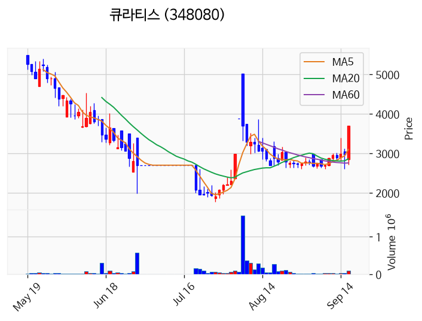

---

### 에이스테크 (상한가)
— 등락률 +29.97% / 거래량 108만 주

**◎ 관련기사**
**[마감시황] 09/16 반도체 강세에 코스피 +1.37% 5일 만에 반등**

[네이버 프리미엄콘텐츠, 2026-09-16]

**◎ 공시**
- _(공시 없음 / 미조회)_

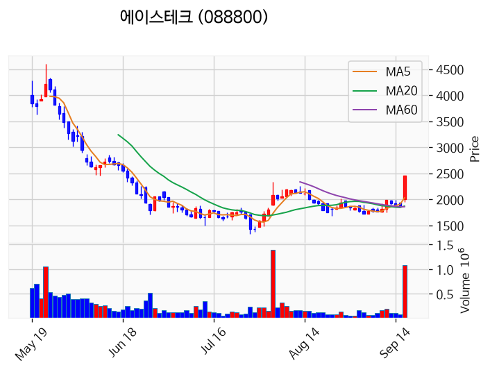

---

### 엠에프씨 (상한가)
— 등락률 +29.96% / 거래량 18만 주

**◎ 관련기사**
**양 제약지수 동반하락, 엠에프씨 상한가**

[newsmp.com, 2026-09-16]

**◎ 공시**
- _(공시 없음 / 미조회)_

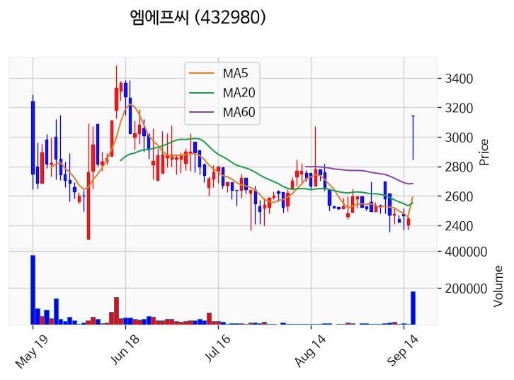

---

### 미투온 (상한가)
— 등락률 +29.95% / 거래량 197만 주

**◎ 관련기사**
**카카오게임즈, 미투온에 980억 베팅…적자 탈출 '시험대'**

[뉴스토마토, 2026-09-16]

**◎ 공시**
- _(공시 없음 / 미조회)_

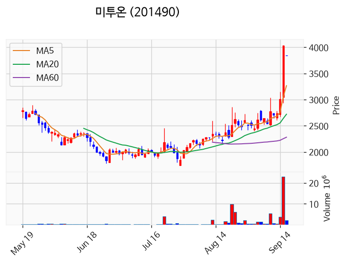

---

### 기가레인 (상한가)
— 등락률 +29.91% / 거래량 271만 주

**◎ 관련기사**
**[주식마감] '카카오게임즈 피인수 효과' 미투온 상한가... 큐라티스, 엠에프씨, 기가레인 등 급등**

[금강일보, 2026-09-16]

**◎ 공시**
- _(공시 없음 / 미조회)_

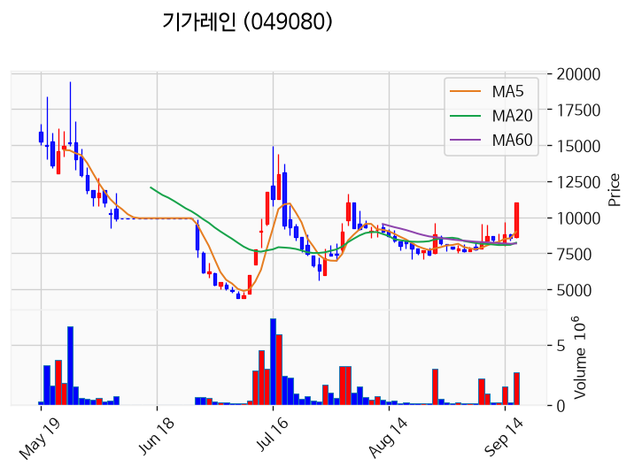

---

### 뷰티스킨 (상한가)
— 등락률 +29.86% / 거래량 473만 주

**◎ 관련기사**
**[공시]뷰티스킨, 300억원 공급계약…중장기 실적 발판**

[한스경제, 2026-09-16]

**◎ 공시**
- [단일판매ㆍ공급계약체결              ](https://dart.fss.or.kr/dsaf001/main.do?rcpNo=20260916900230) — 뷰티스킨, 20260916

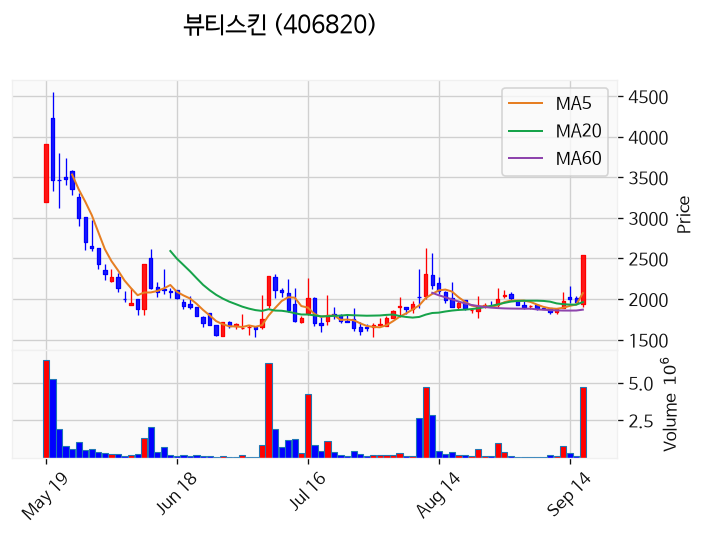

---

### 아이티센피엔에스 (상한가)
— 등락률 +29.85% / 거래량 52만 주

**◎ 관련기사**
**[급등락주 짚어보기] 미투온, 카카오게임즈 피인수에 ‘上’…뷰티스킨·아이티센피엔에스도 급등**

[이투데이, 2026-09-16]

**◎ 공시**
- _(공시 없음 / 미조회)_

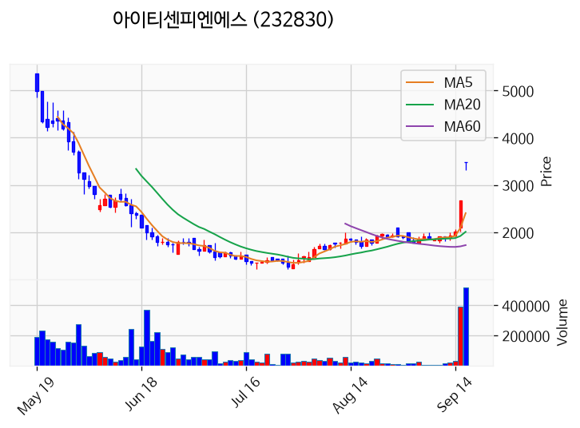

---

### 빛샘전자 (거래량 급증)
— 등락률 +26.45% / 거래량 1,495만 주

**◎ 관련기사**
**코스피, 반도체주 반등에 6700선 안착**

[매일경제 마켓, 2026-09-16]

**◎ 공시**
- _(공시 없음 / 미조회)_

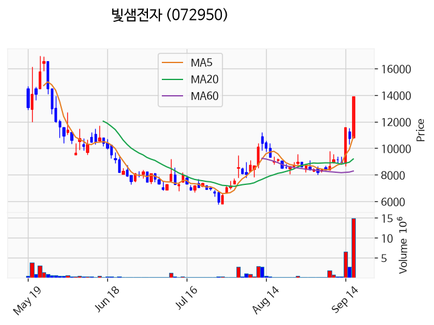

---

### 센서뷰 (거래량 급증)
— 등락률 +19.10% / 거래량 2,458만 주

**◎ 관련기사**
**센서뷰 주가, 9월 16일 애프터마켓 1,334원 13.73% 상승**

[톱스타뉴스, 2026-09-16]

**◎ 공시**
- _(공시 없음 / 미조회)_

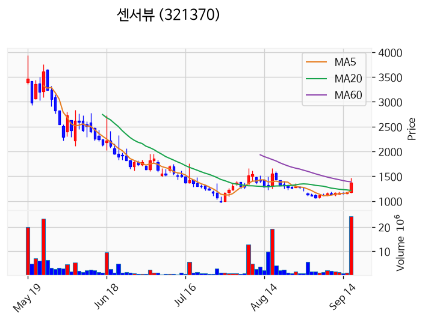

---

### 대한광통신 (거래량 급증)
— 등락률 +13.86% / 거래량 4,566만 주

**◎ 관련기사**
**"통신장비 부족해"…대한광통신 14% 쑥**

[매일경제 마켓, 2026-09-16]

**◎ 공시**
- _(공시 없음 / 미조회)_

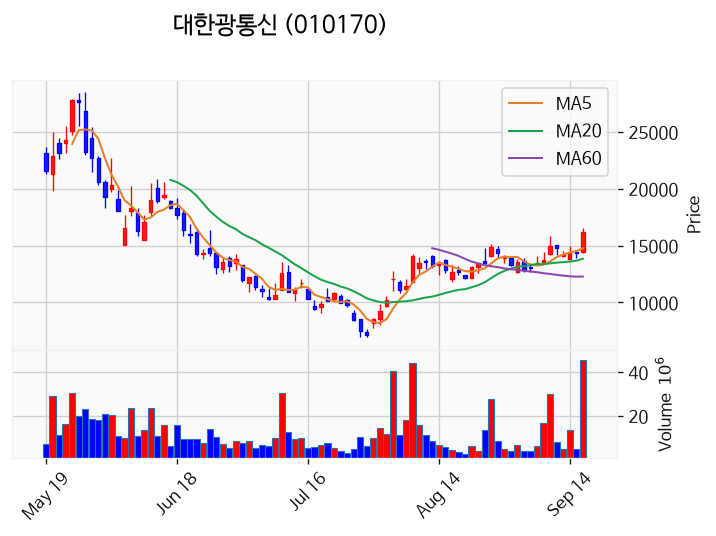

---

### 동국산업 (거래량 급증)
— 등락률 +13.50% / 거래량 1,482만 주

**◎ 관련기사**
**동국산업 주가, 9월 16일 애프터마켓 3,590원 16.75% 상승**

[톱스타뉴스, 2026-09-16]

**◎ 공시**
- _(공시 없음 / 미조회)_

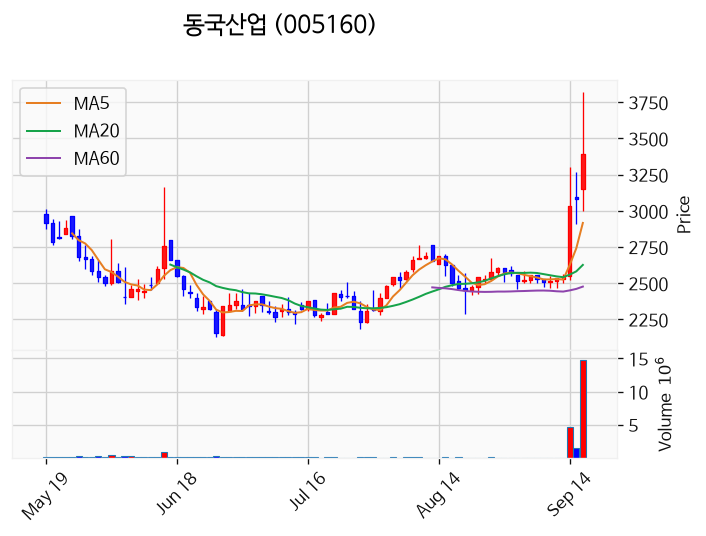

---

### 이노인스트루먼트 (거래량 급증)
— 등락률 +8.98% / 거래량 1,108만 주

**◎ 관련기사**
**코스피 4거래일 하락 끝 반등…삼성전자·SK하이닉스에 기관 매수 몰렸다**

[theconnectmoney.com, 2026-09-16]

**◎ 공시**
- _(공시 없음 / 미조회)_

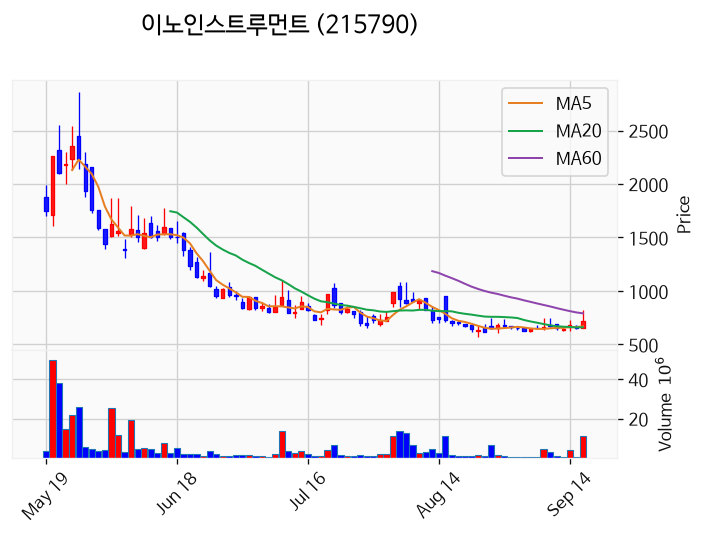

---

### 빛과전자 (거래량 급증)
— 등락률 +7.04% / 거래량 7,343만 주

**◎ 관련기사**
**빛과전자 주가, 9월 16일 애프터마켓 4,400원 6.80% 상승**

[중앙이코노미뉴스, 2026-09-16]

**◎ 공시**
- _(공시 없음 / 미조회)_

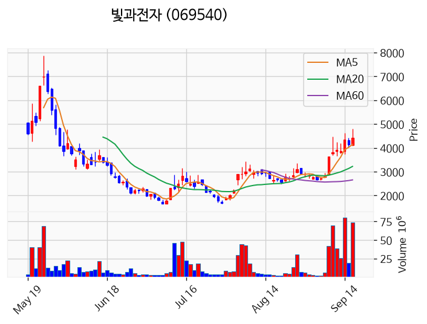

---

### 씨피시스템 (거래량 급증)
— 등락률 +5.00% / 거래량 2,765만 주

**◎ 관련기사**
**씨피시스템 주가, 9월 16일 애프터마켓 4,685원 4.11% 상승**

[톱스타뉴스, 2026-09-16]

**◎ 공시**
- _(공시 없음 / 미조회)_

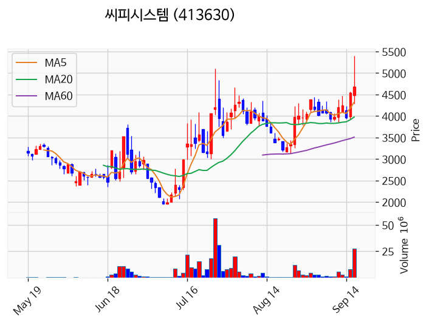

---

### 샌즈랩 (거래량 급증)
— 등락률 +3.77% / 거래량 1,102만 주

**◎ 관련기사**
**젠슨 황이 콕 집은 'AI 보안'…안랩 "AI 공격, AI로 막는다"**

[매일경제 마켓, 2026-09-16]

**◎ 공시**
- _(공시 없음 / 미조회)_

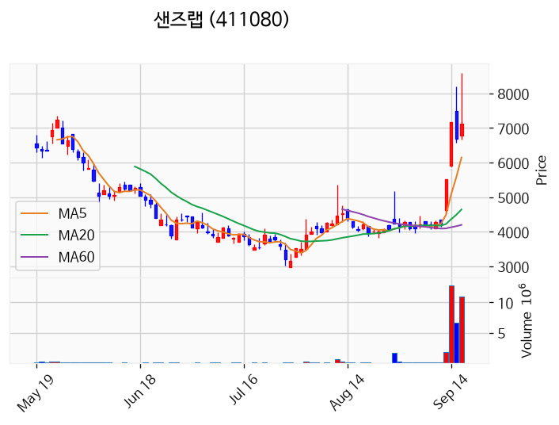

---

### 삼성전자 (거래량 급증)
— 등락률 +2.01% / 거래량 1,176만 주

**◎ 관련기사**
**기관 뭉칫돈에 급등한 DB하이텍…"삼성전자·TSMC 공백 집중수혜"**

[한국경제, 2026-09-16]

**◎ 공시**
- _(공시 없음 / 미조회)_

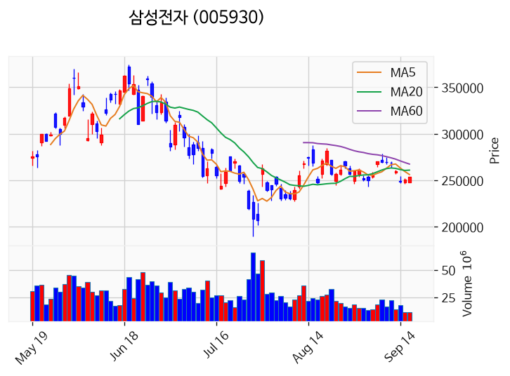

---

### 한컴위드 (거래량 급증)
— 등락률 +1.15% / 거래량 1,278만 주

**◎ 관련기사**
**한컴-대구공공시설관리공단, AI 기술 활용 '데이터 기반 행정 혁신' 추진**

[마일드경제, 2026-09-16]

**◎ 공시**
- _(공시 없음 / 미조회)_

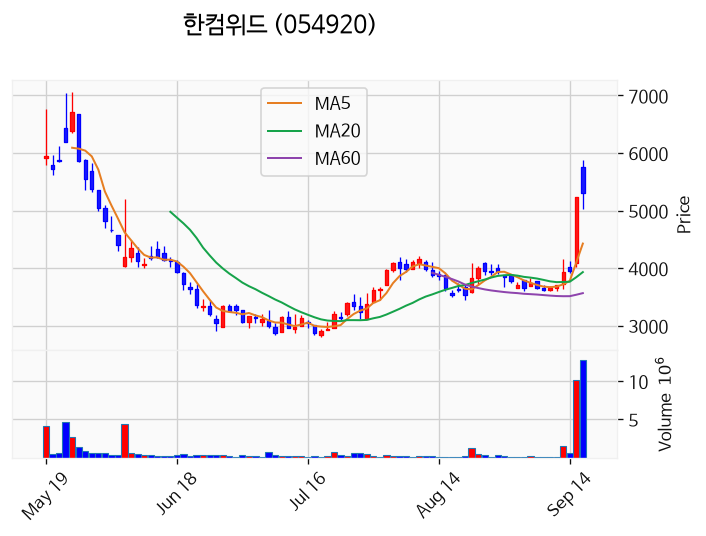

---

### 한국첨단소재 (거래량 급증)
— 등락률 +0.45% / 거래량 3,196만 주

**◎ 관련기사**
**[머니게임] 사토시홀딩스, '빚 돌려막기'로 대주주 CB 50억 현금화?**

[v.daum.net, 2026-09-16]

**◎ 공시**
- _(공시 없음 / 미조회)_

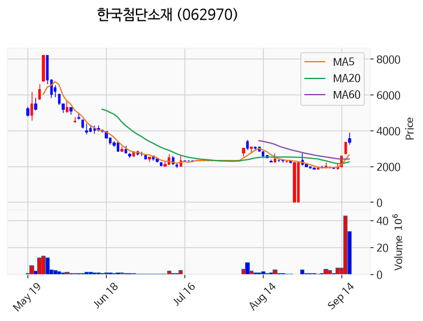

---

### 현대약품 (거래량 급증)
— 등락률 -1.48% / 거래량 1,253만 주

**◎ 관련기사**
**현대약품 "'미프진', 불법 유통 여성 피해 줄이기 위해 도입 결정"**

[뉴스1, 2026-09-16]

**◎ 공시**
- _(공시 없음 / 미조회)_

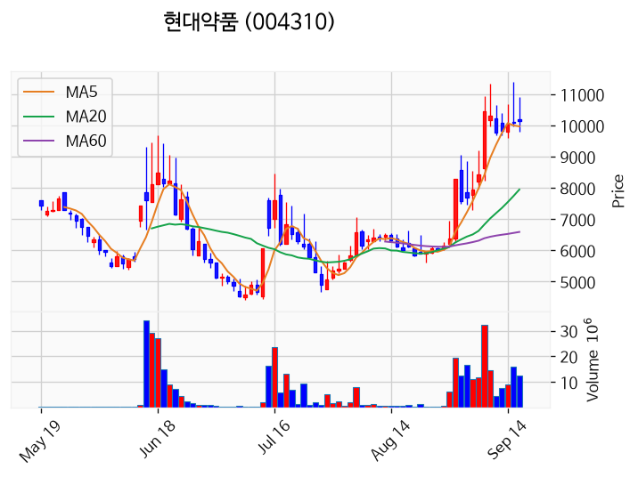

---

### 광전자 (거래량 급증)
— 등락률 -1.88% / 거래량 1,224만 주

**◎ 관련기사**
**[퇴근길 애프터 시황] 반도체주 강세 이어져…코스닥선 급등주 속출**

[아주경제, 2026-09-16]

**◎ 공시**
- _(공시 없음 / 미조회)_

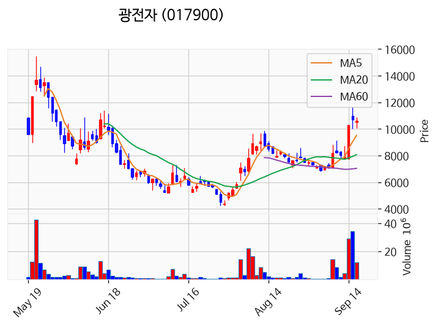

---

### 코스나인 (거래량 급증)
— 등락률 -40.00% / 거래량 3,473만 주

**◎ 관련기사**
_(관련기사 없음 / 미조회)_

**◎ 공시**
- _(공시 없음 / 미조회)_

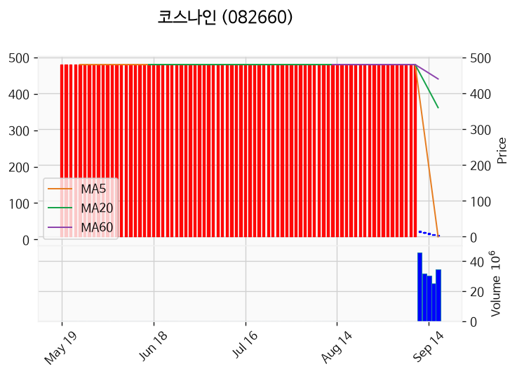

---

## 2. 거래량 폭증 후 급감 패턴 종목
_(폭증 전일 대비 500~1000%, 급감 전일 대비 25% 이하, 급감일 종가가 5일선 대비 -3% 이내)_

### 이화산업
- 폭증일: 2026-09-15, 거래량 0만 주 (전일 대비 820%)
- 급감일: 2026-09-16, 거래량 0만 주 (전일 대비 20%)
- 급감일 종가 13,070원 / 5일선 8,016원 (이격률 +63.05%)

### 호텔신라우
- 폭증일: 2026-09-15, 거래량 0만 주 (전일 대비 502%)
- 급감일: 2026-09-16, 거래량 0만 주 (전일 대비 24%)
- 급감일 종가 28,250원 / 5일선 17,000원 (이격률 +66.18%)

### 대동기어
- 폭증일: 2026-09-15, 거래량 173만 주 (전일 대비 982%)
- 급감일: 2026-09-16, 거래량 15만 주 (전일 대비 9%)
- 급감일 종가 6,100원 / 5일선 3,670원 (이격률 +66.21%)

### SIMPAC
- 폭증일: 2026-09-15, 거래량 11만 주 (전일 대비 513%)
- 급감일: 2026-09-16, 거래량 2만 주 (전일 대비 23%)
- 급감일 종가 4,645원 / 5일선 2,827원 (이격률 +64.31%)

### 유진스팩12호
- 폭증일: 2026-09-15, 거래량 0만 주 (전일 대비 857%)
- 급감일: 2026-09-16, 거래량 0만 주 (전일 대비 17%)
- 급감일 종가 1,981원 / 5일선 1,190원 (이격률 +66.53%)

### 원일특강
- 폭증일: 2026-09-15, 거래량 1만 주 (전일 대비 602%)
- 급감일: 2026-09-16, 거래량 0만 주 (전일 대비 9%)
- 급감일 종가 6,910원 / 5일선 4,172원 (이격률 +65.63%)

### 한국전자인증
- 폭증일: 2026-09-15, 거래량 36만 주 (전일 대비 876%)
- 급감일: 2026-09-16, 거래량 4만 주 (전일 대비 10%)
- 급감일 종가 3,445원 / 5일선 2,079원 (이격률 +65.70%)

### 인바디
- 폭증일: 2026-09-15, 거래량 31만 주 (전일 대비 540%)
- 급감일: 2026-09-16, 거래량 3만 주 (전일 대비 9%)
- 급감일 종가 57,800원 / 5일선 34,560원 (이격률 +67.25%)

### 에스티큐브
- 폭증일: 2026-09-15, 거래량 49만 주 (전일 대비 640%)
- 급감일: 2026-09-16, 거래량 9만 주 (전일 대비 18%)
- 급감일 종가 7,350원 / 5일선 4,542원 (이격률 +61.82%)

### 에스피지
- 폭증일: 2026-09-15, 거래량 166만 주 (전일 대비 668%)
- 급감일: 2026-09-16, 거래량 37만 주 (전일 대비 22%)
- 급감일 종가 98,200원 / 5일선 58,340원 (이격률 +68.32%)

### 아진엑스텍
- 폭증일: 2026-09-15, 거래량 158만 주 (전일 대비 808%)
- 급감일: 2026-09-16, 거래량 29만 주 (전일 대비 18%)
- 급감일 종가 7,040원 / 5일선 4,170원 (이격률 +68.82%)

### 조선선재
- 폭증일: 2026-09-15, 거래량 0만 주 (전일 대비 574%)
- 급감일: 2026-09-16, 거래량 0만 주 (전일 대비 12%)
- 급감일 종가 84,100원 / 5일선 50,400원 (이격률 +66.87%)

### 미투온
- 폭증일: 2026-09-15, 거래량 2,308만 주 (전일 대비 627%)
- 급감일: 2026-09-16, 거래량 197만 주 (전일 대비 8%)
- 급감일 종가 3,840원 / 5일선 1,981원 (이격률 +93.84%)

### 이엠티
- 폭증일: 2026-09-15, 거래량 1만 주 (전일 대비 638%)
- 급감일: 2026-09-16, 거래량 0만 주 (전일 대비 16%)
- 급감일 종가 11,780원 / 5일선 6,752원 (이격률 +74.47%)

### 바이오인프라생명과학
- 폭증일: 2026-09-15, 거래량 1만 주 (전일 대비 914%)
- 급감일: 2026-09-16, 거래량 0만 주 (전일 대비 8%)
- 급감일 종가 99원 / 5일선 60원 (이격률 +65.55%)

### 지투지바이오
- 폭증일: 2026-09-15, 거래량 85만 주 (전일 대비 659%)
- 급감일: 2026-09-16, 거래량 19만 주 (전일 대비 22%)
- 급감일 종가 33,000원 / 5일선 19,820원 (이격률 +66.50%)

### 디비금융제13호스팩
- 폭증일: 2026-09-15, 거래량 3만 주 (전일 대비 904%)
- 급감일: 2026-09-16, 거래량 0만 주 (전일 대비 4%)
- 급감일 종가 2,035원 / 5일선 1,220원 (이격률 +66.80%)
