# 2026년 9월 17일 시황 노트

## 1. 상한가 / 거래량 1,000만주 이상 종목

### 비츠로테크 (상한가)
— 등락률 +30.00% / 거래량 892만 주

**◎ 관련기사**
- [비츠로테크 주가, 9월 17일 11,440원 30.00% 상한가](https://news.google.com/rss/articles/CBMickFVX3lxTFBNekJuLW4xWFFweHBJbXF0QzRkdV9XYjR4WnE5Y3pyUWU3SkdBc2dxaWEyUnlKNnlRU1dFcU9GZ2M1NWZJUmxYTUdSU0pNN3ZHVlJYc2VrZE1ySzhFRjA5MVdySlZNTkpNY3VkelJhdjYwUQ?oc=5) — 톱스타뉴스, 2026-09-17

**◎ 공시**
- _(공시 없음 / 미조회)_

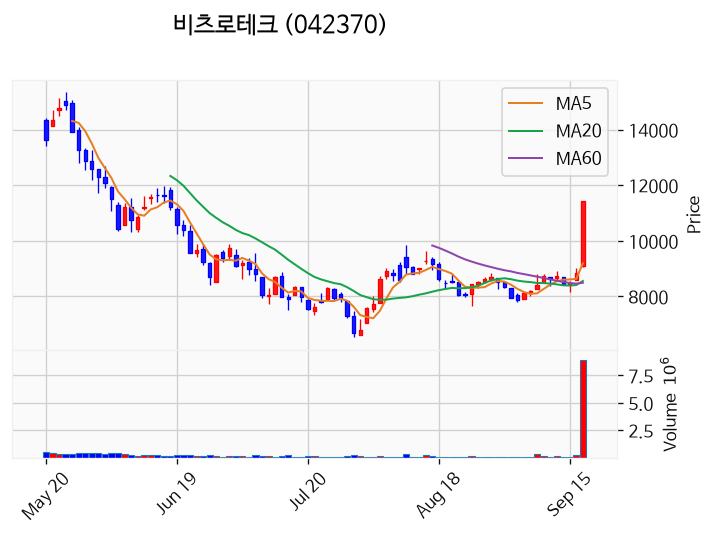

---

### 큐라티스 (상한가)
— 등락률 +29.96% / 거래량 28만 주

**◎ 관련기사**
_(관련기사 없음 / 미조회)_

**◎ 공시**
- _(공시 없음 / 미조회)_

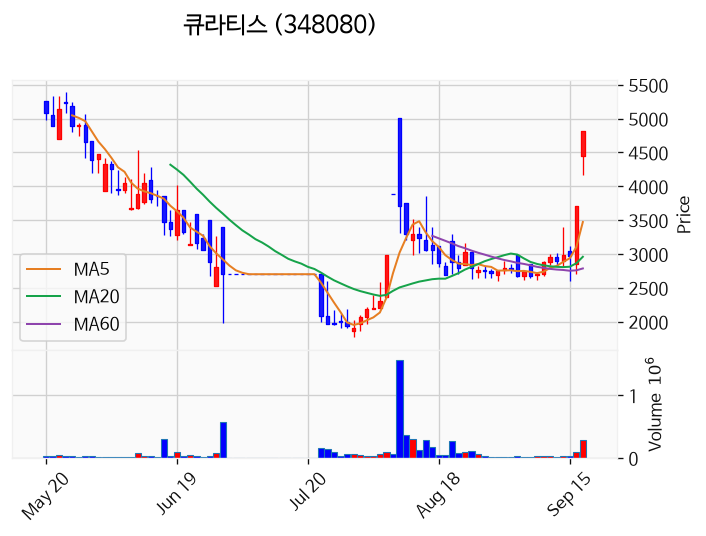

---

### 진양화학 (상한가)
— 등락률 +29.94% / 거래량 447만 주

**◎ 관련기사**
_(관련기사 없음 / 미조회)_

**◎ 공시**
- _(공시 없음 / 미조회)_

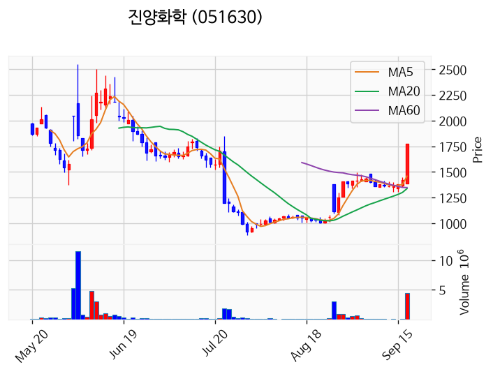

---

### 진영 (상한가)
— 등락률 +29.93% / 거래량 94만 주

**◎ 관련기사**
- [전국 섬 주민 여수 집결… “2026여수세계섬박람회, 섬을 세계로 알리는 무대”](https://news.google.com/rss/articles/CBMiakFVX3lxTFBKbXZ4amZBOEZQck9ZZjVTeVN3NDE0VFhiSmVsT2QzcmUtWXlCRS1IbVZ4R29aS1hJUjF0b1dBaE1TLU5YRU5BdzN6OHdZZjlpdjZ2clJkYzNDRmtQYmE5azMtSTM4RHl4SXc?oc=5) — 비즈월드, 2026-09-17

**◎ 공시**
- _(공시 없음 / 미조회)_

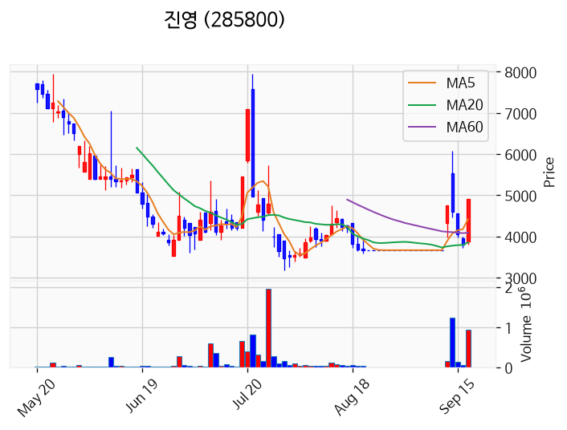

---

### 나라스페이스테크놀로지 (상한가)
— 등락률 +29.92% / 거래량 138만 주

**◎ 관련기사**
- [[테마 제안] 스타십 궤도비행주 — judal 미등록 신규 테마](https://news.google.com/rss/articles/CBMidkFVX3lxTFB5d1o1bnZUX0pEeHYwVFNuVENtSXlGQ3V3Nkh4MFdlQ0Vqa2xvZk9XUWpKZXVBbVkwS3Q2UDEzTXhKNktYVUQwODVXeXA4Y2hRVXp6cGRxalVmdlo2ZU1xSDFwMDZjdEl4ckkwQm5ZdVJzcmc4SkE?oc=5) — judal.co.kr, 2026-09-17

**◎ 공시**
- _(공시 없음 / 미조회)_

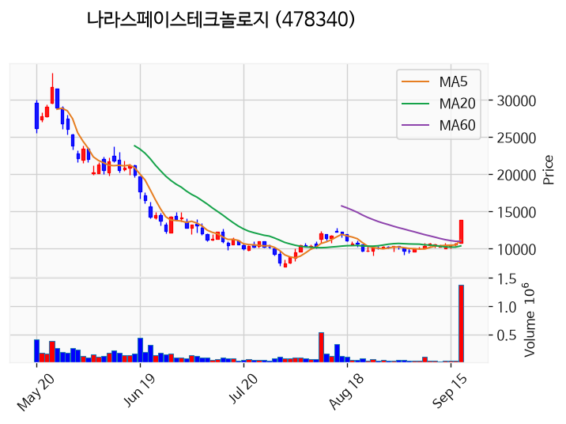

---

### 한켐 (상한가)
— 등락률 +29.91% / 거래량 1,446만 주

**◎ 관련기사**
_(관련기사 없음 / 미조회)_

**◎ 공시**
- _(공시 없음 / 미조회)_

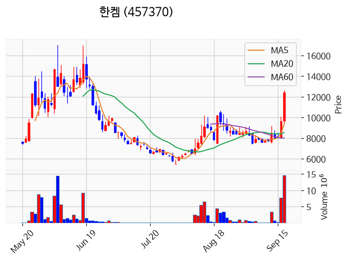

---

### 앤씨앤 (상한가)
— 등락률 +29.89% / 거래량 5만 주

**◎ 관련기사**
- [메가존클라우드, AI 기반 장애 대응 자동화 방안 제시 - 조선비즈](https://news.google.com/rss/articles/CBMiggFBVV95cUxNV3RUck5TMHZxc18taElVRWxMMzBrV09DblNpYlc5Z0hsNmVjYjZPaXlwWUxJNzlOMm5iaXZZSWZGWkVFTGlycFJMdXozVXh4ZlA2N3M4OFVfbU9sUHljMTVGbGVHSTZ3SElWcUl1TzZ4aWZpaDRGUEtTN3NCdXRicXNn0gGWAUFVX3lxTE5QSGtrWlJWNl82T1Vpcl9qLTJ3TkxwdVliNlpBM3Rqd1ZUbC1JdUU0MnJLQnE0dWp4Zm5aV3VIUTAyVk93UFR1cmZteVpHLWpEWExuV3hjTmVoV1ZGLU56ZjFCeGthT2t2RTNYQXJzLWc2LWVmT18ya1lmcnIxWmNHSl9ORE9KZU5aMXE2U0ZXcTZyOVNidw?oc=5) — Chosunbiz, 2026-09-17

**◎ 공시**
- _(공시 없음 / 미조회)_

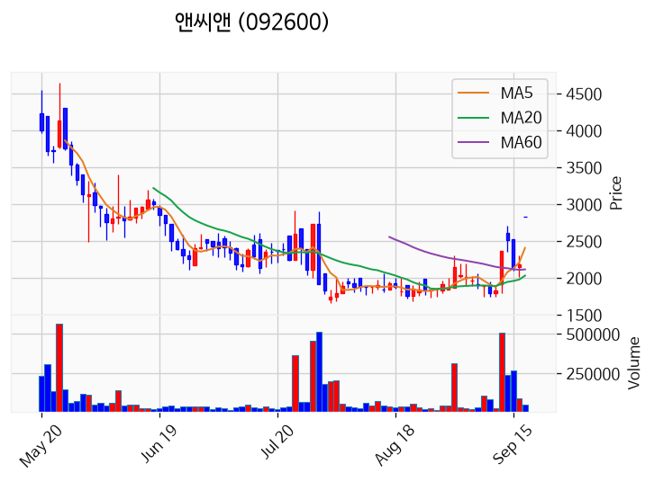

---

### 센서뷰 (거래량 급증)
— 등락률 +20.76% / 거래량 3,297만 주

**◎ 관련기사**
_(관련기사 없음 / 미조회)_

**◎ 공시**
- _(공시 없음 / 미조회)_

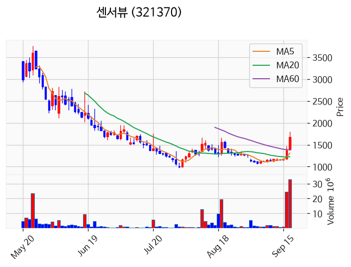

---

### 미투온 (거래량 급증)
— 등락률 +19.14% / 거래량 7,238만 주

**◎ 관련기사**
_(관련기사 없음 / 미조회)_

**◎ 공시**
- _(공시 없음 / 미조회)_

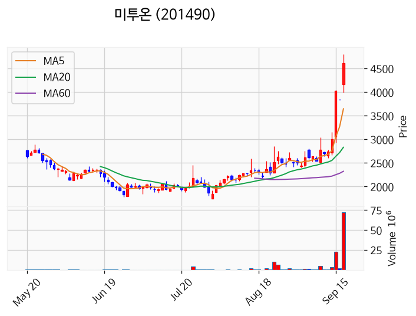

---

### 성호전자 (거래량 급증)
— 등락률 +17.73% / 거래량 1,416만 주

**◎ 관련기사**
_(관련기사 없음 / 미조회)_

**◎ 공시**
- _(공시 없음 / 미조회)_

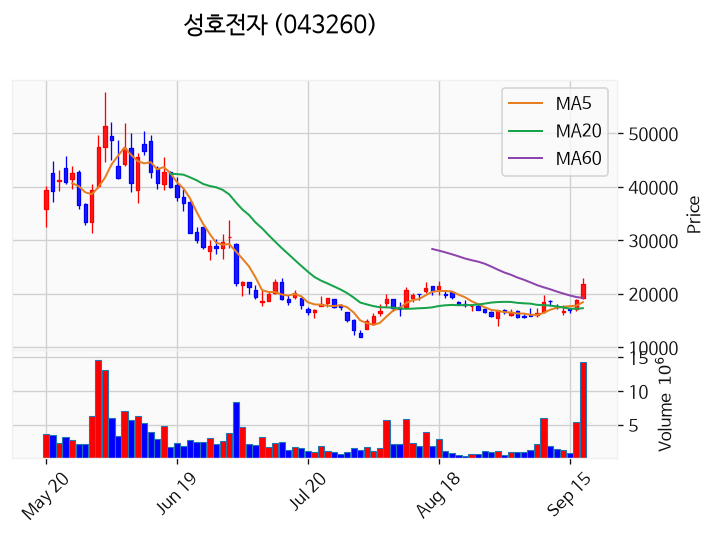

---

### 아주IB투자 (거래량 급증)
— 등락률 +10.57% / 거래량 2,646만 주

**◎ 관련기사**
- [코스피 6,715선 약보합 마감…코스닥은 3거래일 연속 상승](https://news.google.com/rss/articles/CBMickFVX3lxTE5Udk44aWhZcjFnV2p4amUtSkZpWFZ1a0t1WGItMEdtaDhfamRMVFdud3IzODJMeGNMSEFJY1pReVJOM29JOUg3V0NaeF9ja2dsS1FQaDdrRlJ4emNPazFYOEdjNFlvMlJMVXpoNEZ1ZC04UQ?oc=5) — 스페셜타임스, 2026-09-17

**◎ 공시**
- _(공시 없음 / 미조회)_

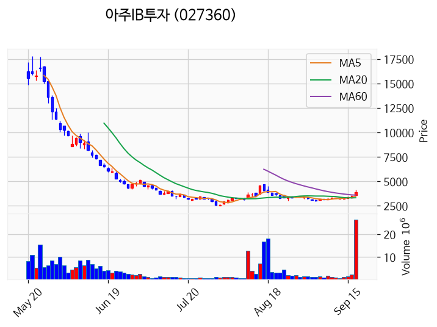

---

### SV인베스트먼트 (거래량 급증)
— 등락률 +5.57% / 거래량 1,188만 주

**◎ 관련기사**
_(관련기사 없음 / 미조회)_

**◎ 공시**
- _(공시 없음 / 미조회)_

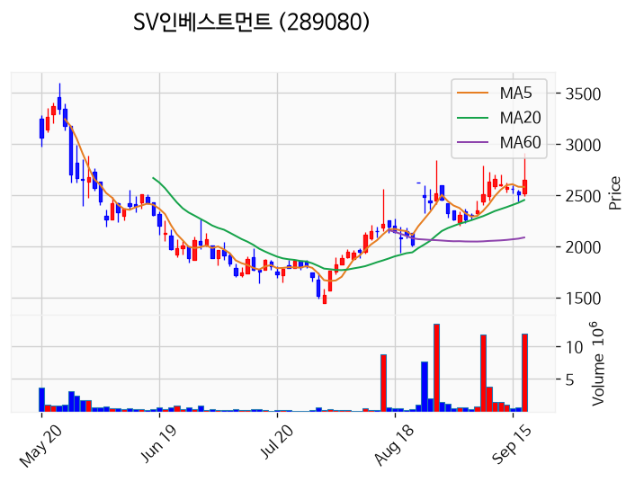

---

### 현대약품 (거래량 급증)
— 등락률 +4.61% / 거래량 1,667만 주

**◎ 관련기사**
- [양 제약지수 동반 상승, 오스코텍 9.02% ↑](https://news.google.com/rss/articles/CBMiZ0FVX3lxTFAwN2NNSm1CRm9FeXk0OTk1YnlweTVQZ3B5ZncxSk93SFphZ1BucXJDTVZEaDVLX2xfUlZKTTZmM2VhZm52QzlPYkdyNVlxZlNFelJjNjUzUU1KZGhIV3FPbE5WWGcxem8?oc=5) — 의약뉴스, 2026-09-17

**◎ 공시**
- _(공시 없음 / 미조회)_

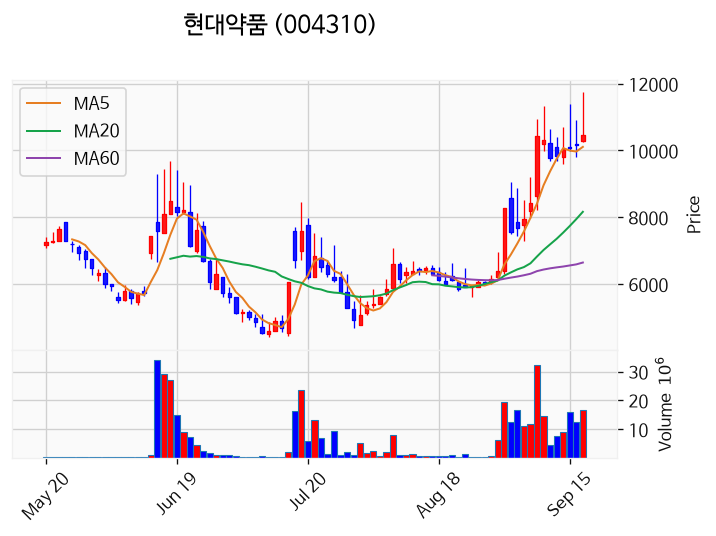

---

### 동국산업 (거래량 급증)
— 등락률 +4.15% / 거래량 1,063만 주

**◎ 관련기사**
_(관련기사 없음 / 미조회)_

**◎ 공시**
- _(공시 없음 / 미조회)_

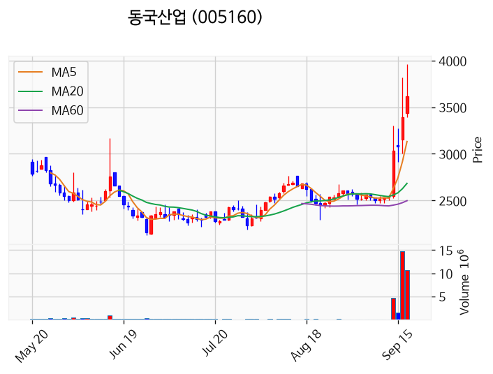

---

### JW신약 (거래량 급증)
— 등락률 +1.43% / 거래량 1,052만 주

**◎ 관련기사**
_(관련기사 없음 / 미조회)_

**◎ 공시**
- _(공시 없음 / 미조회)_

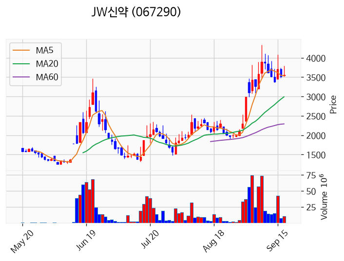

---

### 삼성전자 (거래량 급증)
— 등락률 +0.20% / 거래량 1,144만 주

**◎ 관련기사**
- [삼성전자 대출 호재에 화성 신규 분양도 흥행 기대](https://news.google.com/rss/articles/CBMickFVX3lxTE5yRTJybjg5TUphYnhwbnFHNGJHYkdfOWxHU3NCcnBsVDJ6cWlKTkxGdS1VV0o4dHhLUUNMQlFhMzRVVkx3TF91d3UtaVF1SmhJSmIyU0tDb29kM0xrakQ2Zld6elVNdm43NFY2Ny05Z1Fvd9IBZkFVX3lxTE1DcVF5eHJPdjVxUGJqeWFJSTBjdFdvOU92cklObFFUUW1MS1NFbE9KSXg1ZlNqaTZ1TGFCbWtuTG5uSGxMdllUaHMzVlNFTWgweWVWUFYxSTYtQjViSDc3VTdqTVlYZw?oc=5) — 동아일보, 2026-09-17

**◎ 공시**
- [임원ㆍ주요주주특정증권등소유상황보고서](https://dart.fss.or.kr/dsaf001/main.do?rcpNo=20260917000097) — 신제윤, 20260917

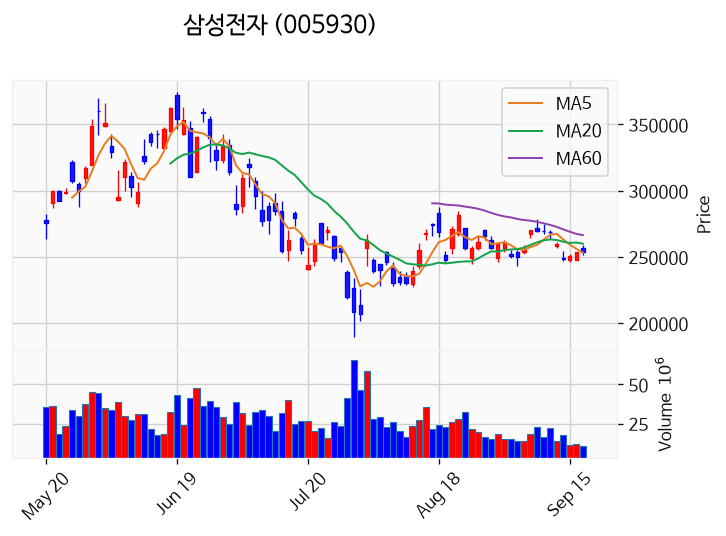

---

### 넷마블 (거래량 급증)
— 등락률 +0.00% / 거래량 1,124만 주

**◎ 관련기사**
- [[도쿄게임쇼 2026] 넷마블, 신작 '펄인블루' 첫 공개](https://news.google.com/rss/articles/CBMiS0FVX3lxTE5SZWNxOWJLaUdVOVFWbjI3c3hMcXVUVzF2RkxDQ2p5Y3NPM1dNOUhiRExMRklLQTBaOVdGaVg5Q1huUE5rUGt1R3Zxdw?oc=5) — 아이뉴스24, 2026-09-17

**◎ 공시**
- _(공시 없음 / 미조회)_

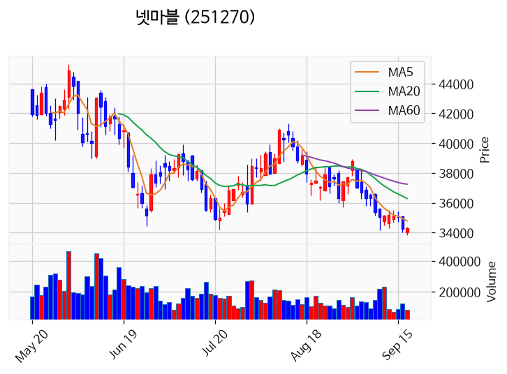

---

### 대한광통신 (거래량 급증)
— 등락률 +0.00% / 거래량 2,206만 주

**◎ 관련기사**
_(관련기사 없음 / 미조회)_

**◎ 공시**
- _(공시 없음 / 미조회)_

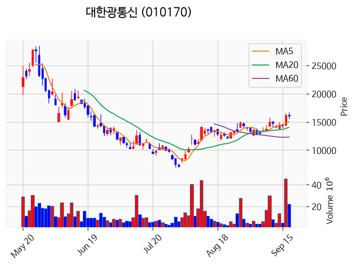

---

### 아이티센피엔에스 (거래량 급증)
— 등락률 -3.02% / 거래량 1,238만 주

**◎ 관련기사**
_(관련기사 없음 / 미조회)_

**◎ 공시**
- _(공시 없음 / 미조회)_

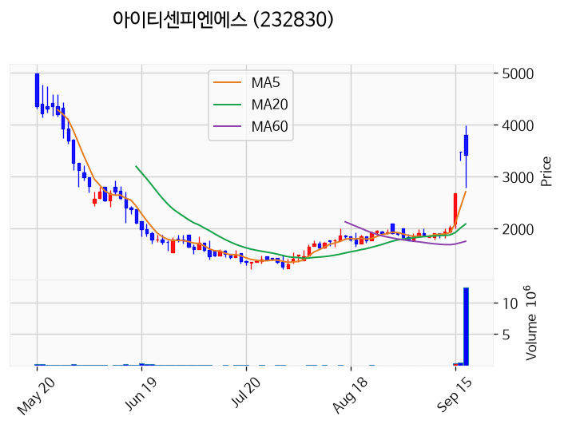

---

### 빛과전자 (거래량 급증)
— 등락률 -7.14% / 거래량 1,295만 주

**◎ 관련기사**
- [두산, 하이엔드 CCL에 사상 최대 9700억원 투자](https://news.google.com/rss/articles/CBMiZEFVX3lxTFBxWkRPd043R2p3MHA1Q3V5WFVRTlIzTnQ0UHUwbHJ4UDN0WV95QUVhNTZfN0hIcjlUZDE1czZXeHlCOVBoTThNUEVHMmt6U3Zrb3o0NElBdkVkcE04Tk90SFNyd2E?oc=5) — 서울경제TV, 2026-09-17

**◎ 공시**
- _(공시 없음 / 미조회)_

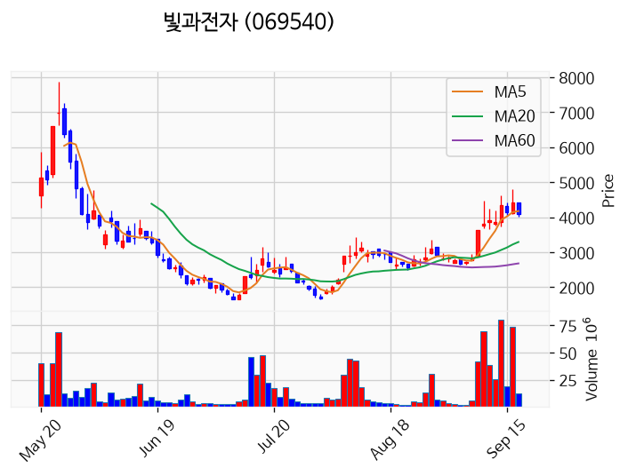

---

### 원풍물산 (거래량 급증)
— 등락률 -23.21% / 거래량 1,019만 주

**◎ 관련기사**
- [[52주 최저가] 모나용평, 전일비 1.33%↓... 현재가 1,930원](https://news.google.com/rss/articles/CBMiYkFVX3lxTE9BSUE3VVFRelk4QUF5U011a29xeExUSXd2cjB6Wm94azRRSXpsU3FwSEJMZG9lVTBBckZEZms2Tk8tVW9xb3FvODBLYkZjVmlKeEktcWRTZDFxOFczTFNPZVBB?oc=5) — 버핏연구소, 2026-09-17

**◎ 공시**
- _(공시 없음 / 미조회)_

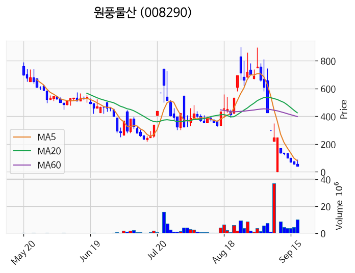

---

### 코스나인 (거래량 급증)
— 등락률 -33.33% / 거래량 3,015만 주

**◎ 관련기사**
- [[52주 최저가] 모나용평, 전일비 1.33%↓... 현재가 1,930원](https://news.google.com/rss/articles/CBMiYkFVX3lxTE9BSUE3VVFRelk4QUF5U011a29xeExUSXd2cjB6Wm94azRRSXpsU3FwSEJMZG9lVTBBckZEZms2Tk8tVW9xb3FvODBLYkZjVmlKeEktcWRTZDFxOFczTFNPZVBB?oc=5) — 버핏연구소, 2026-09-17

**◎ 공시**
- _(공시 없음 / 미조회)_

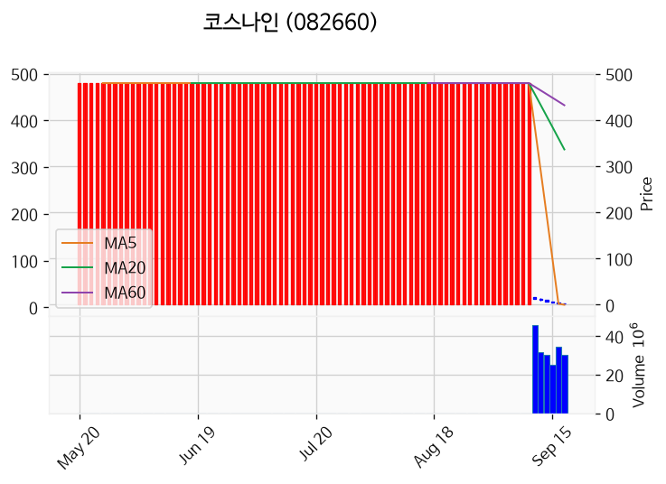

---

## 2. 거래량 폭증 후 급감 패턴 종목
_(폭증 전일 대비 500~1000%, 급감 전일 대비 25% 이하, 급감일 종가가 5일선 대비 -3% 이내)_

### 페스카로
- 폭증일: 2026-09-15, 거래량 162만 주 (전일 대비 848%)
- 급감일: 2026-09-17, 거래량 17만 주 (전일 대비 24%)
- 급감일 종가 8,120원 / 5일선 6,770원 (이격률 +19.94%)

### 동일제강
- 폭증일: 2026-09-16, 거래량 3만 주 (전일 대비 646%)
- 급감일: 2026-09-17, 거래량 0만 주 (전일 대비 14%)
- 급감일 종가 1,444원 / 5일선 1,141원 (이격률 +26.56%)

### 교보18호스팩
- 폭증일: 2026-09-16, 거래량 0만 주 (전일 대비 537%)
- 급감일: 2026-09-17, 거래량 0만 주 (전일 대비 3%)
- 급감일 종가 2,000원 / 5일선 1,604원 (이격률 +24.69%)

### 삼영전자
- 폭증일: 2026-09-16, 거래량 11만 주 (전일 대비 565%)
- 급감일: 2026-09-17, 거래량 2만 주 (전일 대비 16%)
- 급감일 종가 12,480원 / 5일선 9,872원 (이격률 +26.42%)

### 신영와코루
- 폭증일: 2026-09-16, 거래량 1만 주 (전일 대비 559%)
- 급감일: 2026-09-17, 거래량 0만 주 (전일 대비 2%)
- 급감일 종가 13,570원 / 5일선 10,808원 (이격률 +25.56%)

### 한국전자홀딩스
- 폭증일: 2026-09-16, 거래량 17만 주 (전일 대비 612%)
- 급감일: 2026-09-17, 거래량 1만 주 (전일 대비 9%)
- 급감일 종가 1,939원 / 5일선 1,516원 (이격률 +27.89%)

### 금비
- 폭증일: 2026-09-16, 거래량 0만 주 (전일 대비 589%)
- 급감일: 2026-09-17, 거래량 0만 주 (전일 대비 24%)
- 급감일 종가 40,950원 / 5일선 32,320원 (이격률 +26.70%)

### 골드앤에스
- 폭증일: 2026-09-16, 거래량 343만 주 (전일 대비 634%)
- 급감일: 2026-09-17, 거래량 0만 주 (전일 대비 0%)
- 급감일 종가 384원 / 5일선 335원 (이격률 +14.70%)

### 바이오스마트
- 폭증일: 2026-09-16, 거래량 47만 주 (전일 대비 620%)
- 급감일: 2026-09-17, 거래량 9만 주 (전일 대비 19%)
- 급감일 종가 2,830원 / 5일선 2,206원 (이격률 +28.29%)

### 빌리언스
- 폭증일: 2026-09-16, 거래량 18만 주 (전일 대비 586%)
- 급감일: 2026-09-17, 거래량 1만 주 (전일 대비 7%)
- 급감일 종가 3,475원 / 5일선 2,779원 (이격률 +25.04%)

### 잉크테크
- 폭증일: 2026-09-15, 거래량 1만 주 (전일 대비 560%)
- 급감일: 2026-09-17, 거래량 0만 주 (전일 대비 6%)
- 급감일 종가 3,450원 / 5일선 2,759원 (이격률 +25.05%)

### 세동
- 폭증일: 2026-09-15, 거래량 3만 주 (전일 대비 845%)
- 급감일: 2026-09-17, 거래량 1만 주 (전일 대비 24%)
- 급감일 종가 1,254원 / 5일선 1,000원 (이격률 +25.40%)

### 한국첨단소재
- 폭증일: 2026-09-15, 거래량 4,367만 주 (전일 대비 946%)
- 급감일: 2026-09-17, 거래량 432만 주 (전일 대비 14%)
- 급감일 종가 3,080원 / 5일선 2,480원 (이격률 +24.19%)

### 에프알텍
- 폭증일: 2026-09-16, 거래량 18만 주 (전일 대비 892%)
- 급감일: 2026-09-17, 거래량 3만 주 (전일 대비 18%)
- 급감일 종가 2,600원 / 5일선 2,009원 (이격률 +29.42%)

### 이상네트웍스
- 폭증일: 2026-09-16, 거래량 1만 주 (전일 대비 875%)
- 급감일: 2026-09-17, 거래량 0만 주 (전일 대비 24%)
- 급감일 종가 7,560원 / 5일선 5,908원 (이격률 +27.96%)

### 광동헬스바이오
- 폭증일: 2026-09-16, 거래량 0만 주 (전일 대비 920%)
- 급감일: 2026-09-17, 거래량 0만 주 (전일 대비 24%)
- 급감일 종가 879원 / 5일선 700원 (이격률 +25.61%)

### 덕신이피씨
- 폭증일: 2026-09-16, 거래량 3만 주 (전일 대비 664%)
- 급감일: 2026-09-17, 거래량 1만 주 (전일 대비 20%)
- 급감일 종가 3,530원 / 5일선 2,831원 (이격률 +24.69%)

### 신화프리텍
- 폭증일: 2026-09-15, 거래량 52만 주 (전일 대비 934%)
- 급감일: 2026-09-17, 거래량 6만 주 (전일 대비 16%)
- 급감일 종가 1,937원 / 5일선 1,494원 (이격률 +29.67%)

### 동국S&C
- 폭증일: 2026-09-16, 거래량 692만 주 (전일 대비 857%)
- 급감일: 2026-09-17, 거래량 119만 주 (전일 대비 17%)
- 급감일 종가 1,429원 / 5일선 1,131원 (이격률 +26.35%)

### 머큐리
- 폭증일: 2026-09-16, 거래량 430만 주 (전일 대비 515%)
- 급감일: 2026-09-17, 거래량 79만 주 (전일 대비 18%)
- 급감일 종가 4,675원 / 5일선 3,761원 (이격률 +24.30%)

### 우양에이치씨
- 폭증일: 2026-09-16, 거래량 2만 주 (전일 대비 786%)
- 급감일: 2026-09-17, 거래량 0만 주 (전일 대비 6%)
- 급감일 종가 9,340원 / 5일선 7,640원 (이격률 +22.25%)

### 카티스
- 폭증일: 2026-09-15, 거래량 301만 주 (전일 대비 578%)
- 급감일: 2026-09-17, 거래량 119만 주 (전일 대비 12%)
- 급감일 종가 2,965원 / 5일선 2,423원 (이격률 +22.37%)

### 에이치와이티씨
- 폭증일: 2026-09-16, 거래량 2만 주 (전일 대비 865%)
- 급감일: 2026-09-17, 거래량 1만 주 (전일 대비 24%)
- 급감일 종가 3,210원 / 5일선 2,492원 (이격률 +28.81%)

### 애드바이오텍
- 폭증일: 2026-09-16, 거래량 61만 주 (전일 대비 886%)
- 급감일: 2026-09-17, 거래량 5만 주 (전일 대비 8%)
- 급감일 종가 1,851원 / 5일선 1,570원 (이격률 +17.90%)

### 해성디에스
- 폭증일: 2026-09-16, 거래량 58만 주 (전일 대비 858%)
- 급감일: 2026-09-17, 거래량 13만 주 (전일 대비 22%)
- 급감일 종가 54,400원 / 5일선 41,800원 (이격률 +30.14%)

### 타이거일렉
- 폭증일: 2026-09-16, 거래량 15만 주 (전일 대비 591%)
- 급감일: 2026-09-17, 거래량 4만 주 (전일 대비 25%)
- 급감일 종가 71,800원 / 5일선 56,060원 (이격률 +28.08%)

### LS에코에너지
- 폭증일: 2026-09-16, 거래량 104만 주 (전일 대비 749%)
- 급감일: 2026-09-17, 거래량 24만 주 (전일 대비 24%)
- 급감일 종가 53,200원 / 5일선 41,560원 (이격률 +28.01%)

### 질경이
- 폭증일: 2026-09-15, 거래량 0만 주 (전일 대비 561%)
- 급감일: 2026-09-17, 거래량 0만 주 (전일 대비 2%)
- 급감일 종가 805원 / 5일선 607원 (이격률 +32.53%)

### 에스트래픽
- 폭증일: 2026-09-16, 거래량 110만 주 (전일 대비 694%)
- 급감일: 2026-09-17, 거래량 19만 주 (전일 대비 17%)
- 급감일 종가 3,015원 / 5일선 2,461원 (이격률 +22.51%)

### 아시아나IDT
- 폭증일: 2026-09-15, 거래량 3만 주 (전일 대비 734%)
- 급감일: 2026-09-17, 거래량 1만 주 (전일 대비 8%)
- 급감일 종가 9,180원 / 5일선 7,334원 (이격률 +25.17%)

### 모아데이타
- 폭증일: 2026-09-16, 거래량 886만 주 (전일 대비 722%)
- 급감일: 2026-09-17, 거래량 122만 주 (전일 대비 14%)
- 급감일 종가 270원 / 5일선 216원 (이격률 +25.12%)

### 씨피시스템
- 폭증일: 2026-09-15, 거래량 789만 주 (전일 대비 837%)
- 급감일: 2026-09-17, 거래량 242만 주 (전일 대비 9%)
- 급감일 종가 4,470원 / 5일선 3,546원 (이격률 +26.06%)

### 라메디텍
- 폭증일: 2026-09-16, 거래량 25만 주 (전일 대비 895%)
- 급감일: 2026-09-17, 거래량 3만 주 (전일 대비 10%)
- 급감일 종가 2,785원 / 5일선 2,148원 (이격률 +29.66%)

### 미래에셋비전스팩4호
- 폭증일: 2026-09-16, 거래량 0만 주 (전일 대비 744%)
- 급감일: 2026-09-17, 거래량 0만 주 (전일 대비 20%)
- 급감일 종가 2,075원 / 5일선 1,660원 (이격률 +25.00%)
