# 2026년 9월 18일 시황 노트

## 1. 상한가 / 거래량 1,000만주 이상 종목

### 동양 (상한가)
— 등락률 +29.97% / 거래량 502만 주

**◎ 관련기사**
- [남성 의류 쇼핑몰 ‘플라이데이’ 피해예방주의보](https://news.google.com/rss/articles/CBMiakFVX3lxTE5NemFOcTdyeEZ4LVBJSE5vSVVtQktNYm4xSUNYTmR5MHR2UXVUWkFMNnRzbWNSbmZXTDU4bUNpbDYyZDRyTjY2TlJwQ3BVQnJpMVFwYXJvU0lFNWYzaUxONUdFZFNXVmpHQlE?oc=5) — 동양뉴스, 2026-09-18

**◎ 공시**
- _(공시 없음 / 미조회)_

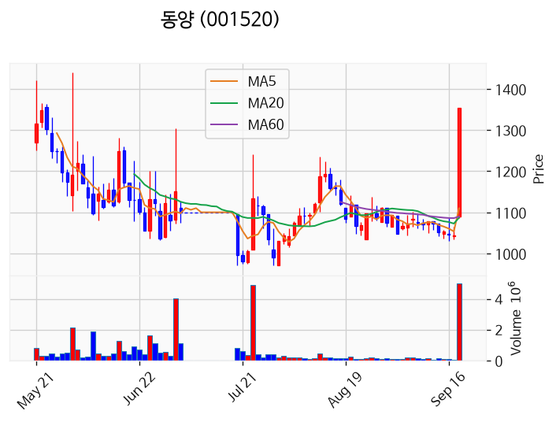

---

### 동양우 (상한가)
— 등락률 +29.96% / 거래량 3만 주

**◎ 관련기사**
_(관련기사 없음 / 미조회)_

**◎ 공시**
- _(공시 없음 / 미조회)_

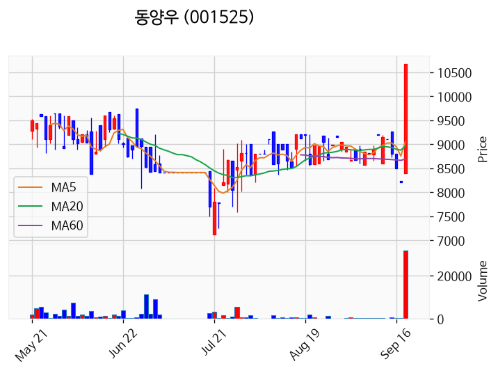

---

### 선도전기 (상한가)
— 등락률 +29.96% / 거래량 816만 주

**◎ 관련기사**
_(관련기사 없음 / 미조회)_

**◎ 공시**
- _(공시 없음 / 미조회)_

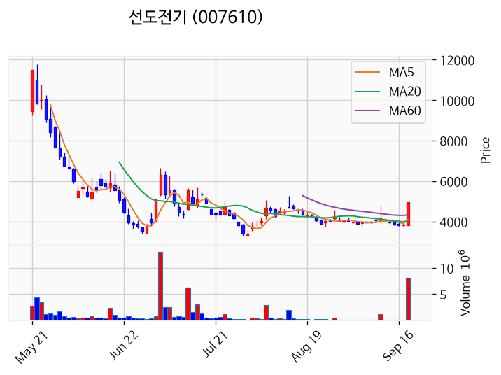

---

### DYP (상한가)
— 등락률 +29.95% / 거래량 42만 주

**◎ 관련기사**
_(관련기사 없음 / 미조회)_

**◎ 공시**
- _(공시 없음 / 미조회)_

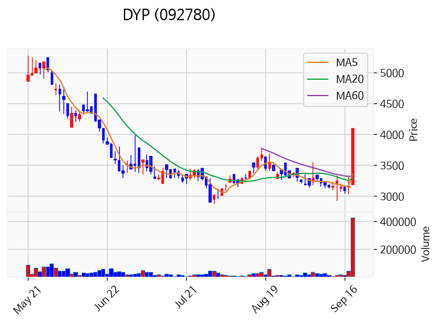

---

### 엔에프씨 (상한가)
— 등락률 +29.92% / 거래량 295만 주

**◎ 관련기사**
- [[코스닥 기관] 한양디지텍·RFHIC·두산테스나 ‘집중 매수’](https://news.google.com/rss/articles/CBMic0FVX3lxTE9zS0Y0NXBDeEZpOGhQc2R0Vk1IcjlBVWthNzhCYUcxOGk0dUdjZGRtd0EtNFhIR0dOVnRrRHdqZlhXb0lPRlRIU3hUdXExUkFLTWNkLWtFY2JJNzA1SUVsUmZxQ3pqVTN3NkZ3X0FkVXh6TFXSAXdBVV95cUxNNjUwMnEzZ3ZmSzFpM2p1OWxsdnkyWGtQZEx1UkU2cVozMndQUDI3aE55MDdUdHYwdU1PdkNPaXlzeUtDNHZ4VHR4VThVR3Nia1NCUnAxNXhpR29yU2sxVERYNHFVQmhwV2RFaVA4NXZodlVoMEJhQQ?oc=5) — pinpointnews.co.kr, 2026-09-18

**◎ 공시**
- _(공시 없음 / 미조회)_

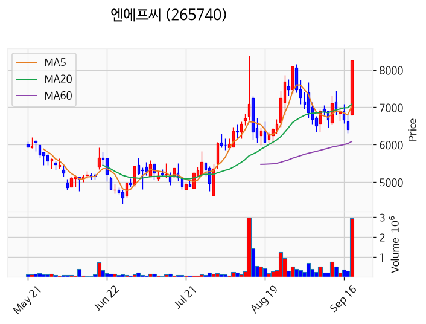

---

### 앤씨앤 (상한가)
— 등락률 +29.91% / 거래량 5만 주

**◎ 관련기사**
- ['인턴' 한소희, "'선우'처럼 완벽주의에 홀로 분투…깊게 공감해" [픽터뷰] - 조선비즈](https://news.google.com/rss/articles/CBMijgFBVV95cUxOR3Q5VnYxdjgxRC1wdTNtZTByNmZCR3RaWVc0M1dlVUxfNl9OcklST3FxQ1BySVFQUGFka2N5YlVZMFRPYnctek5fdWpZUnBmc3J1cGYxVUNnU0dWcTktaENGTXYzdVpuLUQ4OEJIX1BhbFpQZjRtU21rRlpxVXpaUGQ3QkRBTXBBZ1BhcDdR0gGiAUFVX3lxTFB0NHJ1ZVkwLVNTdnJNa3pjcVJVQXdISXlNSm96cGhBMDdjMXVDbmc2WVJfT1FlQ3BYcTVTRVQ2ZUVEckYxVndkczQ2eWlpcE5wQXhOdzFzbUM2djRPcmxWWnhXUDhXdllwdlM3RUxUVk9zS21MdHVhTW9ZcFdpX1A2Sm02a0JrSDJBNXBscnFtQmdYdkJaR0VRbGhsQ1RfeG5KUQ?oc=5) — Chosunbiz, 2026-09-18

**◎ 공시**
- [[기재정정]주요사항보고서(유상증자결정)](https://dart.fss.or.kr/dsaf001/main.do?rcpNo=20260918000282) — 앤씨앤, 20260918

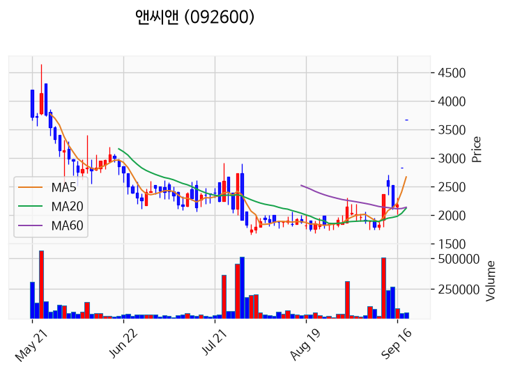

---

### 아이오케이이엔엠 (상한가)
— 등락률 +29.86% / 거래량 23만 주

**◎ 관련기사**
_(관련기사 없음 / 미조회)_

**◎ 공시**
- _(공시 없음 / 미조회)_

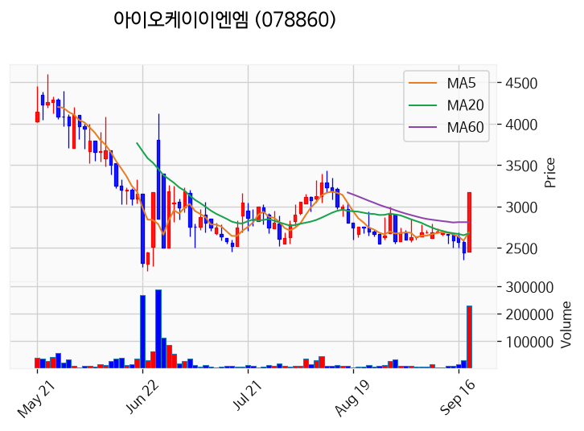

---

### 동양2우B (상한가)
— 등락률 +29.84% / 거래량 2만 주

**◎ 관련기사**
_(관련기사 없음 / 미조회)_

**◎ 공시**
- _(공시 없음 / 미조회)_

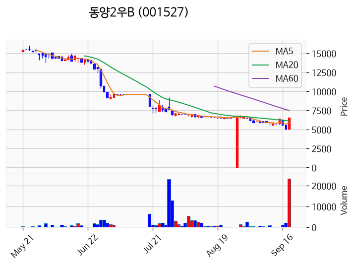

---

### 성호전자 (거래량 급증)
— 등락률 +23.84% / 거래량 1,943만 주

**◎ 관련기사**
- [[코스닥 기관] 한양디지텍·RFHIC·두산테스나 ‘집중 매수’](https://news.google.com/rss/articles/CBMic0FVX3lxTE9zS0Y0NXBDeEZpOGhQc2R0Vk1IcjlBVWthNzhCYUcxOGk0dUdjZGRtd0EtNFhIR0dOVnRrRHdqZlhXb0lPRlRIU3hUdXExUkFLTWNkLWtFY2JJNzA1SUVsUmZxQ3pqVTN3NkZ3X0FkVXh6TFXSAXdBVV95cUxNNjUwMnEzZ3ZmSzFpM2p1OWxsdnkyWGtQZEx1UkU2cVozMndQUDI3aE55MDdUdHYwdU1PdkNPaXlzeUtDNHZ4VHR4VThVR3Nia1NCUnAxNXhpR29yU2sxVERYNHFVQmhwV2RFaVA4NXZodlVoMEJhQQ?oc=5) — pinpointnews.co.kr, 2026-09-18

**◎ 공시**
- _(공시 없음 / 미조회)_

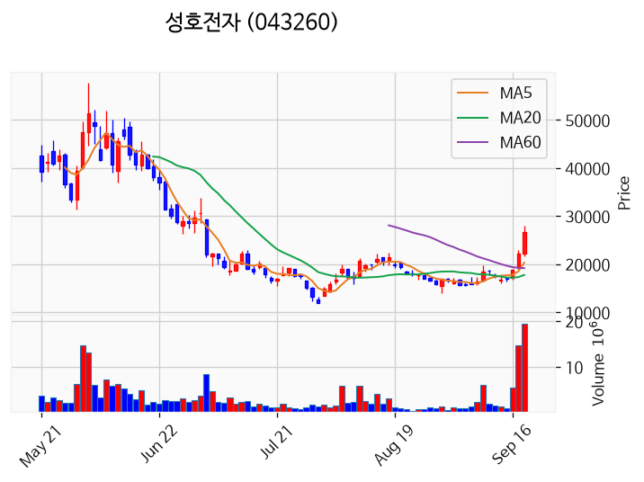

---

### 우리로 (거래량 급증)
— 등락률 +15.53% / 거래량 1,948만 주

**◎ 관련기사**
- [AI 모멘텀 회복에 코스피 2%대↑](https://news.google.com/rss/articles/CBMibEFVX3lxTE9KdWRnLVJRaDhjR3UtVmdwTUxsX2JTczZXZmRJaU03NW9WMHpoQ1M0UUxlakliZzZLc1Brckdnb0V5eFB2a2JHVDI4WjB6MkVIZ0p3R0xDSlJCUDBoNTZJNXFxeHJmWlNHMWppWA?oc=5) — KB Think, 2026-09-18

**◎ 공시**
- _(공시 없음 / 미조회)_

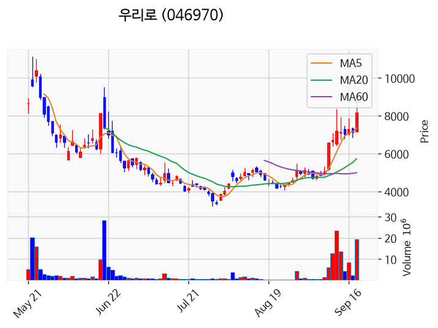

---

### 대한광통신 (거래량 급증)
— 등락률 +14.14% / 거래량 5,374만 주

**◎ 관련기사**
- [美 국채 금리·유가 부담 덜자 살아난 투심…코스피 2.66%↑[MTN 마감시황]](https://news.google.com/rss/articles/CBMiZEFVX3lxTE5qVFlXdlJmSldnZGJONGNWMXdlWmFzMnFDLVVzaU1mNjNwZWoyeDVTVHhWRjVtZ2NYbzVqUDMzaGVkZTJtdVh6X19kOUtFTlBFcl9MQVVVRlNvYlhkQWxfWC1HcHk?oc=5) — MTN 머니투데이방송, 2026-09-18

**◎ 공시**
- _(공시 없음 / 미조회)_

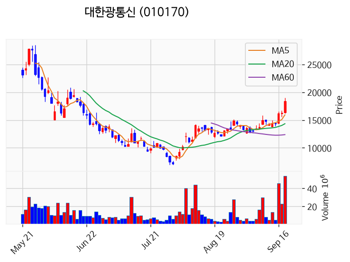

---

### 뷰티스킨 (거래량 급증)
— 등락률 +13.85% / 거래량 1,132만 주

**◎ 관련기사**
_(관련기사 없음 / 미조회)_

**◎ 공시**
- _(공시 없음 / 미조회)_

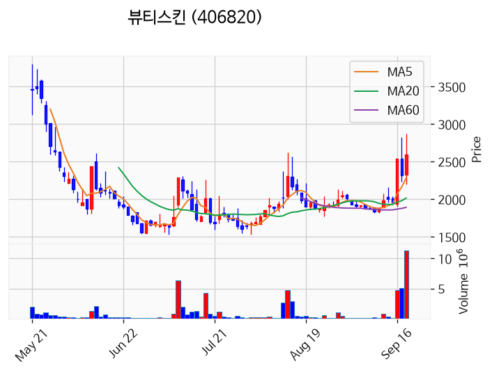

---

### 이노인스트루먼트 (거래량 급증)
— 등락률 +13.76% / 거래량 1,197만 주

**◎ 관련기사**
_(관련기사 없음 / 미조회)_

**◎ 공시**
- _(공시 없음 / 미조회)_

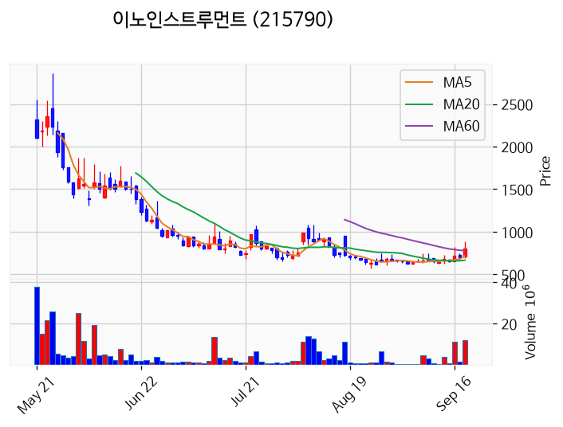

---

### KBI메탈 (거래량 급증)
— 등락률 +10.54% / 거래량 1,486만 주

**◎ 관련기사**
- [코스피, 삼성전자·SK하이닉스 급등에 6890선 껑충…코스닥 광통신·전력설비주 강세](https://news.google.com/rss/articles/CBMic0FVX3lxTE01TzduTkRGZS1oS0lCeUdLMHVlVElWWXNGT3JDREhHWHZIRUdDZUx4d1g4MnhoS2Q0c3U1THlmQXBfVmFfWjE3RXE1d0Q1WnpEa3VyZm1YUXIwZ05abzViYnJtM01yMEJiWU1pbzhXaUwtNGvSAXdBVV95cUxQV2wxcVVXWDVPQ1pKR3hSTWxralM0NzZYaU1aclBZUkI3NTJYelc1TFY1LUNveWFOVFNKZ01ha0x3SzNVT3AwWS1YYjZ2LWxyRmdGdlM4RVc2VFhXcTk2Mm5EUm5CeHM1M0VDYlU2blBVUUFNbk9MMA?oc=5) — pinpointnews.co.kr, 2026-09-18

**◎ 공시**
- _(공시 없음 / 미조회)_

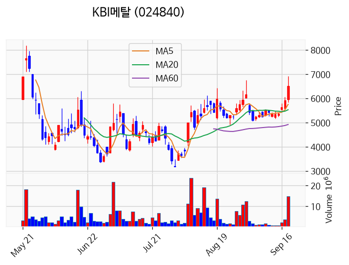

---

### 센서뷰 (거래량 급증)
— 등락률 +10.14% / 거래량 4,262만 주

**◎ 관련기사**
_(관련기사 없음 / 미조회)_

**◎ 공시**
- _(공시 없음 / 미조회)_

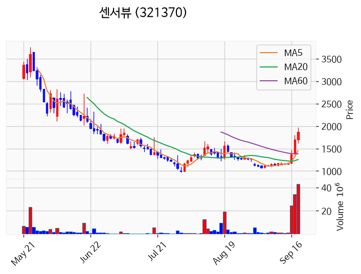

---

### 파미셀 (거래량 급증)
— 등락률 +9.59% / 거래량 1,013만 주

**◎ 관련기사**
_(관련기사 없음 / 미조회)_

**◎ 공시**
- _(공시 없음 / 미조회)_

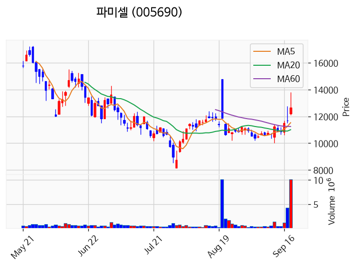

---

### 대원전선 (거래량 급증)
— 등락률 +8.32% / 거래량 1,153만 주

**◎ 관련기사**
- [[거래소 외국인] SK하이닉스 매수 폭발…삼성전자·두산에너빌리티는 매도](https://news.google.com/rss/articles/CBMic0FVX3lxTE12Q3JWN0hwRkFxeXk1bVkwajBqbXlMdFQzOTl1WFRKRmVmU1dxRHlaTTVZYVZWN2dOVDhhY2FxWlJyeExIQ2MzRmJqM2FvaTJHS0dFQUxOdDZJeWV2Nk1xbzVWZ2lpeDZYOU9fNGJMMHh6NGfSAXdBVV95cUxOamN3WG0yOG96aWxwNEZPRDVRV0Z6OEpxN29mZ2JSczlTZ1Uyb3JXNUZubk90MWozQk5qVWMyWXRmMzN1MEx2d1hDbTlwU0NiS2pWWHBoTFMyRjVaYXpYaEZLMlZuQWgyU3VuMFJaS3l4d0djV2d3Zw?oc=5) — pinpointnews.co.kr, 2026-09-18

**◎ 공시**
- _(공시 없음 / 미조회)_

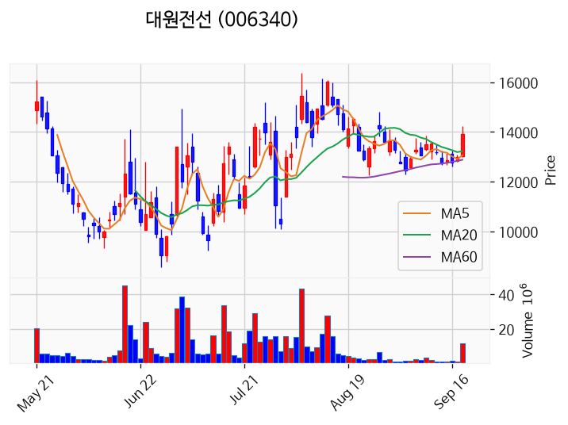

---

### 빛샘전자 (거래량 급증)
— 등락률 +5.85% / 거래량 1,435만 주

**◎ 관련기사**
- [코스피, 삼성전자·SK하이닉스 급등에 6890선 껑충…코스닥 광통신·전력설비주 강세](https://news.google.com/rss/articles/CBMic0FVX3lxTE01TzduTkRGZS1oS0lCeUdLMHVlVElWWXNGT3JDREhHWHZIRUdDZUx4d1g4MnhoS2Q0c3U1THlmQXBfVmFfWjE3RXE1d0Q1WnpEa3VyZm1YUXIwZ05abzViYnJtM01yMEJiWU1pbzhXaUwtNGvSAXdBVV95cUxQV2wxcVVXWDVPQ1pKR3hSTWxralM0NzZYaU1aclBZUkI3NTJYelc1TFY1LUNveWFOVFNKZ01ha0x3SzNVT3AwWS1YYjZ2LWxyRmdGdlM4RVc2VFhXcTk2Mm5EUm5CeHM1M0VDYlU2blBVUUFNbk9MMA?oc=5) — pinpointnews.co.kr, 2026-09-18

**◎ 공시**
- _(공시 없음 / 미조회)_

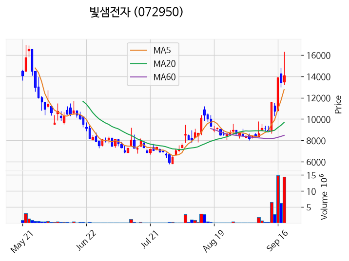

---

### 광전자 (거래량 급증)
— 등락률 +3.41% / 거래량 2,005만 주

**◎ 관련기사**
_(관련기사 없음 / 미조회)_

**◎ 공시**
- _(공시 없음 / 미조회)_

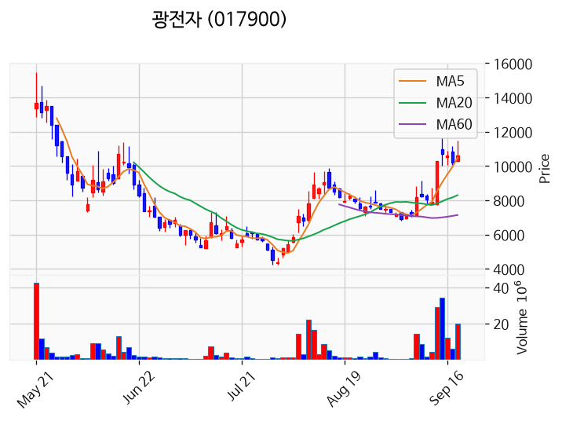

---

### 삼성전자 (거래량 급증)
— 등락률 +2.97% / 거래량 1,699만 주

**◎ 관련기사**
- [삼성전자 인도법인 "AI기술, 고가 가전에만 적용되지 않을 것"](https://news.google.com/rss/articles/CBMiT0FVX3lxTE9aREtNWWNjamt4a191ZGtJSlV3bEJvNzllbXoxUXh0Y25KU0R2eEZpc3E1Ylpob0d3QWNGZm5ITzBGWDNtdm1ldkpscDJOdlk?oc=5) — v.daum.net, 2026-09-18

**◎ 공시**
- [임원ㆍ주요주주특정증권등소유상황보고서](https://dart.fss.or.kr/dsaf001/main.do?rcpNo=20260918000212) — 조혜경, 20260918
- [임원ㆍ주요주주특정증권등소유상황보고서](https://dart.fss.or.kr/dsaf001/main.do?rcpNo=20260918000191) — 이혁재, 20260918

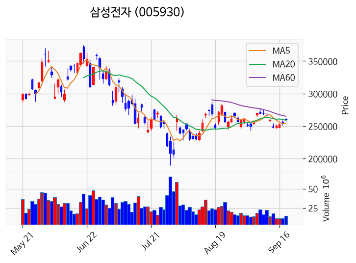

---

### 금호전기 (거래량 급증)
— 등락률 +2.54% / 거래량 1,048만 주

**◎ 관련기사**
_(관련기사 없음 / 미조회)_

**◎ 공시**
- _(공시 없음 / 미조회)_

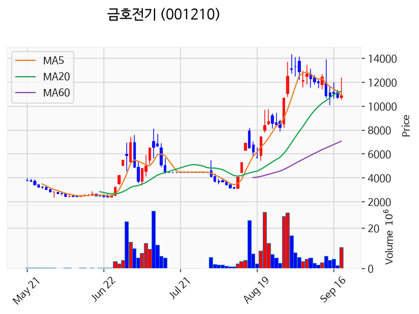

---

### 빛과전자 (거래량 급증)
— 등락률 +0.12% / 거래량 1,838만 주

**◎ 관련기사**
- [코스피, 삼성전자·SK하이닉스 급등에 6890선 껑충…코스닥 광통신·전력설비주 강세](https://news.google.com/rss/articles/CBMic0FVX3lxTE01TzduTkRGZS1oS0lCeUdLMHVlVElWWXNGT3JDREhHWHZIRUdDZUx4d1g4MnhoS2Q0c3U1THlmQXBfVmFfWjE3RXE1d0Q1WnpEa3VyZm1YUXIwZ05abzViYnJtM01yMEJiWU1pbzhXaUwtNGvSAXdBVV95cUxQV2wxcVVXWDVPQ1pKR3hSTWxralM0NzZYaU1aclBZUkI3NTJYelc1TFY1LUNveWFOVFNKZ01ha0x3SzNVT3AwWS1YYjZ2LWxyRmdGdlM4RVc2VFhXcTk2Mm5EUm5CeHM1M0VDYlU2blBVUUFNbk9MMA?oc=5) — pinpointnews.co.kr, 2026-09-18

**◎ 공시**
- _(공시 없음 / 미조회)_

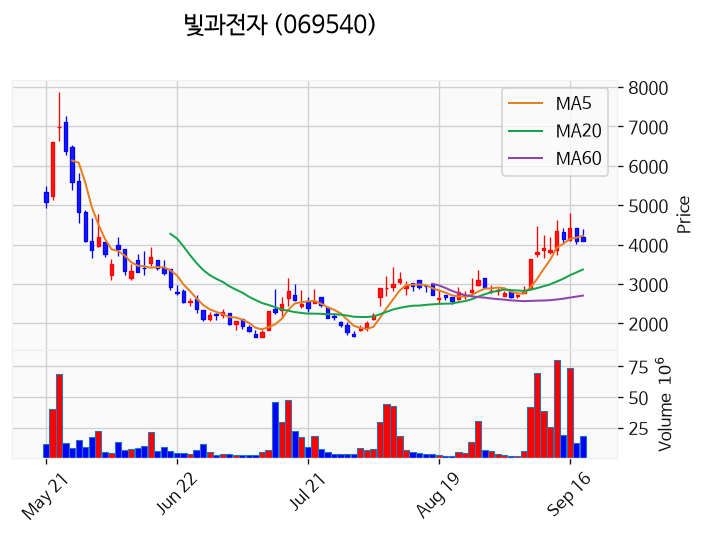

---

### 미투온 (거래량 급증)
— 등락률 -9.28% / 거래량 1,105만 주

**◎ 관련기사**
_(관련기사 없음 / 미조회)_

**◎ 공시**
- _(공시 없음 / 미조회)_

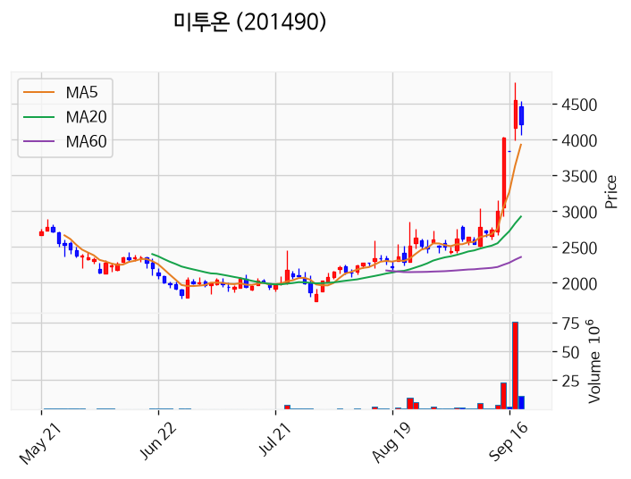

---

### 코스나인 (거래량 급증)
— 등락률 -50.00% / 거래량 5,682만 주

**◎ 관련기사**
_(관련기사 없음 / 미조회)_

**◎ 공시**
- _(공시 없음 / 미조회)_

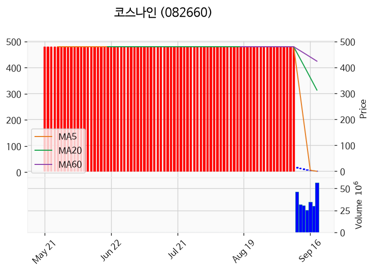

---

## 2. 거래량 폭증 후 급감 패턴 종목
_(폭증 전일 대비 500~1000%, 급감 전일 대비 25% 이하, 급감일 종가가 5일선 대비 -3% 이내)_

### 티웨이홀딩스
- 폭증일: 2026-09-17, 거래량 15만 주 (전일 대비 758%)
- 급감일: 2026-09-18, 거래량 0만 주 (전일 대비 0%)
- 급감일 종가 1,063원 / 5일선 1,075원 (이격률 -1.15%)

### 크라운해태홀딩스우
- 폭증일: 2026-09-15, 거래량 0만 주 (전일 대비 711%)
- 급감일: 2026-09-18, 거래량 0만 주 (전일 대비 5%)
- 급감일 종가 5,190원 / 5일선 5,130원 (이격률 +1.17%)

### 호텔신라우
- 폭증일: 2026-09-17, 거래량 0만 주 (전일 대비 770%)
- 급감일: 2026-09-18, 거래량 0만 주 (전일 대비 13%)
- 급감일 종가 28,050원 / 5일선 28,180원 (이격률 -0.46%)

### 대림제지
- 폭증일: 2026-09-17, 거래량 2만 주 (전일 대비 856%)
- 급감일: 2026-09-18, 거래량 0만 주 (전일 대비 0%)
- 급감일 종가 10,800원 / 5일선 10,810원 (이격률 -0.09%)

### 세원물산
- 폭증일: 2026-09-16, 거래량 0만 주 (전일 대비 935%)
- 급감일: 2026-09-18, 거래량 0만 주 (전일 대비 11%)
- 급감일 종가 8,330원 / 5일선 8,476원 (이격률 -1.72%)

### 체시스
- 폭증일: 2026-09-16, 거래량 5만 주 (전일 대비 508%)
- 급감일: 2026-09-18, 거래량 3만 주 (전일 대비 24%)
- 급감일 종가 4,690원 / 5일선 4,479원 (이격률 +4.71%)

### 해성산업1우
- 폭증일: 2026-09-15, 거래량 0만 주 (전일 대비 601%)
- 급감일: 2026-09-18, 거래량 0만 주 (전일 대비 13%)
- 급감일 종가 6,030원 / 5일선 5,984원 (이격률 +0.77%)

### 현대에버다임
- 폭증일: 2026-09-17, 거래량 14만 주 (전일 대비 783%)
- 급감일: 2026-09-18, 거래량 3만 주 (전일 대비 23%)
- 급감일 종가 6,760원 / 5일선 6,650원 (이격률 +1.65%)

### 케이피엠테크
- 폭증일: 2026-09-17, 거래량 4만 주 (전일 대비 819%)
- 급감일: 2026-09-18, 거래량 1만 주 (전일 대비 22%)
- 급감일 종가 5,130원 / 5일선 4,836원 (이격률 +6.08%)

### 아이컴포넌트
- 폭증일: 2026-09-17, 거래량 13만 주 (전일 대비 703%)
- 급감일: 2026-09-18, 거래량 2만 주 (전일 대비 17%)
- 급감일 종가 6,510원 / 5일선 6,498원 (이격률 +0.18%)

### 이글루
- 폭증일: 2026-09-17, 거래량 44만 주 (전일 대비 862%)
- 급감일: 2026-09-18, 거래량 10만 주 (전일 대비 24%)
- 급감일 종가 6,220원 / 5일선 5,972원 (이격률 +4.15%)

### 에스디시스템
- 폭증일: 2026-09-17, 거래량 7만 주 (전일 대비 980%)
- 급감일: 2026-09-18, 거래량 2만 주 (전일 대비 24%)
- 급감일 종가 2,700원 / 5일선 2,676원 (이격률 +0.90%)

### 아이디스
- 폭증일: 2026-09-17, 거래량 1만 주 (전일 대비 970%)
- 급감일: 2026-09-18, 거래량 0만 주 (전일 대비 18%)
- 급감일 종가 16,680원 / 5일선 16,134원 (이격률 +3.38%)

### 듀켐바이오
- 폭증일: 2026-09-17, 거래량 12만 주 (전일 대비 815%)
- 급감일: 2026-09-18, 거래량 2만 주 (전일 대비 14%)
- 급감일 종가 6,050원 / 5일선 5,954원 (이격률 +1.61%)

### 플레이디
- 폭증일: 2026-09-16, 거래량 8만 주 (전일 대비 701%)
- 급감일: 2026-09-18, 거래량 1만 주 (전일 대비 13%)
- 급감일 종가 2,275원 / 5일선 2,274원 (이격률 +0.04%)

### SK시그넷
- 폭증일: 2026-09-16, 거래량 1만 주 (전일 대비 722%)
- 급감일: 2026-09-18, 거래량 0만 주 (전일 대비 9%)
- 급감일 종가 8,130원 / 5일선 8,108원 (이격률 +0.27%)

### 크라운제과
- 폭증일: 2026-09-17, 거래량 4만 주 (전일 대비 711%)
- 급감일: 2026-09-18, 거래량 0만 주 (전일 대비 10%)
- 급감일 종가 7,770원 / 5일선 7,914원 (이격률 -1.82%)

### 셀비온
- 폭증일: 2026-09-17, 거래량 7만 주 (전일 대비 724%)
- 급감일: 2026-09-18, 거래량 2만 주 (전일 대비 21%)
- 급감일 종가 13,470원 / 5일선 13,212원 (이격률 +1.95%)

### 엘에이티
- 폭증일: 2026-09-16, 거래량 0만 주 (전일 대비 644%)
- 급감일: 2026-09-18, 거래량 0만 주 (전일 대비 9%)
- 급감일 종가 3,550원 / 5일선 3,535원 (이격률 +0.42%)

### 프로이천
- 폭증일: 2026-09-17, 거래량 81만 주 (전일 대비 928%)
- 급감일: 2026-09-18, 거래량 18만 주 (전일 대비 22%)
- 급감일 종가 1,765원 / 5일선 1,667원 (이격률 +5.87%)

### 크라우드웍스
- 폭증일: 2026-09-16, 거래량 101만 주 (전일 대비 844%)
- 급감일: 2026-09-18, 거래량 43만 주 (전일 대비 14%)
- 급감일 종가 1,530원 / 5일선 1,335원 (이격률 +14.62%)

### 에이치엠씨제7호스팩
- 폭증일: 2026-09-17, 거래량 1만 주 (전일 대비 669%)
- 급감일: 2026-09-18, 거래량 0만 주 (전일 대비 2%)
- 급감일 종가 2,060원 / 5일선 2,060원 (이격률 +0.00%)

### 비츠로넥스텍
- 폭증일: 2026-09-17, 거래량 92만 주 (전일 대비 858%)
- 급감일: 2026-09-18, 거래량 22만 주 (전일 대비 24%)
- 급감일 종가 11,420원 / 5일선 10,980원 (이격률 +4.01%)

### 디비금융제13호스팩
- 폭증일: 2026-09-17, 거래량 1만 주 (전일 대비 692%)
- 급감일: 2026-09-18, 거래량 0만 주 (전일 대비 1%)
- 급감일 종가 2,030원 / 5일선 2,033원 (이격률 -0.15%)
