# 2026년 9월 21일 시황 노트

## 1. 상한가 / 거래량 1,000만주 이상 종목

### 네오사피엔스 (상한가)
— 등락률 +268.50% / 거래량 3,715만 주

**◎ 관련기사**
- [네오사피엔스, 코스닥 입성…북미 공략·음성 AI 사업 확대](https://news.google.com/rss/articles/CBMiVkFVX3lxTFBzcEdqYXZmNzNOUnZtcjJxOXRsdVpYVlY5UVVBZ1hGampDZzZ2aVkzMWQweXJTeTM0enVoTzhfYTRRS0cwSkZPa0VPaFN3Wnp4R2Qtbkxn?oc=5) — 지디넷코리아, 2026-09-21

**◎ 공시**
- _(공시 없음 / 미조회)_

---

### 시그네틱스 (상한가)
— 등락률 +30.00% / 거래량 122만 주

**◎ 관련기사**
- [반도체 수출 259% 급증…소부장株 불기둥, 시그네틱스 '上'[핫종목]](https://news.google.com/rss/articles/CBMiT0FVX3lxTFBickFJeHk3Z2Utd2haUUhueVltRjUwQnQwZm1PaXNkNlMyalZ2anQwc1NRdXExbmxhUzdzZ2JZQTk1Q1NPMjNUX0R6STIzaGc?oc=5) — v.daum.net, 2026-09-21

**◎ 공시**
- _(공시 없음 / 미조회)_

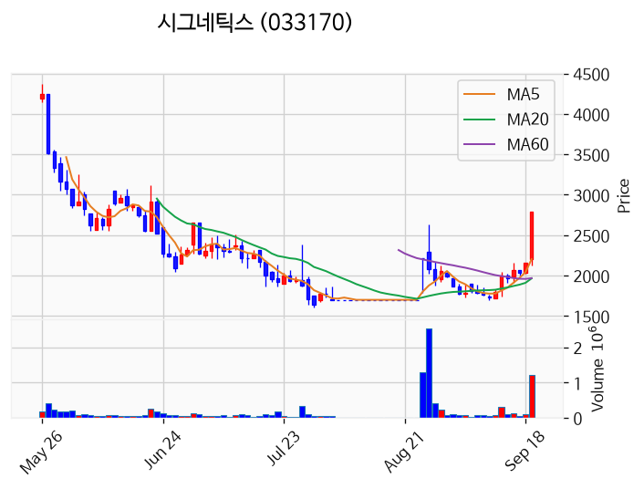

---

### 캔버스엔 (상한가)
— 등락률 +30.00% / 거래량 56만 주

**◎ 관련기사**
- [[마감시황]코스닥, 836.27로 1.11% 상승 마감…반도체 장비 강세·개인 순매수](https://news.google.com/rss/articles/CBMiY0FVX3lxTFB0S1dNaXR6NG9JNVo4SVVsNHpabDJMeEVUYnhQMHJaTlRLSmJMWktmeHg1clltRDRMdkwySDh3Nm9FN1hyNW0wbDNrQVc2b0EyaWk4QWlMUVd2dktqdlZzZWhBaw?oc=5) — twig24.com, 2026-09-21

**◎ 공시**
- _(공시 없음 / 미조회)_

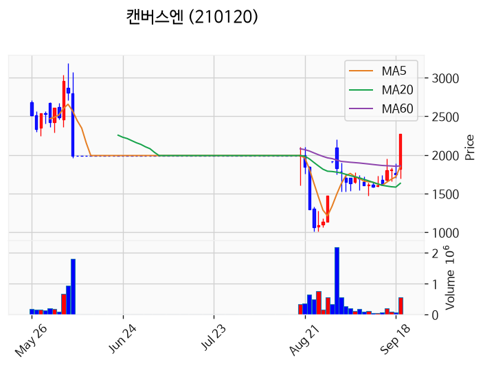

---

### 토마토시스템 (상한가)
— 등락률 +29.97% / 거래량 65만 주

**◎ 관련기사**
- [[마감시황]코스닥, 836.27로 1.11% 상승 마감…반도체 장비 강세·개인 순매수](https://news.google.com/rss/articles/CBMiY0FVX3lxTFB0S1dNaXR6NG9JNVo4SVVsNHpabDJMeEVUYnhQMHJaTlRLSmJMWktmeHg1clltRDRMdkwySDh3Nm9FN1hyNW0wbDNrQVc2b0EyaWk4QWlMUVd2dktqdlZzZWhBaw?oc=5) — twig24.com, 2026-09-21

**◎ 공시**
- _(공시 없음 / 미조회)_

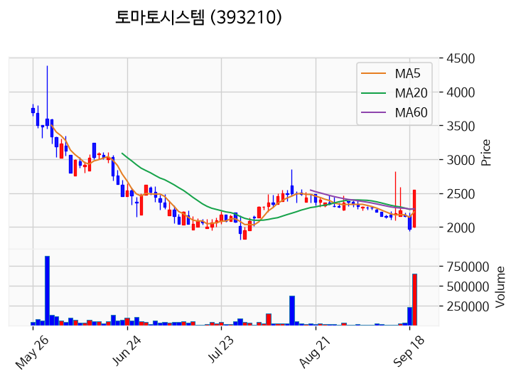

---

### 비트플래닛 (상한가)
— 등락률 +29.95% / 거래량 36만 주

**◎ 관련기사**
- [[마감시황]코스닥, 836.27로 1.11% 상승 마감…반도체 장비 강세·개인 순매수](https://news.google.com/rss/articles/CBMiY0FVX3lxTFB0S1dNaXR6NG9JNVo4SVVsNHpabDJMeEVUYnhQMHJaTlRLSmJMWktmeHg1clltRDRMdkwySDh3Nm9FN1hyNW0wbDNrQVc2b0EyaWk4QWlMUVd2dktqdlZzZWhBaw?oc=5) — twig24.com, 2026-09-21

**◎ 공시**
- _(공시 없음 / 미조회)_

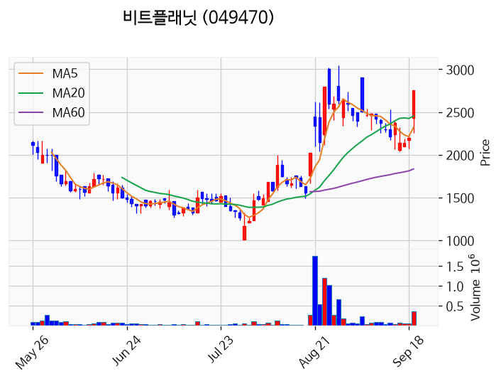

---

### 스카이랩스 (상한가)
— 등락률 +29.89% / 거래량 890만 주

**◎ 관련기사**
- [오후 이슈 [은행] : 신한지주, 메리츠금융지주, 하나금융지주, KB금융, 우리금융지주](https://news.google.com/rss/articles/CBMiWkFVX3lxTE1LekZTVVh3YXVMMGNjeHAyN3VvcF9yLTFhSC1YQlQ1VEtpdFJMWkUwWmJ1M3ZTeW52NmtXLVVRdlN0Ui1kenJTelIyY0FwREo5R2lYbUpVMXAyQQ?oc=5) — 파이낸셜뉴스, 2026-09-21

**◎ 공시**
- _(공시 없음 / 미조회)_

---

### 와이씨 (거래량 급증)
— 등락률 +19.48% / 거래량 1,026만 주

**◎ 관련기사**
- [오후 이슈 [은행] : 신한지주, 메리츠금융지주, 하나금융지주, KB금융, 우리금융지주](https://news.google.com/rss/articles/CBMiWkFVX3lxTE1LekZTVVh3YXVMMGNjeHAyN3VvcF9yLTFhSC1YQlQ1VEtpdFJMWkUwWmJ1M3ZTeW52NmtXLVVRdlN0Ui1kenJTelIyY0FwREo5R2lYbUpVMXAyQQ?oc=5) — 파이낸셜뉴스, 2026-09-21

**◎ 공시**
- _(공시 없음 / 미조회)_

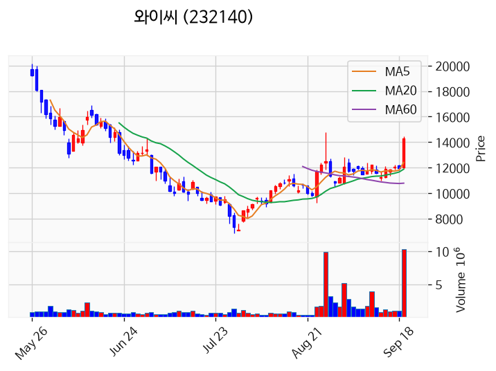

---

### 더즌 (거래량 급증)
— 등락률 +17.56% / 거래량 1,658만 주

**◎ 관련기사**
- [더즌, 카이아와 스테이블코인 기반 크로스보더 결제·FX 인프라 구축 MOU](https://news.google.com/rss/articles/CBMiTkFVX3lxTE92WkxZaUN2dkJhT0o5X2tZaDNwQ0wxR2x4WkZCbjlqWnVXdUVMcEYtdktfWWd0Q05NMWdNbkgzSURVNXBIb2hMM1RCcGw2dw?oc=5) — 전자신문, 2026-09-21

**◎ 공시**
- _(공시 없음 / 미조회)_

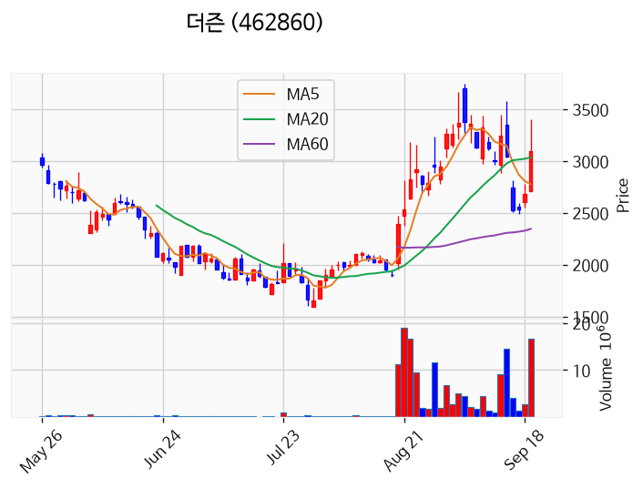

---

### SFA반도체 (거래량 급증)
— 등락률 +15.52% / 거래량 2,680만 주

**◎ 관련기사**
- [반도체 수출 259% 급증…소부장株 불기둥, 시그네틱스 '上'[핫종목]](https://news.google.com/rss/articles/CBMiT0FVX3lxTFBickFJeHk3Z2Utd2haUUhueVltRjUwQnQwZm1PaXNkNlMyalZ2anQwc1NRdXExbmxhUzdzZ2JZQTk1Q1NPMjNUX0R6STIzaGc?oc=5) — v.daum.net, 2026-09-21

**◎ 공시**
- _(공시 없음 / 미조회)_

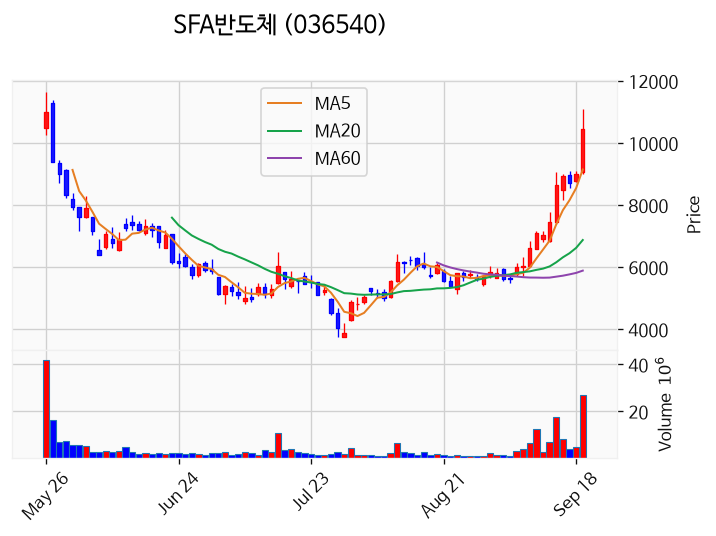

---

### 에스엠벡셀 (거래량 급증)
— 등락률 +12.60% / 거래량 1,399만 주

**◎ 관련기사**
- [팬오션, 추석 맞아 어르신 특식 기부·배식 봉사](https://news.google.com/rss/articles/CBMiaEFVX3lxTE1aaGNCNlJndVVoS0JzbWJEVmdDSE8tLVY2MUFFVFpUV1pPSE9kRUREV2ViVFhOTEtYRER3aDAxSzZIcmlsT2hMVmFVNnJ6ZUdkWEdDaG9jU3NYcjluQV80TFFPNm9QWkwz?oc=5) — ebn.co.kr, 2026-09-21

**◎ 공시**
- [임원ㆍ주요주주특정증권등소유상황보고서](https://dart.fss.or.kr/dsaf001/main.do?rcpNo=20260921000250) — 에스엠상선, 20260921
- [최대주주등소유주식변동신고서              ](https://dart.fss.or.kr/dsaf001/main.do?rcpNo=20260921800174) — 에스엠벡셀, 20260921
- [주식등의대량보유상황보고서(일반)](https://dart.fss.or.kr/dsaf001/main.do?rcpNo=20260921000090) — 에스엠하이플러스, 20260921

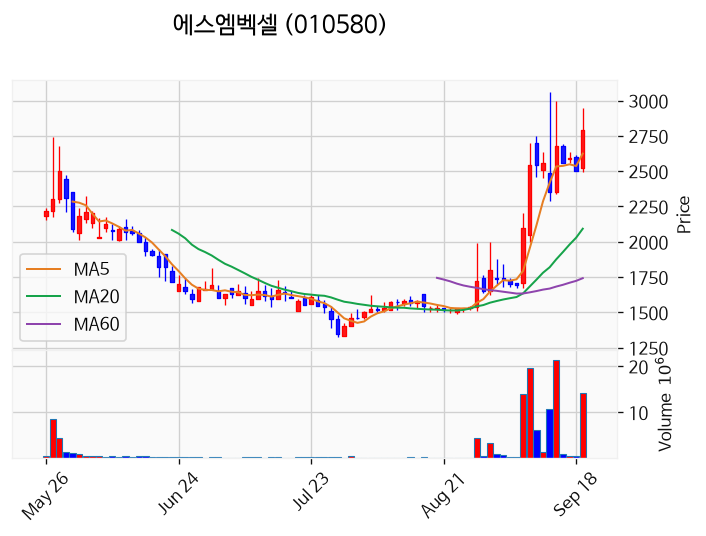

---

### 우리기술투자 (거래량 급증)
— 등락률 +8.47% / 거래량 1,074만 주

**◎ 관련기사**
- [코스피, 반도체·수출 호조에 7000선 회복···삼성전자 4.98%↑](https://news.google.com/rss/articles/CBMiakFVX3lxTFBkWHdHTnE2dVJ4QVg0eDM3T2tYb2lyLUdVZmY5aE4wYWtRakI4MkZTR3ZwR3V1LVhsa2htakVOLTZkdUdLOVpVWk5Jc0tORklabk81RjlSLXlIa2tKc2h1LUN6MDJ4eDAyNGc?oc=5) — 서울파이낸스, 2026-09-21

**◎ 공시**
- _(공시 없음 / 미조회)_

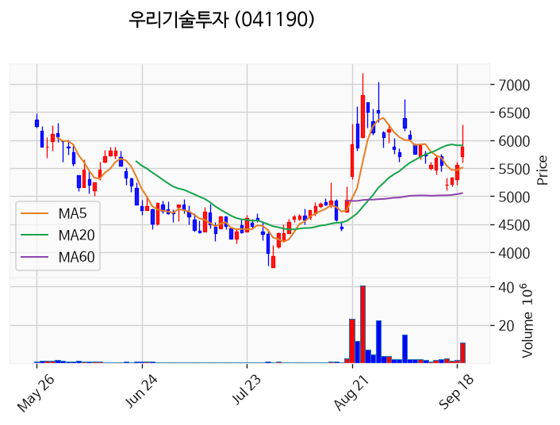

---

### 삼성전자 (거래량 급증)
— 등락률 +4.21% / 거래량 2,166만 주

**◎ 관련기사**
- [삼성전자가 끌어올린 코스피 7000선…코스닥도 1%대 상승 마감](https://news.google.com/rss/articles/CBMiUkFVX3lxTFAwYWJJbEpQWkZrUjRFZ25kT2NFNFpScUQ3bFVsU0stY1MzM29XLXFoYTlENUZGcXdQb1kwMEpTdlZCeDVFaVlQZUZZRkZmMHVtS3c?oc=5) — 매일경제 마켓, 2026-09-21

**◎ 공시**
- _(공시 없음 / 미조회)_

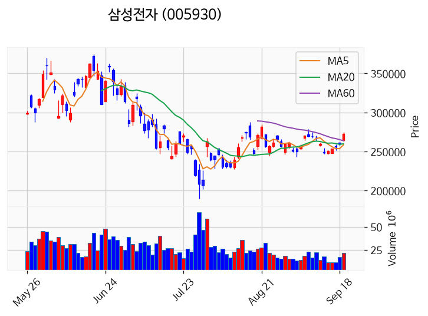

---

### 광전자 (거래량 급증)
— 등락률 +3.71% / 거래량 1,853만 주

**◎ 관련기사**
_(관련기사 없음 / 미조회)_

**◎ 공시**
- _(공시 없음 / 미조회)_

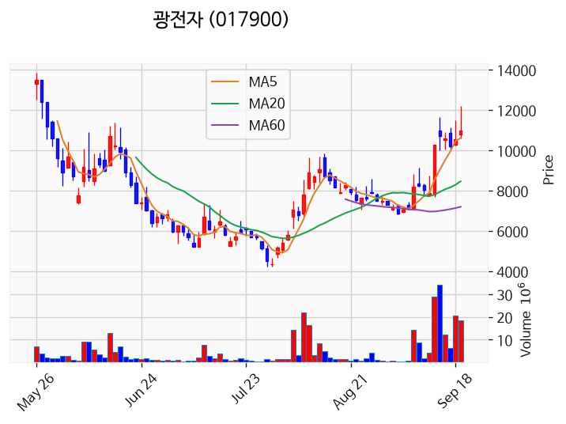

---

### 대한광통신 (거래량 급증)
— 등락률 -2.73% / 거래량 1,309만 주

**◎ 관련기사**
- [9/16일 공략주 Review _ PS일렉트로닉스](https://news.google.com/rss/articles/CBMiiwFBVV95cUxQMVRmTGF6SjFVMnZ6NDN2d2tVNnN2X0tBRGJYZk9Qa2pkZjlRQlUtVzBLYmtWVUNKYjY0dW92WVl2ZmlKLUJuVVF0YzBBQ1lfSHpCbjZ2Rmk4RnpLY2c1YUxpaE1XV05VYzRXTlQ3LVJ5QnFGZGZSQUdIaFU5Y1RtRjkyeHdMNkUyRHRr?oc=5) — 네이버 프리미엄콘텐츠, 2026-09-21

**◎ 공시**
- _(공시 없음 / 미조회)_

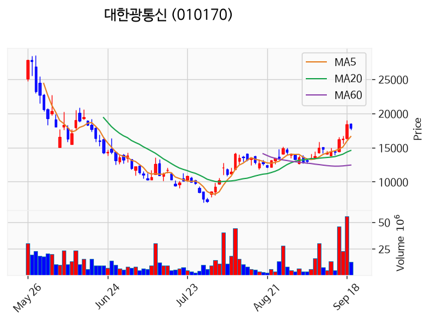

---

### 동양 (거래량 급증)
— 등락률 -11.46% / 거래량 1,055만 주

**◎ 관련기사**
- [동양생명-ABL생명, 통합 추진 후 첫 공동 사회공헌 진행](https://news.google.com/rss/articles/CBMib0FVX3lxTFAyd1FHVTFmT2pIaXFqQl9XZUctNWx2Yml2LUtqcmRub1BlUk96OTc5S3Z1elM2VDRFVWZyNVNjVV9DeXJoY3NrNXFRZXkwanFpcFlXd3BJcG9vLWlCUVpscTczVDNGMFBIMUx5T1EtSdIBckFVX3lxTFBxTmxFRzRlV2JvUE1DWTlyZktSa2FKZy1BekF1UERoYzR5b1Zxb05WX0Fua0pKU2JaQlI5ZXhhblpsREYtMkROUUJOMkp2cVY5OExieFV3NUY5ZE1yaUdLd1ZFSG0wV2c0ZzJBc1cxeFpqZw?oc=5) — 팝콘뉴스, 2026-09-21

**◎ 공시**
- _(공시 없음 / 미조회)_

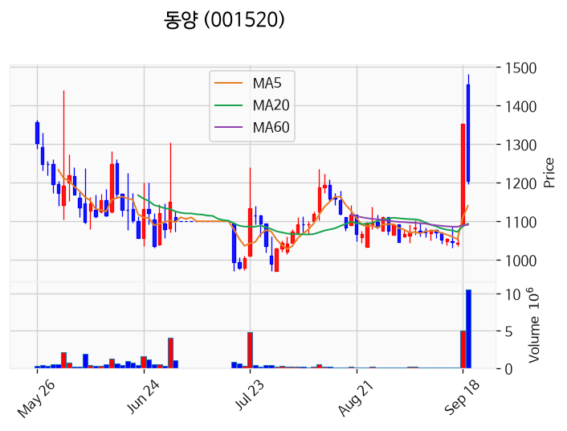

---

## 2. 거래량 폭증 후 급감 패턴 종목
_(폭증 전일 대비 500~1000%, 급감 전일 대비 25% 이하, 급감일 종가가 5일선 대비 -3% 이내)_

_해당 종목 없음_
