# 2026년 9월 22일 시황 노트

## 1. 상한가 / 거래량 1,000만주 이상 종목

### 한국제17호스팩 (상한가)
— 등락률 +63.25% / 거래량 18,992만 주

**◎ 관련기사**
- [[코스닥 새내기] 공모가 구하기로 끝난 ‘한국제17호스팩’ 열풍](https://news.google.com/rss/articles/CBMibEFVX3lxTE5FTlA3WHZITVFxWVBEX3hvWEoyVi11UUg3OFM0X1dQZWFHOFluSDk1M2NTU0RtRnJmZUtsNHBrVDU4cG4tckFVb1NhT0xmRVVueDVTUzFmWlhvNUhVekZiTTh3OFNZQVlERWN2ZQ?oc=5) — 뉴스웰, 2026-09-22

**◎ 공시**
- _(공시 없음 / 미조회)_

---

### 동국생명과학 (상한가)
— 등락률 +29.98% / 거래량 1,426만 주

**◎ 관련기사**
- [외국인·기관 동반 매도에 코스닥 0.23% 하락](https://news.google.com/rss/articles/CBMiY0FVX3lxTE5EdkhyQ2tBRlFlbFU5UnpuTzQzMG50OExJeS0zdWZLSVQxNmVoVVBVVzZ4UXBRWXlQcjFoQUE5ZGhvc0MwM0ZCLV9CeUI4SVJRMkVsSDR4cUFPSjRSYmd4M3U2aw?oc=5) — twig24.com, 2026-09-22

**◎ 공시**
- _(공시 없음 / 미조회)_

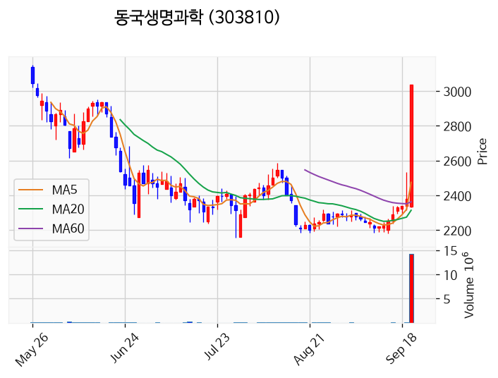

---

### 노타 (상한가)
— 등락률 +29.97% / 거래량 245만 주

**◎ 관련기사**
- ["고성능 GPU나 외부서버 없어도 된다"…노타, 로봇팔 작업 3배↑](https://news.google.com/rss/articles/CBMibEFVX3lxTFBwdmIza1F6T0NXTzhUdFNkalZKQTZrd3B5YjlWRmVYR0ZlLURMSC1qRWRXT0FGU1pxT0ZIekstMEpKaGJIRE80dlc0LXBFSGlhRGJjazBraWh5X1BnX283RzJuUWtlTGdqV2tuSQ?oc=5) — 유니콘팩토리, 2026-09-22

**◎ 공시**
- _(공시 없음 / 미조회)_

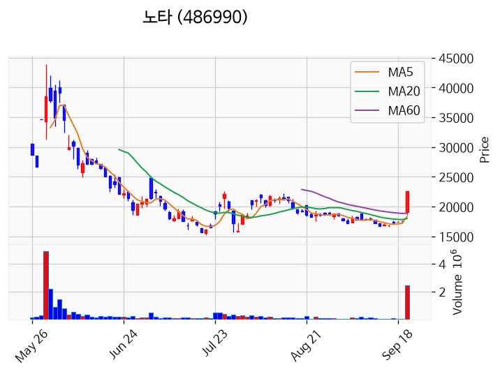

---

### 셀리드 (상한가)
— 등락률 +29.95% / 거래량 199만 주

**◎ 관련기사**
- [셀리드, 100억원 규모 투자유치 성공, 휴니버스글로벌 전략적 투자 참여](https://news.google.com/rss/articles/CBMiWkFVX3lxTE1ENV9tRm9BRW1KSEUwcEkzbkdZcHdMT3p5NFZKdU84Q2QwZGpBLXN0TmJtRlBJeGZHbHg2MjBURE5iWkowS0NXQ2wzXzlIRDlnUlJQUDNFSVgtdw?oc=5) — 한국경제, 2026-09-22

**◎ 공시**
- [[기재정정]주요사항보고서(유상증자결정)](https://dart.fss.or.kr/dsaf001/main.do?rcpNo=20260922000158) — 셀리드, 20260922
- [주요사항보고서(유상증자결정)](https://dart.fss.or.kr/dsaf001/main.do?rcpNo=20260921000434) — 셀리드, 20260922

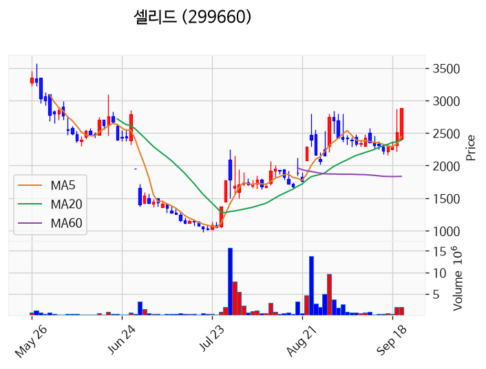

---

### 더블유에스아이 (상한가)
— 등락률 +29.94% / 거래량 385만 주

**◎ 관련기사**
- [[급등락주 짚어보기] 코스닥서 노타ㆍ더블유에스아이 등 6개 상한가⋯코스피는 ‘잠잠’ · 시장 영향은?](https://news.google.com/rss/articles/CBMiXEFVX3lxTE0zQmh6UmZVRzM0Z0FFVDBjRlNtcThBQi16XzN5aVZDb3QwdWEtWTRqM0E0LUxldWlWVnpranhPanI0NVpNSHVPa2xheUd6WEQ2RlNDT09LMXRPeWZU?oc=5) — supple.kr, 2026-09-22

**◎ 공시**
- _(공시 없음 / 미조회)_

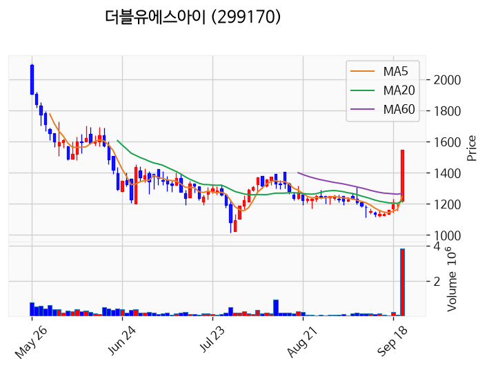

---

### 씨싸이트 (상한가)
— 등락률 +29.93% / 거래량 34만 주

**◎ 관련기사**
- [[급등락주 짚어보기] 코스닥서 노타ㆍ더블유에스아이 등 6개 상한가⋯코스피는 ‘잠잠’ · 시장 영향은?](https://news.google.com/rss/articles/CBMiXEFVX3lxTE0zQmh6UmZVRzM0Z0FFVDBjRlNtcThBQi16XzN5aVZDb3QwdWEtWTRqM0E0LUxldWlWVnpranhPanI0NVpNSHVPa2xheUd6WEQ2RlNDT09LMXRPeWZU?oc=5) — supple.kr, 2026-09-22

**◎ 공시**
- _(공시 없음 / 미조회)_

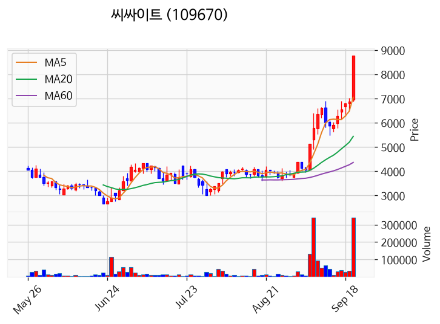

---

### 동일기연 (상한가)
— 등락률 +29.81% / 거래량 2만 주

**◎ 관련기사**
_(관련기사 없음 / 미조회)_

**◎ 공시**
- _(공시 없음 / 미조회)_

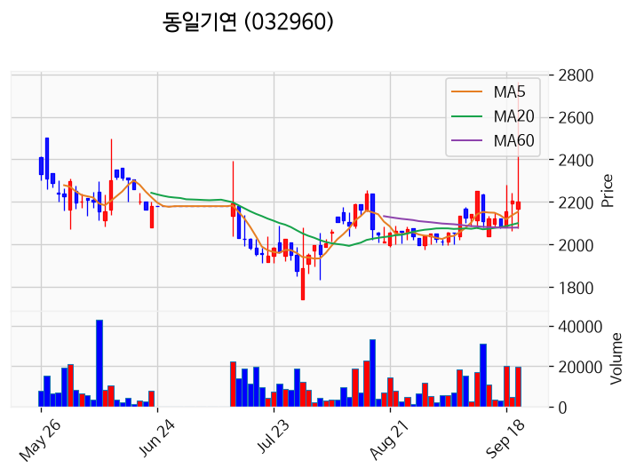

---

### 수성웹툰 (상한가)
— 등락률 +29.63% / 거래량 498만 주

**◎ 관련기사**
_(관련기사 없음 / 미조회)_

**◎ 공시**
- _(공시 없음 / 미조회)_

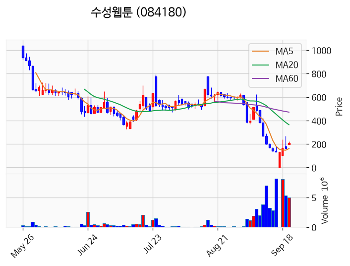

---

### 삼미금속 (거래량 급증)
— 등락률 +18.79% / 거래량 2,194만 주

**◎ 관련기사**
_(관련기사 없음 / 미조회)_

**◎ 공시**
- _(공시 없음 / 미조회)_

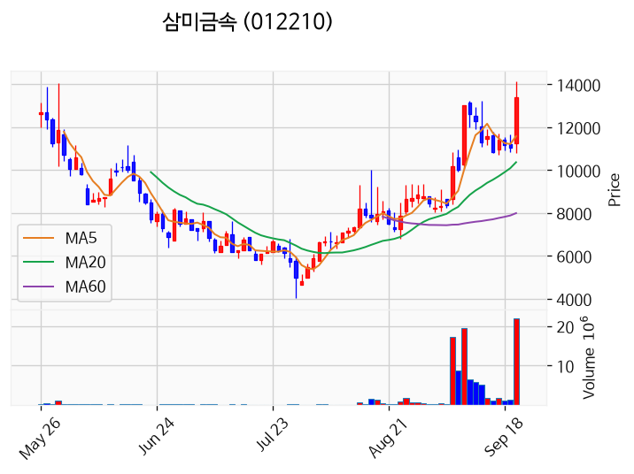

---

### KB제34호스팩 (거래량 급증)
— 등락률 +15.75% / 거래량 10,317만 주

**◎ 관련기사**
- [[코스닥 새내기] 달리다 미끄러진 ‘KB제34호스팩’](https://news.google.com/rss/articles/CBMibEFVX3lxTFBzOWpyR3gtU0lnN3M5YlZtV2xRRmxGZEZhX2lBQ3VSZ0JadVlGeUVucEp2MDhVaHVJeVB4ZXRIbjZnaV9BLW81QWtCWkVXNm16c3ZGU3NVSndQQ05XTFJXSDVsRWpRc3hVZ0FNUg?oc=5) — 뉴스웰, 2026-09-22

**◎ 공시**
- _(공시 없음 / 미조회)_

---

### 동국산업 (거래량 급증)
— 등락률 +14.66% / 거래량 1,171만 주

**◎ 관련기사**
_(관련기사 없음 / 미조회)_

**◎ 공시**
- _(공시 없음 / 미조회)_

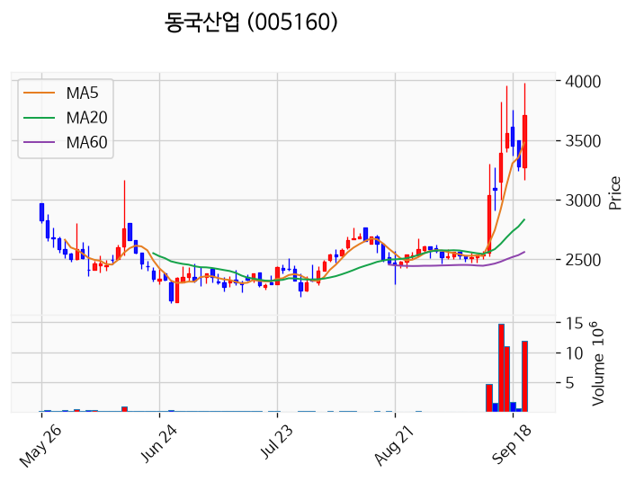

---

### 무림P&P (거래량 급증)
— 등락률 +11.28% / 거래량 1,171만 주

**◎ 관련기사**
_(관련기사 없음 / 미조회)_

**◎ 공시**
- _(공시 없음 / 미조회)_

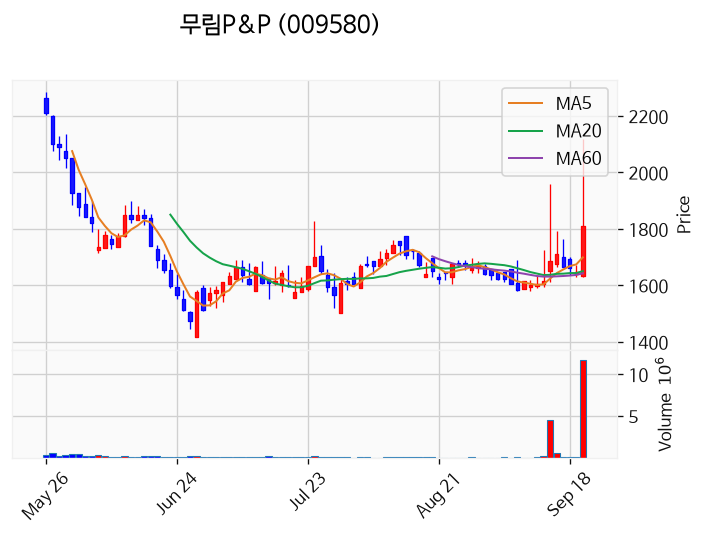

---

### 우리기술투자 (거래량 급증)
— 등락률 +2.22% / 거래량 1,110만 주

**◎ 관련기사**
_(관련기사 없음 / 미조회)_

**◎ 공시**
- _(공시 없음 / 미조회)_

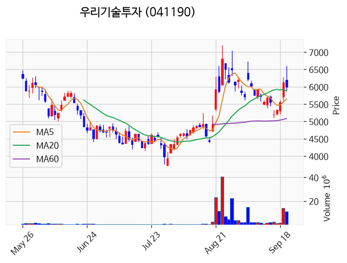

---

### 센서뷰 (거래량 급증)
— 등락률 +1.42% / 거래량 1,155만 주

**◎ 관련기사**
_(관련기사 없음 / 미조회)_

**◎ 공시**
- _(공시 없음 / 미조회)_

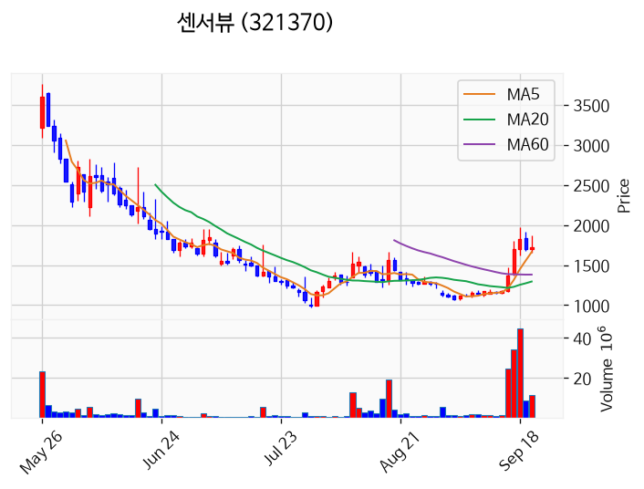

---

### 삼성전자 (거래량 급증)
— 등락률 +0.55% / 거래량 1,721만 주

**◎ 관련기사**
- [삼성전자 DS 노조 추석 끝나면 다시 '성과급' 논의..내년 교섭안 정한다 - 머니투데이](https://news.google.com/rss/articles/CBMiekFVX3lxTE9MZFF1a3dxSW91TDZmMUVFN1k5M29qUGlDUVk3UlY4U3B4VlZhNlN5bmI3cldmbDdsZTFCZEs0WUc3UDJUaHBxUHlGZ3Z6ZUV1N2paRU5lTzljSTM0Q1doQzMxb3FJNWRUZmtjZ185bGlkMnp0WUhOWlVn0gF_QVVfeXFMT19MQVdNTWxOckdtT2xpNnB6YTBnb3I3ODVnNzcwdnhZOVV2UURRNWNuQ2hOTkZkUm5JTzMyTlVITnpYY0l5VTYtdU91NUtxNmNYSUE4ZE53dWcweUNDWmc2QWZVVGVGdmlBbWlucVBVRC14UVJMSm51X2F6RS1kcw?oc=5) — mt.co.kr, 2026-09-22

**◎ 공시**
- _(공시 없음 / 미조회)_

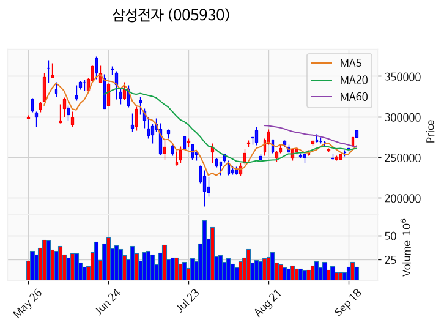

---

### SFA반도체 (거래량 급증)
— 등락률 -0.09% / 거래량 1,454만 주

**◎ 관련기사**
- [[9.22(화) 한국장 마감] 혼조 마감 (코스피 +0.15%, 코스닥 -0.23%)](https://news.google.com/rss/articles/CBMieEFVX3lxTE45dFktdkp2QjlpTFZFdlF6VU1RMkstWkJqN2ZLRkVfbHBlRE9uRnJRUGRrOE5ROW5VZWw2X1Z4MV8yNkJKYzBTVGg1TDdIZExjd2o3M01kWGtHTEVUVkpUMzBUVFlmeEpzVlJVUVY2T1dlR1VPV0N0YQ?oc=5) — 주달, 2026-09-22

**◎ 공시**
- _(공시 없음 / 미조회)_

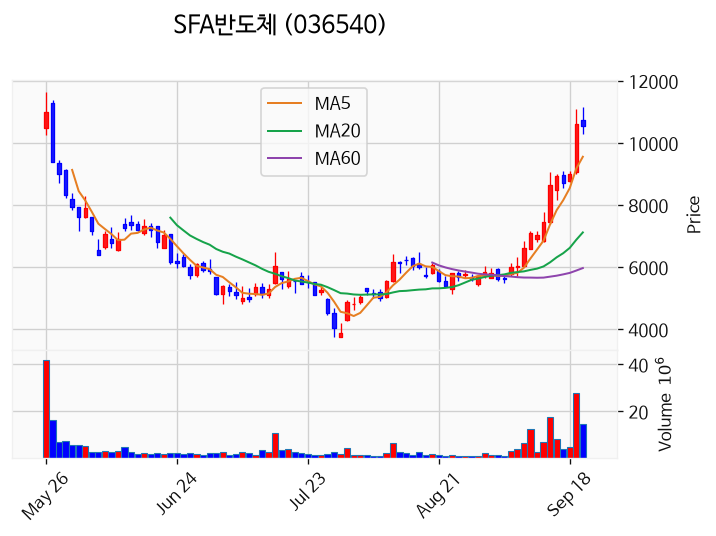

---

### 네오사피엔스 (거래량 급증)
— 등락률 -11.52% / 거래량 1,257만 주

**◎ 관련기사**
_(관련기사 없음 / 미조회)_

**◎ 공시**
- _(공시 없음 / 미조회)_

---

## 2. 거래량 폭증 후 급감 패턴 종목
_(폭증 전일 대비 500~1000%, 급감 전일 대비 25% 이하, 급감일 종가가 5일선 대비 -3% 이내)_

_해당 종목 없음_
