# 2026년 9월 23일 시황 노트

## 1. 상한가 / 거래량 1,000만주 이상 종목

### 와이즈플래닛컴퍼니 (상한가)
— 등락률 +275.83% / 거래량 2,427만 주

**◎ 관련기사**
- [[특징주] 와이즈플래닛컴퍼니, 코스닥 데뷔 첫날 ‘불기둥’… 증권가 전망은?](https://news.google.com/rss/articles/CBMicEFVX3lxTE5HaWZ6ZmRKLTNlNTZjRTVhaHpIR3Q2bDg2LUNFYUpxTnZUckg5alktZVB4YlZGZGxwelJISHlVZzUxNzlfcTdFRl9BamptbnZpLXZGM0g4RGNhV3BFb1JCTlk3c25fZDNtMm1hV1VpbEk?oc=5) — 비즈트리뷴, 2026-09-23

**◎ 공시**
- _(공시 없음 / 미조회)_

---

### 티엔엔터테인먼트 (상한가)
— 등락률 +30.00% / 거래량 14만 주

**◎ 관련기사**
_(관련기사 없음 / 미조회)_

**◎ 공시**
- _(공시 없음 / 미조회)_

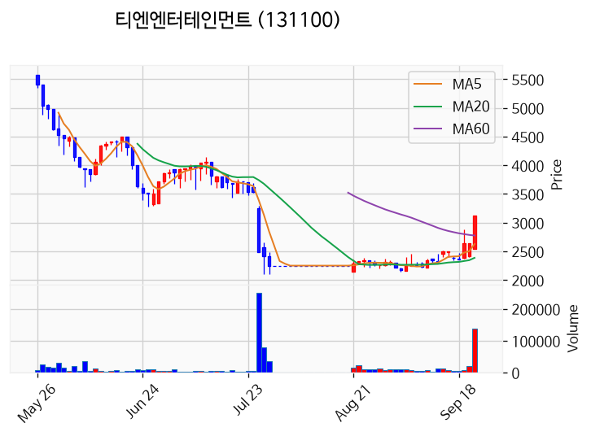

---

### 파이온엑스 (상한가)
— 등락률 +29.96% / 거래량 79만 주

**◎ 관련기사**
_(관련기사 없음 / 미조회)_

**◎ 공시**
- _(공시 없음 / 미조회)_

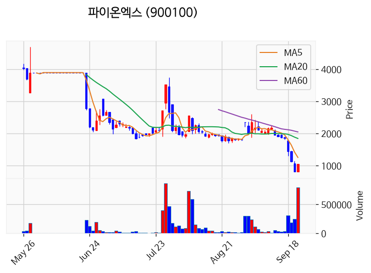

---

### HT로보틱스 (상한가)
— 등락률 +29.95% / 거래량 1,283만 주

**◎ 관련기사**
- [오후 이슈 [반도체] : 아스플로, 제우스, 메가터치, 피엠티, 엑시콘](https://news.google.com/rss/articles/CBMiWkFVX3lxTE14T1NSY2hHUFZnSDRsdjA1eVd4SkdJd3JTVFdpVGtPYWhmVVJQWjJuUk5rZUVuYXZobU1TZkFMX3F3UlQzc2Z5WnBvdEMxcHBQLXJVWV9SYVloZw?oc=5) — 파이낸셜뉴스, 2026-09-23

**◎ 공시**
- _(공시 없음 / 미조회)_

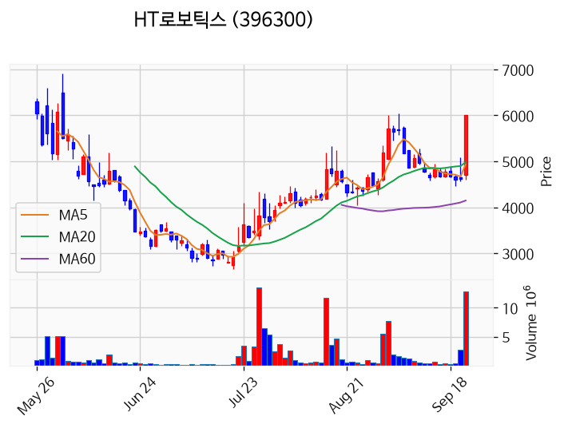

---

### 우리넷 (상한가)
— 등락률 +29.90% / 거래량 708만 주

**◎ 관련기사**
- [오후 이슈 [반도체] : 아스플로, 제우스, 메가터치, 피엠티, 엑시콘](https://news.google.com/rss/articles/CBMiWkFVX3lxTE14T1NSY2hHUFZnSDRsdjA1eVd4SkdJd3JTVFdpVGtPYWhmVVJQWjJuUk5rZUVuYXZobU1TZkFMX3F3UlQzc2Z5WnBvdEMxcHBQLXJVWV9SYVloZw?oc=5) — 파이낸셜뉴스, 2026-09-23

**◎ 공시**
- _(공시 없음 / 미조회)_

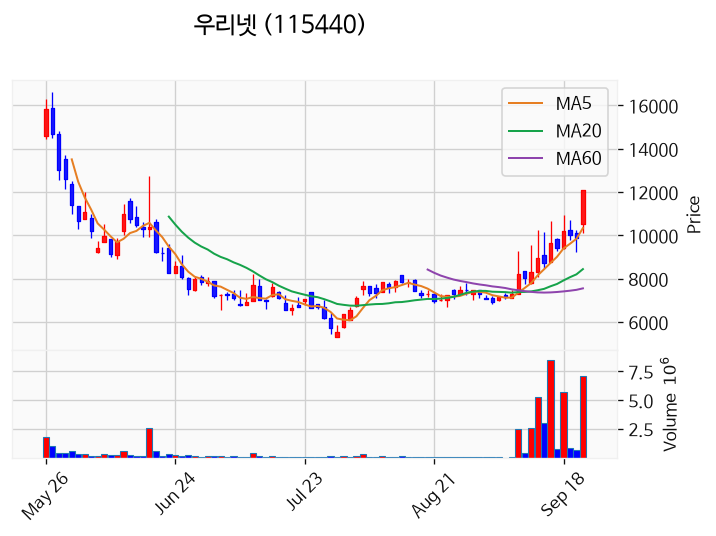

---

### 삼기에너지솔루션즈 (거래량 급증)
— 등락률 +20.09% / 거래량 3,529만 주

**◎ 관련기사**
_(관련기사 없음 / 미조회)_

**◎ 공시**
- _(공시 없음 / 미조회)_

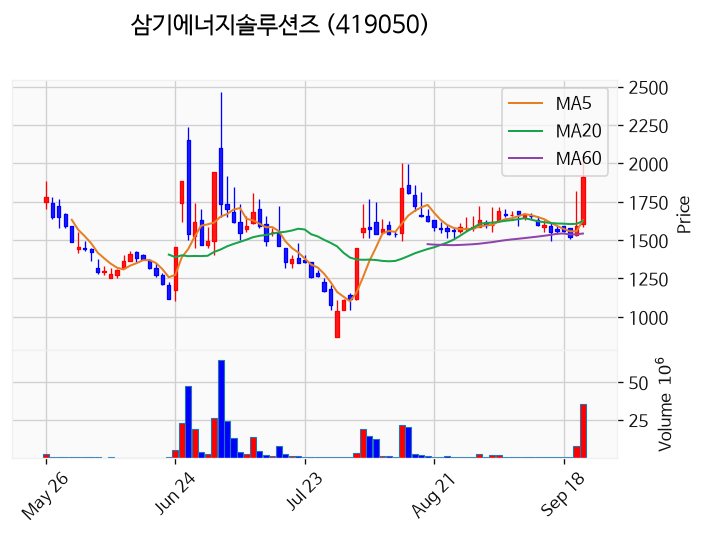

---

### 토마토시스템 (거래량 급증)
— 등락률 +19.46% / 거래량 1,299만 주

**◎ 관련기사**
- [오후 이슈 [반도체] : 아스플로, 제우스, 메가터치, 피엠티, 엑시콘](https://news.google.com/rss/articles/CBMiWkFVX3lxTE14T1NSY2hHUFZnSDRsdjA1eVd4SkdJd3JTVFdpVGtPYWhmVVJQWjJuUk5rZUVuYXZobU1TZkFMX3F3UlQzc2Z5WnBvdEMxcHBQLXJVWV9SYVloZw?oc=5) — 파이낸셜뉴스, 2026-09-23

**◎ 공시**
- _(공시 없음 / 미조회)_

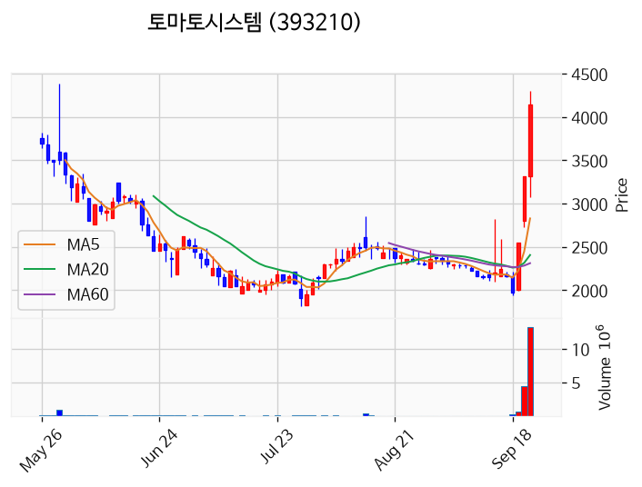

---

### 엑스게이트 (거래량 급증)
— 등락률 +9.92% / 거래량 1,660만 주

**◎ 관련기사**
- [AI발 보안 수요 확대 기대…양자암호 관련주 일제히 상승](https://news.google.com/rss/articles/CBMiYkFVX3lxTFA1THBhS05haWVOM0lFdDNIRnc2Z1hpZzdlcXRmUUg1bExVM09FWVlNVGlsak81QWowVkN4ZEtiWFJzSFdfSVotNGtCb2NNcUJoOVY0RWtDVVJ0WmI1YTVVZlJR?oc=5) — 매일신문, 2026-09-23

**◎ 공시**
- _(공시 없음 / 미조회)_

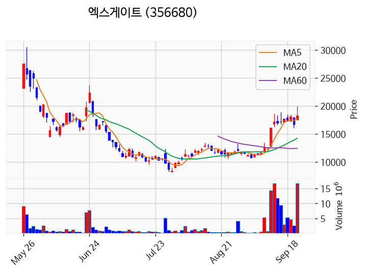

---

### 빛샘전자 (거래량 급증)
— 등락률 +8.38% / 거래량 1,170만 주

**◎ 관련기사**
_(관련기사 없음 / 미조회)_

**◎ 공시**
- _(공시 없음 / 미조회)_

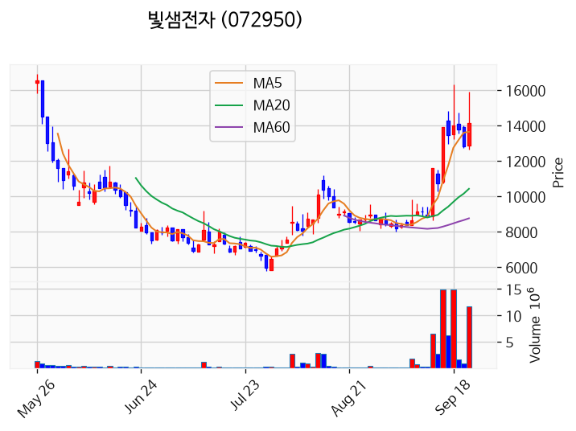

---

### 드림시큐리티 (거래량 급증)
— 등락률 +4.83% / 거래량 1,513만 주

**◎ 관련기사**
- [AI발 보안 수요 확대 기대…양자암호 관련주 일제히 상승](https://news.google.com/rss/articles/CBMiYkFVX3lxTFA1THBhS05haWVOM0lFdDNIRnc2Z1hpZzdlcXRmUUg1bExVM09FWVlNVGlsak81QWowVkN4ZEtiWFJzSFdfSVotNGtCb2NNcUJoOVY0RWtDVVJ0WmI1YTVVZlJR?oc=5) — 매일신문, 2026-09-23

**◎ 공시**
- _(공시 없음 / 미조회)_

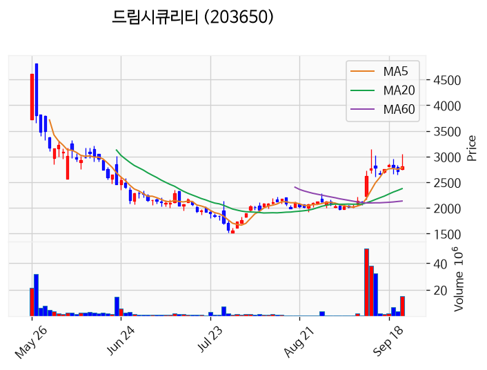

---

### 센서뷰 (거래량 급증)
— 등락률 +4.00% / 거래량 2,584만 주

**◎ 관련기사**
_(관련기사 없음 / 미조회)_

**◎ 공시**
- _(공시 없음 / 미조회)_

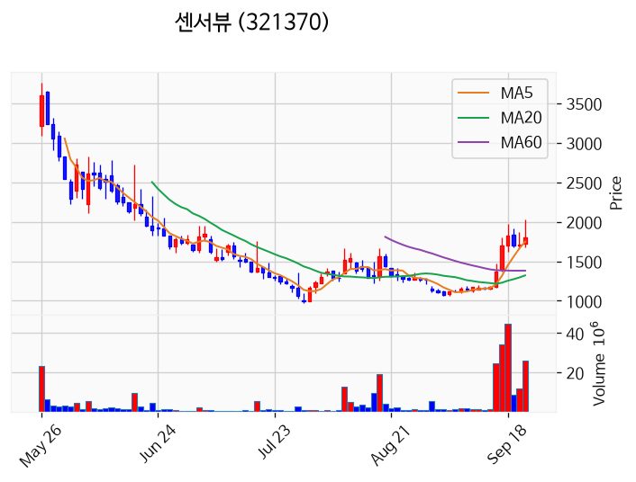

---

### 우리로 (거래량 급증)
— 등락률 +3.55% / 거래량 1,138만 주

**◎ 관련기사**
_(관련기사 없음 / 미조회)_

**◎ 공시**
- _(공시 없음 / 미조회)_

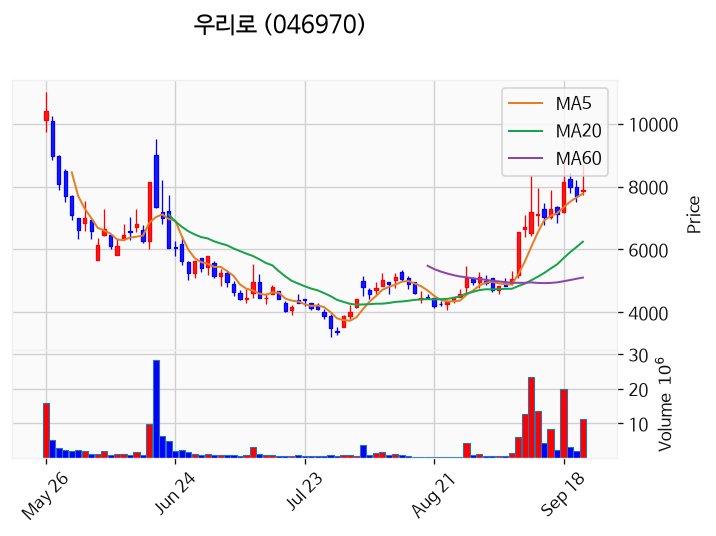

---

### 삼성전자 (거래량 급증)
— 등락률 +3.07% / 거래량 2,016만 주

**◎ 관련기사**
- [삼성전자, 'LPDDR6' 표준 선점 포문…'온디바이스 AI 메모리' 주도권 쥔다](https://news.google.com/rss/articles/CBMicEFVX3lxTE5uZkk4OG9yTDA5Qm5aZTlhekhubTVHRk9lQ1l3QW83cUUxR0ZlLWRTQnFjV2FrQ2piWEVJYWxicjk1N3pmWjFYR3RpRzY4WW1MMVgtTGJsWWJNd250R2lGREZ4OEJTbXJrdzlENFVyUkw?oc=5) — 오피니언뉴스, 2026-09-23

**◎ 공시**
- _(공시 없음 / 미조회)_

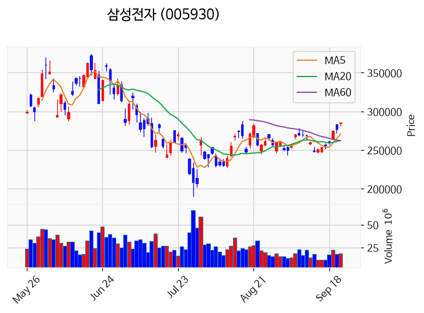

---

### 빛과전자 (거래량 급증)
— 등락률 +2.29% / 거래량 1,136만 주

**◎ 관련기사**
_(관련기사 없음 / 미조회)_

**◎ 공시**
- _(공시 없음 / 미조회)_

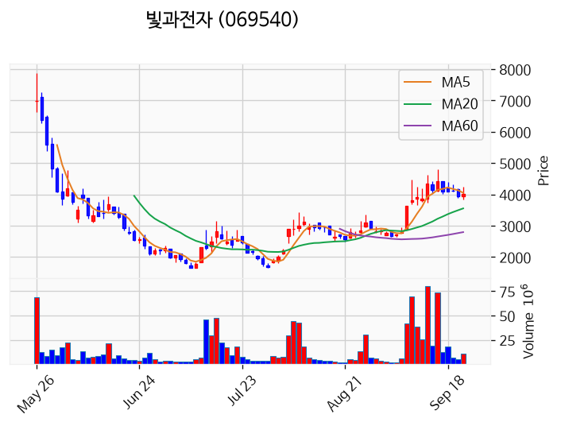

---

### 미투온 (거래량 급증)
— 등락률 -0.94% / 거래량 1,773만 주

**◎ 관련기사**
- [[부고] 문찬걸(IBK투자증권 금융소비자보호본부장)씨 모친상](https://news.google.com/rss/articles/CBMia0FVX3lxTE56T2E5WFV5U2R6Q3hfRDZuUWgxbGpWYjhnSXJzNXQ5cTdHTkFlUkZVQTZUQ0h1SG9wdTV1aVFOYlJNeTVMN1EwbzdWaTRoMlhSdnVSbzdubWRXYUhCejZxNzNLRHZhclZCVXo0?oc=5) — 라이센스뉴스, 2026-09-23

**◎ 공시**
- _(공시 없음 / 미조회)_

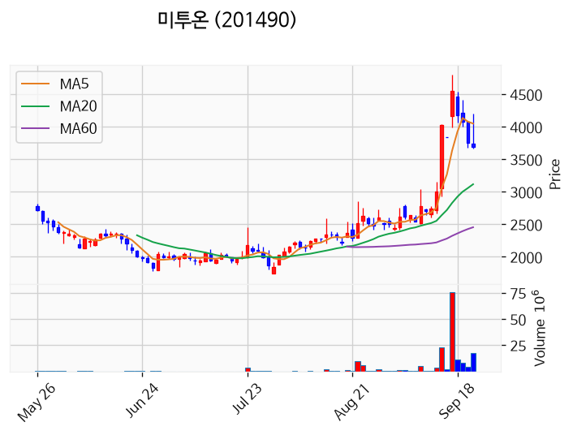

---

### 동국생명과학 (거래량 급증)
— 등락률 -8.07% / 거래량 1,307만 주

**◎ 관련기사**
_(관련기사 없음 / 미조회)_

**◎ 공시**
- _(공시 없음 / 미조회)_

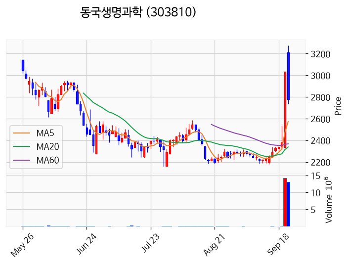

---

## 2. 거래량 폭증 후 급감 패턴 종목
_(폭증 전일 대비 500~1000%, 급감 전일 대비 25% 이하, 급감일 종가가 5일선 대비 -3% 이내)_

### 흥국화재우
- 폭증일: 2026-09-22, 거래량 0만 주 (전일 대비 756%)
- 급감일: 2026-09-23, 거래량 0만 주 (전일 대비 8%)
- 급감일 종가 5,700원 / 5일선 3,460원 (이격률 +64.74%)

### 코오롱우
- 폭증일: 2026-09-22, 거래량 1만 주 (전일 대비 700%)
- 급감일: 2026-09-23, 거래량 0만 주 (전일 대비 12%)
- 급감일 종가 13,090원 / 5일선 7,816원 (이격률 +67.48%)

### 보령
- 폭증일: 2026-09-22, 거래량 32만 주 (전일 대비 827%)
- 급감일: 2026-09-23, 거래량 5만 주 (전일 대비 15%)
- 급감일 종가 8,280원 / 5일선 4,952원 (이격률 +67.21%)

### 엘에스스팩1호
- 폭증일: 2026-09-22, 거래량 1만 주 (전일 대비 731%)
- 급감일: 2026-09-23, 거래량 0만 주 (전일 대비 1%)
- 급감일 종가 1,988원 / 5일선 1,191원 (이격률 +66.97%)

### DRB동일
- 폭증일: 2026-09-22, 거래량 10만 주 (전일 대비 858%)
- 급감일: 2026-09-23, 거래량 2만 주 (전일 대비 20%)
- 급감일 종가 3,900원 / 5일선 2,361원 (이격률 +65.18%)

### 호텔신라우
- 폭증일: 2026-09-22, 거래량 0만 주 (전일 대비 507%)
- 급감일: 2026-09-23, 거래량 0만 주 (전일 대비 16%)
- 급감일 종가 27,750원 / 5일선 16,700원 (이격률 +66.17%)

### 미래에셋비전스팩10호
- 폭증일: 2026-09-22, 거래량 1만 주 (전일 대비 569%)
- 급감일: 2026-09-23, 거래량 0만 주 (전일 대비 23%)
- 급감일 종가 1,962원 / 5일선 1,178원 (이격률 +66.53%)

### 우성머티리얼스
- 폭증일: 2026-09-22, 거래량 88만 주 (전일 대비 777%)
- 급감일: 2026-09-23, 거래량 14만 주 (전일 대비 16%)
- 급감일 종가 2,860원 / 5일선 1,575원 (이격률 +81.59%)

### 시공테크
- 폭증일: 2026-09-22, 거래량 105만 주 (전일 대비 844%)
- 급감일: 2026-09-23, 거래량 15만 주 (전일 대비 15%)
- 급감일 종가 3,660원 / 5일선 2,217원 (이격률 +65.09%)

### 제일테크노스
- 폭증일: 2026-09-22, 거래량 6만 주 (전일 대비 973%)
- 급감일: 2026-09-23, 거래량 0만 주 (전일 대비 6%)
- 급감일 종가 5,300원 / 5일선 3,148원 (이격률 +68.36%)

### 서울반도체
- 폭증일: 2026-09-22, 거래량 157만 주 (전일 대비 587%)
- 급감일: 2026-09-23, 거래량 30만 주 (전일 대비 19%)
- 급감일 종가 10,560원 / 5일선 6,230원 (이격률 +69.50%)

### 아세아텍
- 폭증일: 2026-09-22, 거래량 2만 주 (전일 대비 593%)
- 급감일: 2026-09-23, 거래량 0만 주 (전일 대비 18%)
- 급감일 종가 1,730원 / 5일선 1,023원 (이격률 +69.11%)

### 한전기술
- 폭증일: 2026-09-22, 거래량 202만 주 (전일 대비 527%)
- 급감일: 2026-09-23, 거래량 46만 주 (전일 대비 23%)
- 급감일 종가 130,800원 / 5일선 79,700원 (이격률 +64.12%)

### 케이피티유
- 폭증일: 2026-09-22, 거래량 1만 주 (전일 대비 668%)
- 급감일: 2026-09-23, 거래량 0만 주 (전일 대비 11%)
- 급감일 종가 3,315원 / 5일선 2,028원 (이격률 +63.46%)

### 하이텍팜
- 폭증일: 2026-09-22, 거래량 11만 주 (전일 대비 715%)
- 급감일: 2026-09-23, 거래량 2만 주 (전일 대비 19%)
- 급감일 종가 9,880원 / 5일선 5,954원 (이격률 +65.94%)

### MSDI
- 폭증일: 2026-09-22, 거래량 70만 주 (전일 대비 737%)
- 급감일: 2026-09-23, 거래량 16만 주 (전일 대비 23%)
- 급감일 종가 3,360원 / 5일선 1,944원 (이격률 +72.84%)

### 미원화학
- 폭증일: 2026-09-22, 거래량 1만 주 (전일 대비 641%)
- 급감일: 2026-09-23, 거래량 0만 주 (전일 대비 15%)
- 급감일 종가 10,030원 / 5일선 6,044원 (이격률 +65.95%)

### 듀켐바이오
- 폭증일: 2026-09-22, 거래량 16만 주 (전일 대비 813%)
- 급감일: 2026-09-23, 거래량 3만 주 (전일 대비 18%)
- 급감일 종가 6,220원 / 5일선 3,712원 (이격률 +67.56%)

### 애드바이오텍
- 폭증일: 2026-09-22, 거래량 36만 주 (전일 대비 567%)
- 급감일: 2026-09-23, 거래량 7만 주 (전일 대비 20%)
- 급감일 종가 1,799원 / 5일선 1,087원 (이격률 +65.44%)

### 이비테크
- 폭증일: 2026-09-22, 거래량 0만 주 (전일 대비 560%)
- 급감일: 2026-09-23, 거래량 0만 주 (전일 대비 11%)
- 급감일 종가 5,200원 / 5일선 3,150원 (이격률 +65.08%)

### 인바이츠바이오코아
- 폭증일: 2026-09-22, 거래량 0만 주 (전일 대비 684%)
- 급감일: 2026-09-23, 거래량 0만 주 (전일 대비 10%)
- 급감일 종가 1,449원 / 5일선 851원 (이격률 +70.19%)

### 라온피플
- 폭증일: 2026-09-22, 거래량 48만 주 (전일 대비 851%)
- 급감일: 2026-09-23, 거래량 8만 주 (전일 대비 17%)
- 급감일 종가 3,180원 / 5일선 1,936원 (이격률 +64.26%)

### 오션스바이오
- 폭증일: 2026-09-22, 거래량 0만 주 (전일 대비 863%)
- 급감일: 2026-09-23, 거래량 0만 주 (전일 대비 1%)
- 급감일 종가 2,515원 / 5일선 1,786원 (이격률 +40.82%)

### 이삭엔지니어링
- 폭증일: 2026-09-22, 거래량 29만 주 (전일 대비 805%)
- 급감일: 2026-09-23, 거래량 4만 주 (전일 대비 13%)
- 급감일 종가 3,505원 / 5일선 2,063원 (이격률 +69.90%)

### 바스칸바이오제약
- 폭증일: 2026-09-22, 거래량 0만 주 (전일 대비 625%)
- 급감일: 2026-09-23, 거래량 0만 주 (전일 대비 6%)
- 급감일 종가 3,490원 / 5일선 2,082원 (이격률 +67.63%)

### 티엘비
- 폭증일: 2026-09-22, 거래량 248만 주 (전일 대비 822%)
- 급감일: 2026-09-23, 거래량 56만 주 (전일 대비 22%)
- 급감일 종가 44,600원 / 5일선 25,440원 (이격률 +75.31%)

### LX홀딩스1우
- 폭증일: 2026-09-22, 거래량 0만 주 (전일 대비 650%)
- 급감일: 2026-09-23, 거래량 0만 주 (전일 대비 17%)
- 급감일 종가 7,440원 / 5일선 4,430원 (이격률 +67.95%)

### 지투파워
- 폭증일: 2026-09-22, 거래량 273만 주 (전일 대비 905%)
- 급감일: 2026-09-23, 거래량 59만 주 (전일 대비 22%)
- 급감일 종가 10,260원 / 5일선 6,262원 (이격률 +63.85%)

### 티에프이
- 폭증일: 2026-09-22, 거래량 54만 주 (전일 대비 563%)
- 급감일: 2026-09-23, 거래량 7만 주 (전일 대비 12%)
- 급감일 종가 64,400원 / 5일선 37,400원 (이격률 +72.19%)

### 탈로스
- 폭증일: 2026-09-22, 거래량 0만 주 (전일 대비 686%)
- 급감일: 2026-09-23, 거래량 0만 주 (전일 대비 1%)
- 급감일 종가 2,595원 / 5일선 1,528원 (이격률 +69.83%)
