# 2026년 9월 28일 시황 노트

## 1. 상한가 / 거래량 1,000만주 이상 종목

### HLB바이오스텝 (상한가)
— 등락률 +30.00% / 거래량 15만 주

**◎ 관련기사**
- [HLB그룹, 리픽투 FDA 승인 기념 전사 프로모션](https://news.google.com/rss/articles/CBMibEFVX3lxTE15UkRKSWZsTWFNN0Q4anFucXN1Uk5HbDN5ejFyZjR0ZEJPa1VsM3VMV1RVMkFJUnVlZlJ0eG5ZUy1IcWotRVFiQ3pma2hnQ2tvUlVJZGo3UnJkYTBKSzdvNDY1dmR0aGs2OVR5MQ?oc=5) — 중소기업신문, 2026-09-28

**◎ 공시**
- _(공시 없음 / 미조회)_

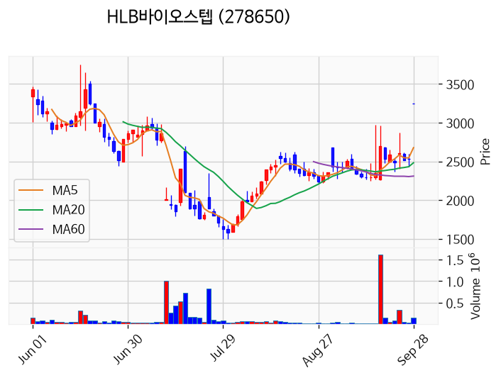

---

### HLB제약 (상한가)
— 등락률 +30.00% / 거래량 3만 주

**◎ 관련기사**
- [HLB제약 주가, 9월 28일 애프터마켓 9,620원 30.00% 상한가](https://news.google.com/rss/articles/CBMickFVX3lxTE1qQVNPd0lsdEJFWHRRVXZza2xrZGZSVmRrRDM3T2xPU29DWnoyQkdZdkk2U0ZaNEViSnlUamZiNE9MWW5tU040YnRsN2ZLNkN5NWY1ZlU1c3Mza3F4Z3l6ZGZhQ0cwa1pnZjVxNXZWcWhfdw?oc=5) — 톱스타뉴스, 2026-09-28

**◎ 공시**
- _(공시 없음 / 미조회)_

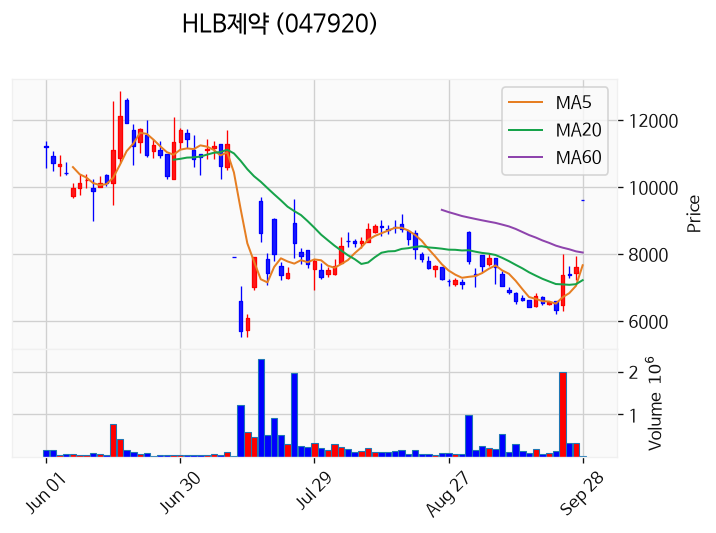

---

### HLB펩 (상한가)
— 등락률 +30.00% / 거래량 29만 주

**◎ 관련기사**
- [HLB그룹, ‘리픽투’ FDA 승인 기념 고객 감사 프로모션](https://news.google.com/rss/articles/CBMiTkFVX3lxTE5UMTUxOTQzMU4wdDVndi1tcV91RTAza181YzlBTVdTNDRHUVljcW5YSWlTSUt4eXd0ZThFVWhzeDcwSENuZ1JUeUtac1dTUQ?oc=5) — dt.co.kr, 2026-09-28

**◎ 공시**
- _(공시 없음 / 미조회)_

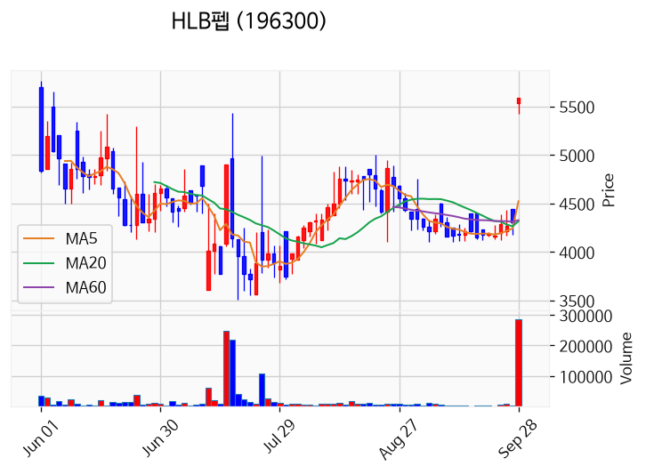

---

### 씨싸이트 (상한가)
— 등락률 +30.00% / 거래량 4만 주

**◎ 관련기사**
- [[공시]구미현 일가,씨싸이트 504억 인수…경영권 접수](https://news.google.com/rss/articles/CBMia0FVX3lxTE9FUGswaFRIVHJfcGc1MjhYNDdXSzE1Z1RHVUNSeUwwa1lDSFh3WGpEdldDYldqNGtyUkN3dFUxVV9XSjk4WklGZ2lPazVSUDNWVUhMeENTbnV3bmVGT0w2bDdYcmdJWkdPb0g40gFvQVVfeXFMT0pFazh0TW1hMTFTdll5T3ZYWVdYclZVUWdfdVhBcGdpbXZIZVlfX0dtZEJOZTgyVllIQ1dvQzRYZGZCSmFmM1Z2TWJManRWblFTcUJuamsyM0hpT2xmMW1LV0JlQW9KNS1XTUUwNEpr?oc=5) — 한스경제, 2026-09-28

**◎ 공시**
- _(공시 없음 / 미조회)_

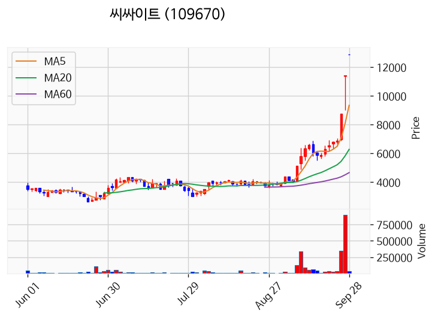

---

### HLB이노베이션 (상한가)
— 등락률 +29.99% / 거래량 126만 주

**◎ 관련기사**
- [SK하이닉스, TSMC와 HBM5 검증… ‘올해의 파트너’ 2년 연속 선정](https://news.google.com/rss/articles/CBMimgFBVV95cUxObmloRHRfRmcxbU05dHFicXBCZDdwbXdwTUR4UVdMZjU5UTB5RWlXQTVCWjFTM2ZqYzRVcDF3Y1hUdFNid0ZhNTNsSnJKYXl1bHozZWppaFpDa0JTWi1CUWxZdzQ3TE50TDVPNXRHMjgyZ1hESnc3Wm1xZjNzM3JKYy02aEZEUGV6cXdCX09ST2FGay1iUjAtWGZ3?oc=5) — Chosunbiz, 2026-09-28

**◎ 공시**
- _(공시 없음 / 미조회)_

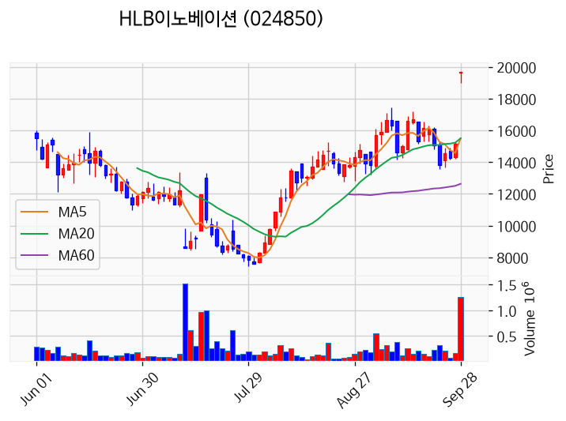

---

### 한국비엔씨 (상한가)
— 등락률 +29.98% / 거래량 2,038만 주

**◎ 관련기사**
_(관련기사 없음 / 미조회)_

**◎ 공시**
- _(공시 없음 / 미조회)_

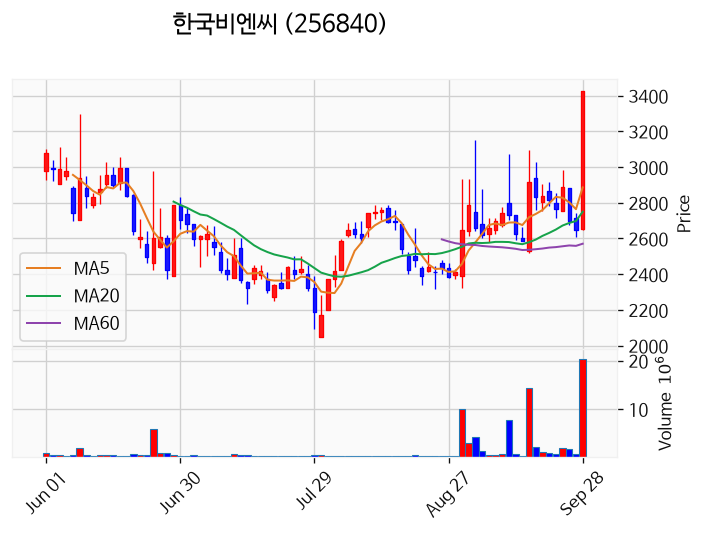

---

### HLB생명과학 (상한가)
— 등락률 +29.96% / 거래량 27만 주

**◎ 관련기사**
- [美 금리 부담에 반도체株 '털썩'⋯코스피 '6900선' 붕괴](https://news.google.com/rss/articles/CBMiS0FVX3lxTFBMWUFUUjlPRWRzZWdvSWcweHg2N0E2N2xwUlV2Y3QzakdxTWpHamhPaDhSSXFjUjNjby1wc2JnUGpmZl9qZ1VoVGctOA?oc=5) — 아이뉴스24, 2026-09-28

**◎ 공시**
- _(공시 없음 / 미조회)_

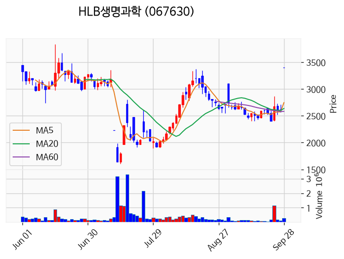

---

### HLB (상한가)
— 등락률 +29.95% / 거래량 34만 주

**◎ 관련기사**
- [HLB그룹, ‘리픽투’ FDA 승인 기념 고객 감사 프로모션](https://news.google.com/rss/articles/CBMiTkFVX3lxTE5UMTUxOTQzMU4wdDVndi1tcV91RTAza181YzlBTVdTNDRHUVljcW5YSWlTSUt4eXd0ZThFVWhzeDcwSENuZ1JUeUtac1dTUQ?oc=5) — dt.co.kr, 2026-09-28

**◎ 공시**
- _(공시 없음 / 미조회)_

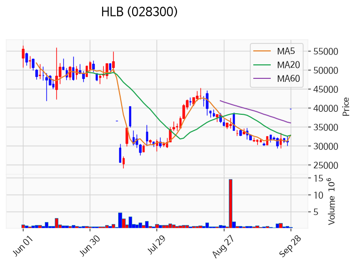

---

### HLB파나진 (상한가)
— 등락률 +29.95% / 거래량 37만 주

**◎ 관련기사**
_(관련기사 없음 / 미조회)_

**◎ 공시**
- _(공시 없음 / 미조회)_

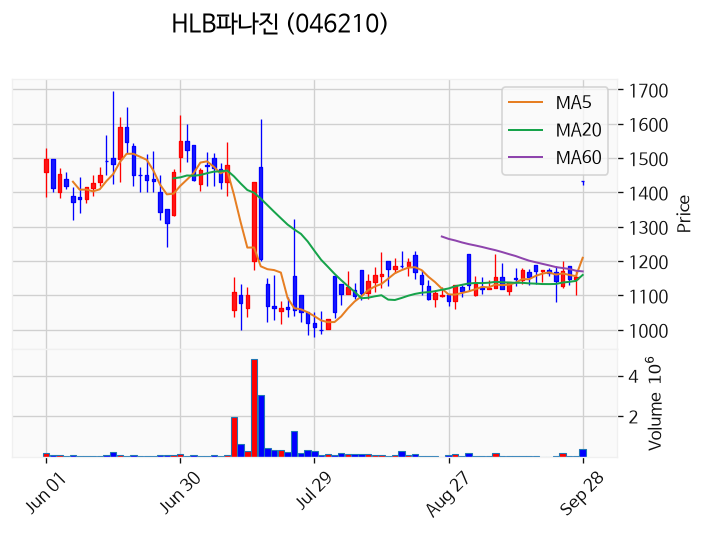

---

### HLB테라퓨틱스 (상한가)
— 등락률 +29.84% / 거래량 21만 주

**◎ 관련기사**
- [HLB그룹, ‘리픽투’ FDA 승인 기념 고객 감사 프로모션](https://news.google.com/rss/articles/CBMiTkFVX3lxTE5UMTUxOTQzMU4wdDVndi1tcV91RTAza181YzlBTVdTNDRHUVljcW5YSWlTSUt4eXd0ZThFVWhzeDcwSENuZ1JUeUtac1dTUQ?oc=5) — dt.co.kr, 2026-09-28

**◎ 공시**
- _(공시 없음 / 미조회)_

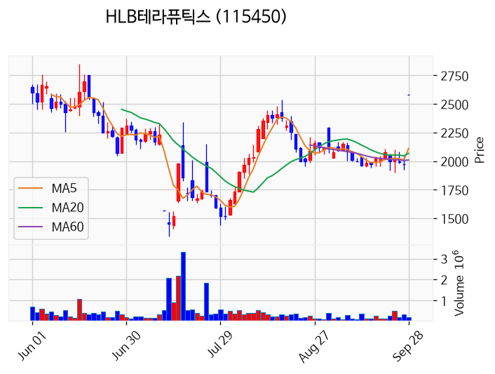

---

### HLB제넥스 (상한가)
— 등락률 +29.83% / 거래량 130만 주

**◎ 관련기사**
- [HLB그룹, ‘리픽투’ FDA 승인 기념 고객 감사 프로모션](https://news.google.com/rss/articles/CBMiTkFVX3lxTE5UMTUxOTQzMU4wdDVndi1tcV91RTAza181YzlBTVdTNDRHUVljcW5YSWlTSUt4eXd0ZThFVWhzeDcwSENuZ1JUeUtac1dTUQ?oc=5) — dt.co.kr, 2026-09-28

**◎ 공시**
- _(공시 없음 / 미조회)_

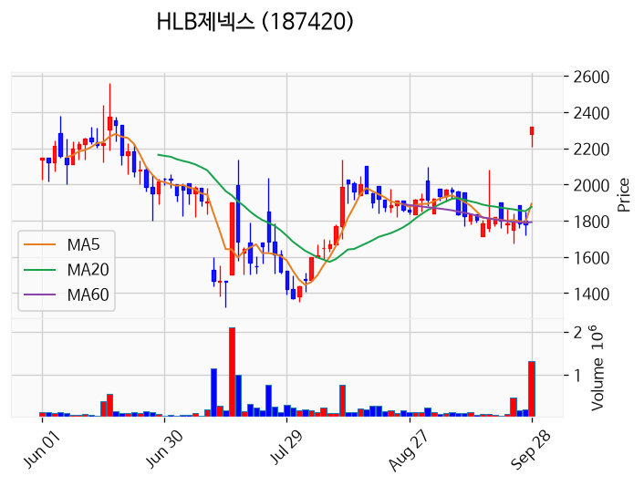

---

### HLB글로벌 (상한가)
— 등락률 +29.82% / 거래량 40만 주

**◎ 관련기사**
- [HLB그룹, 리픽투 FDA 승인 기념 전사 프로모션](https://news.google.com/rss/articles/CBMibEFVX3lxTE15UkRKSWZsTWFNN0Q4anFucXN1Uk5HbDN5ejFyZjR0ZEJPa1VsM3VMV1RVMkFJUnVlZlJ0eG5ZUy1IcWotRVFiQ3pma2hnQ2tvUlVJZGo3UnJkYTBKSzdvNDY1dmR0aGs2OVR5MQ?oc=5) — 중소기업신문, 2026-09-28

**◎ 공시**
- _(공시 없음 / 미조회)_

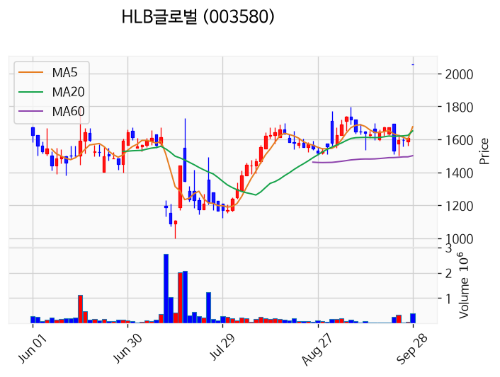

---

### 동국생명과학 (거래량 급증)
— 등락률 +24.46% / 거래량 3,195만 주

**◎ 관련기사**
- [동국생명과학 주가, 9월 28일 애프터마켓 3,500원 25.00% 상승](https://news.google.com/rss/articles/CBMickFVX3lxTE56dF9hUi0tQ1JoUnhlMTZrdFpzNWtoQkQyVWY0U2VmNEJXdXBYWVVuT2RHeTlHc1RxbWFHb19xdHQzakpTbGFBNklud3FteC1GOGprRkJZUU9mMHZaWkF0TzI1aFRxWldnYk9JTXJGR3R5UQ?oc=5) — 톱스타뉴스, 2026-09-28

**◎ 공시**
- _(공시 없음 / 미조회)_

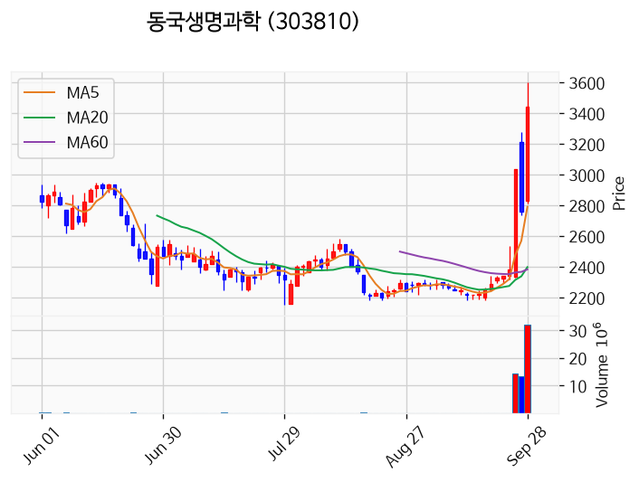

---

### 매드업 (거래량 급증)
— 등락률 +16.08% / 거래량 1,125만 주

**◎ 관련기사**
- [매드업 주가, 9월 28일 애프터마켓 8,950원 16.08% 상승](https://news.google.com/rss/articles/CBMickFVX3lxTFBBbmVqTWthYkR2VjY5S3gweVI5dEtwU09qVk4xR2NqVi1YWXBkMXluOWRDMDFQY0pPV2U2SlJJaWpGanprdzU4Ui0tbTNfbTNwUzQ1VGxmM1VzLXJaY1EyZjlTN1pnYlpvdkd0Z29wTm5NUQ?oc=5) — 톱스타뉴스, 2026-09-28

**◎ 공시**
- _(공시 없음 / 미조회)_

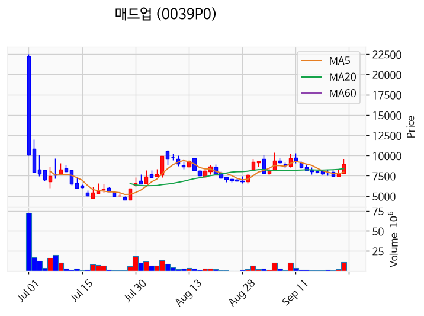

---

### 삼익제약 (거래량 급증)
— 등락률 +15.27% / 거래량 1,095만 주

**◎ 관련기사**
- [삼익제약 주가, 9월 28일 애프터마켓 10,420원 15.27% 상승](https://news.google.com/rss/articles/CBMickFVX3lxTE5SeG5paUR5SVZTVnNYaWdLUFJESVZ5M2ZDUERiNU9hRmpXdDlnZkFuVFJFSGswQk51dC1LR1VLMzZvcGxrTmVHTEVuUjl1UmpoWVNiNTIzUVVBa2oxSk9jSnJlVURkYzJJQ2NabkRSVUhLZw?oc=5) — 톱스타뉴스, 2026-09-28

**◎ 공시**
- _(공시 없음 / 미조회)_

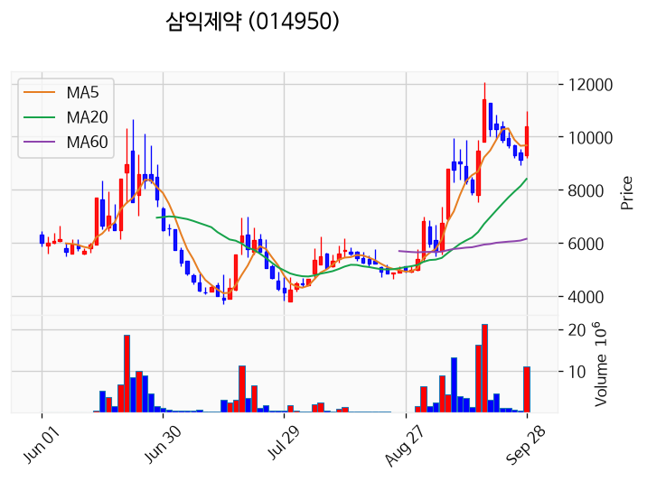

---

### 한화솔루션 (거래량 급증)
— 등락률 +15.07% / 거래량 1,011만 주

**◎ 관련기사**
- [맹탕 미·중 회담에 태양광주 '빵끗'…한화솔루션·OCI홀딩스 급등](https://news.google.com/rss/articles/CBMiWkFVX3lxTE9FdDRIcF9jYWRWR3hBeno4X3p3TDM0b1hNUG0yQkstOXRxN2J0TXRzaEUwaTZzdjJjc2lHUEthODlpdlpvS3lKbVp2cElHSzFkRDBvUGNmbGdZUQ?oc=5) — 한국경제, 2026-09-28

**◎ 공시**
- _(공시 없음 / 미조회)_

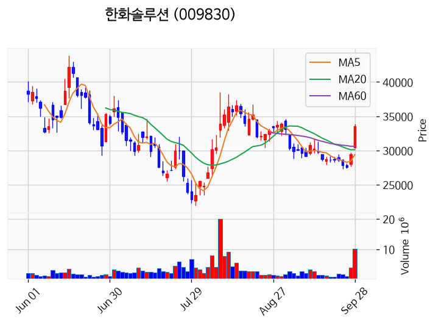

---

### 더블유에스아이 (거래량 급증)
— 등락률 +9.77% / 거래량 2,032만 주

**◎ 관련기사**
_(관련기사 없음 / 미조회)_

**◎ 공시**
- _(공시 없음 / 미조회)_

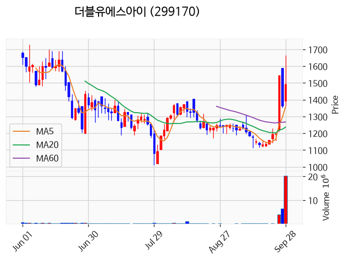

---

### 토마토시스템 (거래량 급증)
— 등락률 +8.74% / 거래량 1,699만 주

**◎ 관련기사**
- [토마토시스템 주가, 9월 28일 애프터마켓 4,420원 8.87% 상승](https://news.google.com/rss/articles/CBMickFVX3lxTE5Ubng4elhzc1d1WXBPNDVHejZsUFQ4VVlfb0JLNmtaaEo3X0ZMZlpETDhKVHRtbVJHRWFjbk5fMXVyVm1rNXh0VWgtV0ZVMHVDYTBVd29na0xuc3I4emZzTjg4OW0tSVlCdzg1eVBhbVAxZw?oc=5) — 톱스타뉴스, 2026-09-28

**◎ 공시**
- _(공시 없음 / 미조회)_

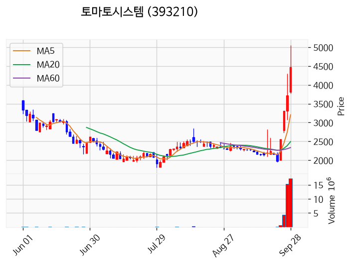

---

### 대우건설 (거래량 급증)
— 등락률 +7.17% / 거래량 1,231만 주

**◎ 관련기사**
- [대우건설, '두정역 푸르지오 그랑피크' 분양 중](https://news.google.com/rss/articles/CBMiWkFVX3lxTE83VC14bmE5TGVveG05aHh2TXdnOFF3Skdvb1I0ZEVtR0otNkdoWG9MbDdpTnJkNmNQNmI5R0d3WGVaSHFXRDh3OEZaWS1xeW9RV2hBQk9nT0xSdw?oc=5) — 한국경제, 2026-09-28

**◎ 공시**
- _(공시 없음 / 미조회)_

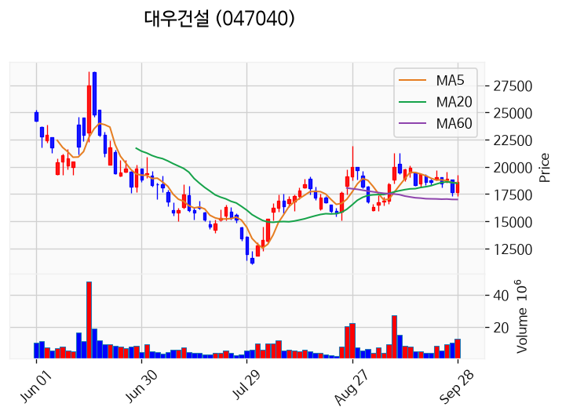

---

### HT로보틱스 (거래량 급증)
— 등락률 -2.00% / 거래량 1,834만 주

**◎ 관련기사**
- [[인사] 배재대](https://news.google.com/rss/articles/CBMic0FVX3lxTFA0MU5pUHVOSktGUFVsc2ExT3JoVTFHOHIxLXpsQ3dwaEJ6cU9TbmV5eTE3UEhUR08ySU1icUtUX3VrUkUta1JnVXNidGFaczRjNVljS1lIZlg3Tk55cVRtS0hnbUxyQ2I1d1BZaFQ4QmhPYVHSAXdBVV95cUxQRFQ3OGlybk9QZ2kwcWVjY1ZqVGJndDcyT2Q4VjRGVVZwdkYxcW5Zbkp1RXBoY3JKRzBrUDduZ1RsWXlHMjhtOE1NLUE2c0tpbmpvMmV1UDI3RlhJdnJOd3ZvWjhMdnlWQnlMLXB6bVItR2ptY0oyYw?oc=5) — 핀포인트뉴스, 2026-09-28

**◎ 공시**
- _(공시 없음 / 미조회)_

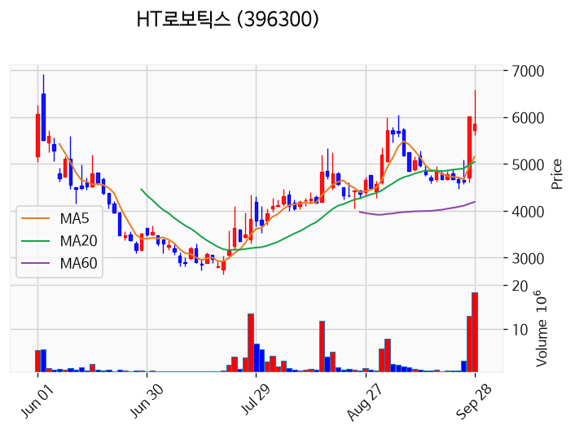

---

### 삼성전자 (거래량 급증)
— 등락률 -5.25% / 거래량 2,056만 주

**◎ 관련기사**
- [삼성전자, 화성에 1조7천억 신규 투자…연구동 짓는다](https://news.google.com/rss/articles/CBMiW0FVX3lxTE9tdHBQVmZnQTBoeGpfTTBUZFFyNHltLWJ0SDNZODBGX3JGczNYdTN1blBuYm5MZEpmVUg1a2lpVXBmTkJ4bUJwNThhcTIyZmhLQkVxazRDWF82MW_SAWBBVV95cUxPd3pzcVo2ZGk5SkhIeWY1VjBmTUFuYnZFcFZDdTBmaDB6MnFITFRtaUI5Yk5kVXZkcjlKUUlwZnlObUpEY3o0RUZ0QVN3M1NuOVdpd2NNcUE0UFM1NFdFems?oc=5) — 연합뉴스, 2026-09-28

**◎ 공시**
- _(공시 없음 / 미조회)_

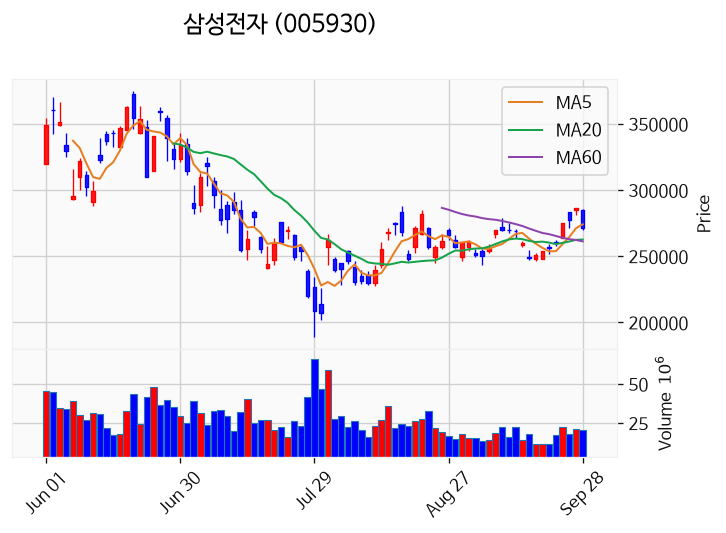

---

## 2. 거래량 폭증 후 급감 패턴 종목
_(폭증 전일 대비 500~1000%, 급감 전일 대비 25% 이하, 급감일 종가가 5일선 대비 -3% 이내)_

_해당 종목 없음_
