# 2026년 9월 29일 시황 노트

## 1. 상한가 / 거래량 1,000만주 이상 종목

### 글로벌테크놀로지 (상한가)
— 등락률 +68.10% / 거래량 4,295만 주

**◎ 관련기사**
- [[52주 최고가] 글로벌테크놀로지, 전일비 64.70%↑... 현재가 16,470원](https://news.google.com/rss/articles/CBMiYkFVX3lxTE8zeGRjbHNnalpSM0tPZl90b196NnE3QVZlcEJRblg3bm9wYkZuSEstNkV1ZFJmb2JwZmhwbWZnTk9vZ0pfMWFzVGpzVU5sbG8yN0JjcUQ1X0Y5eHJPMkU4N2xB?oc=5) — 버핏연구소, 2026-09-29

**◎ 공시**
- _(공시 없음 / 미조회)_

---

### 빅웨이브로보틱스 (상한가)
— 등락률 +67.78% / 거래량 1,319만 주

**◎ 관련기사**
- [빅웨이브로보틱스 첫날 63.9%↑...초기 VC ‘텐배거’ 기대](https://news.google.com/rss/articles/CBMib0FVX3lxTE1mOGl3ZE9XbUJlM2JmNnNHNDRiRUltVEFVVi1pVUhyV28yN3pHU2NtYkY4dGUwOGVCMmd3ZzVNeVlCamZFWFhfdnBGcmVpeDhzVXBCWWhCd2pzNGhWTExLUVJBbjdILWF5TGJsN3ZiZw?oc=5) — 뉴스톱, 2026-09-29

**◎ 공시**
- _(공시 없음 / 미조회)_

---

### 테라뷰 (상한가)
— 등락률 +30.00% / 거래량 874만 주

**◎ 관련기사**
- [테라뷰, 美 코밸런트와 13.6억 EOTPR 공급계약](https://news.google.com/rss/articles/CBMiakFVX3lxTE53Qmp5eW1mUEZxRlVVZl9vNGQyMXFKM29oVV8yTGpWREpUbDJLMlZjVGZKQkw5Q2g0al9ZcmZQTzJuRWQzNEJkMnZtNGpPa0xjTXgzYlVicXMxblhXUE5uVlEzWWM3QmJqSFE?oc=5) — 더스탁(The Stock), 2026-09-29

**◎ 공시**
- _(공시 없음 / 미조회)_

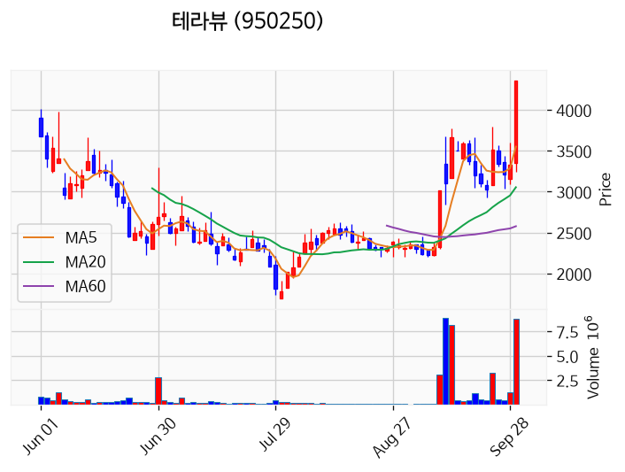

---

### 씨싸이트 (상한가)
— 등락률 +29.99% / 거래량 11만 주

**◎ 관련기사**
- [[급등락주 짚어보기] 테라뷰·씨싸이트 '上'…반도체 수주·경영권 호재에 급등](https://news.google.com/rss/articles/CBMickFVX3lxTE5mQk00ZENNZ2ZvSTdYZDNTUFJOTE11MWx5M0haWENSTHVaTVRZZnZCR0t4UENCUzJhcVU0U2t1a1lmMnVobFhocGZ3Rl9acVhNMlhlajg3VXpfN0Rwc29Nd2h3SE1PZmFrclhpVUM4MTZvZw?oc=5) — 이투데이, 2026-09-29

**◎ 공시**
- _(공시 없음 / 미조회)_

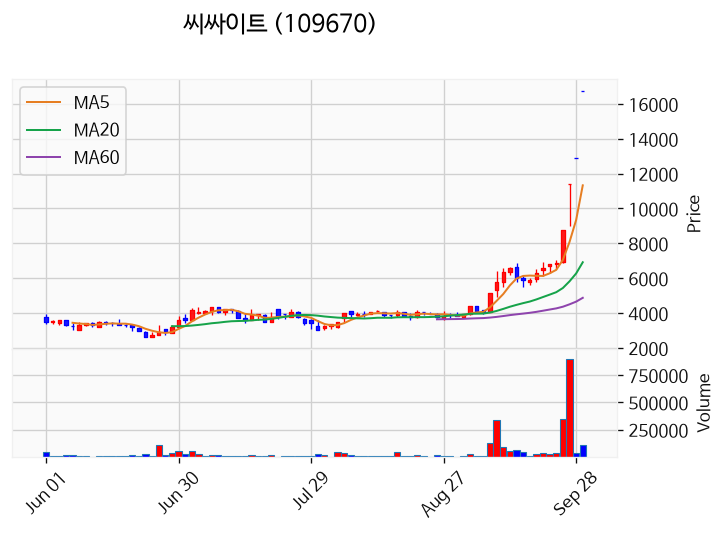

---

### 라메디텍 (상한가)
— 등락률 +29.95% / 거래량 83만 주

**◎ 관련기사**
- [[급등락주 짚어보기] 테라뷰·씨싸이트 '上'…반도체 수주·경영권 호재에 급등](https://news.google.com/rss/articles/CBMickFVX3lxTE5mQk00ZENNZ2ZvSTdYZDNTUFJOTE11MWx5M0haWENSTHVaTVRZZnZCR0t4UENCUzJhcVU0U2t1a1lmMnVobFhocGZ3Rl9acVhNMlhlajg3VXpfN0Rwc29Nd2h3SE1PZmFrclhpVUM4MTZvZw?oc=5) — 이투데이, 2026-09-29

**◎ 공시**
- _(공시 없음 / 미조회)_

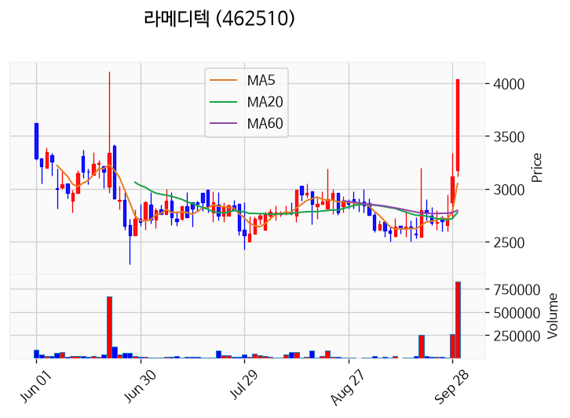

---

### 현대바이오랜드 (상한가)
— 등락률 +29.90% / 거래량 1,538만 주

**◎ 관련기사**
- [[52주 최고가] 글로벌테크놀로지, 전일비 64.70%↑... 현재가 16,470원](https://news.google.com/rss/articles/CBMiYkFVX3lxTE8zeGRjbHNnalpSM0tPZl90b196NnE3QVZlcEJRblg3bm9wYkZuSEstNkV1ZFJmb2JwZmhwbWZnTk9vZ0pfMWFzVGpzVU5sbG8yN0JjcUQ1X0Y5eHJPMkU4N2xB?oc=5) — 버핏연구소, 2026-09-29

**◎ 공시**
- _(공시 없음 / 미조회)_

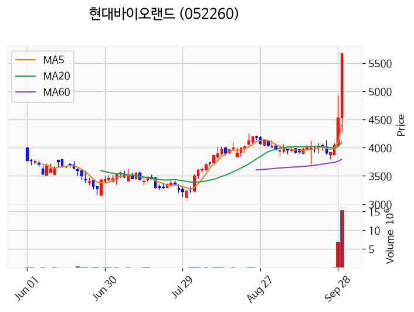

---

### 나인테크 (거래량 급증)
— 등락률 +19.46% / 거래량 1,395만 주

**◎ 관련기사**
- [코스피, 美 금리 부담에 0.27% 내려 6870선...코스닥은 반도체 소부장 강세](https://news.google.com/rss/articles/CBMic0FVX3lxTE1LT3dmck9CZ1kzM0lFSlgzZ1BSdjcxMHNabjRCemlhTzU4S0NZUllSWjh6NXhXVFY5X1JJaDhtZnNSLVhFVmJxcnF0S1hzRzk5Y1Bob185Y2xQZW0wSXNTV29YMVhUc0JfcU1PODdIUE0wNkHSAXdBVV95cUxPYWM3SlhoM1VnZEo2VFI2eDlQY0ZCMkVnYndfOTNuMW93Zk41VlRORkJMSE40Sm1RNDE5Z1FrMzF4TlNpZW5TaHFoSF9zbWRrdmEwZmZzWmlOckxTcTR3aHNqRVFpTXVmeTNRMWxpZDdnSlBETXBmbw?oc=5) — 핀포인트뉴스, 2026-09-29

**◎ 공시**
- [[기재정정]단일판매ㆍ공급계약체결              ](https://dart.fss.or.kr/dsaf001/main.do?rcpNo=20260929900368) — 나인테크, 20260929

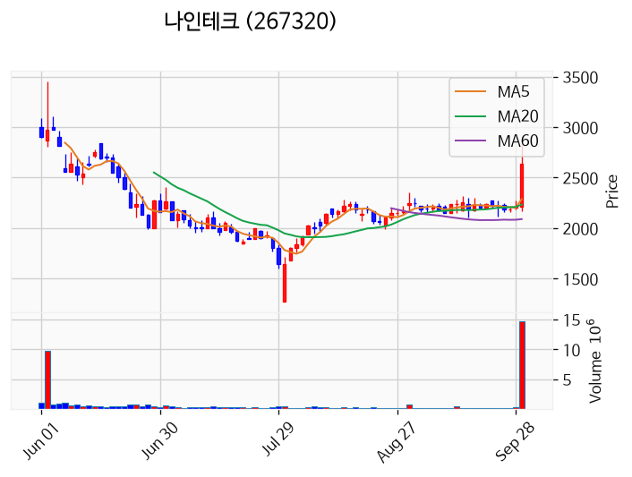

---

### 한빛레이저 (거래량 급증)
— 등락률 +13.54% / 거래량 2,353만 주

**◎ 관련기사**
- [코스피, 美 금리 부담에 0.27% 내려 6870선...코스닥은 반도체 소부장 강세](https://news.google.com/rss/articles/CBMic0FVX3lxTE1LT3dmck9CZ1kzM0lFSlgzZ1BSdjcxMHNabjRCemlhTzU4S0NZUllSWjh6NXhXVFY5X1JJaDhtZnNSLVhFVmJxcnF0S1hzRzk5Y1Bob185Y2xQZW0wSXNTV29YMVhUc0JfcU1PODdIUE0wNkHSAXdBVV95cUxPYWM3SlhoM1VnZEo2VFI2eDlQY0ZCMkVnYndfOTNuMW93Zk41VlRORkJMSE40Sm1RNDE5Z1FrMzF4TlNpZW5TaHFoSF9zbWRrdmEwZmZzWmlOckxTcTR3aHNqRVFpTXVmeTNRMWxpZDdnSlBETXBmbw?oc=5) — 핀포인트뉴스, 2026-09-29

**◎ 공시**
- _(공시 없음 / 미조회)_

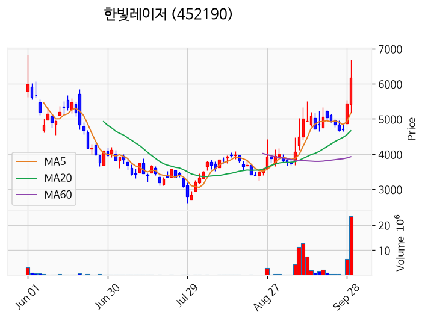

---

### MDS테크 (거래량 급증)
— 등락률 +11.48% / 거래량 1,059만 주

**◎ 관련기사**
_(관련기사 없음 / 미조회)_

**◎ 공시**
- _(공시 없음 / 미조회)_

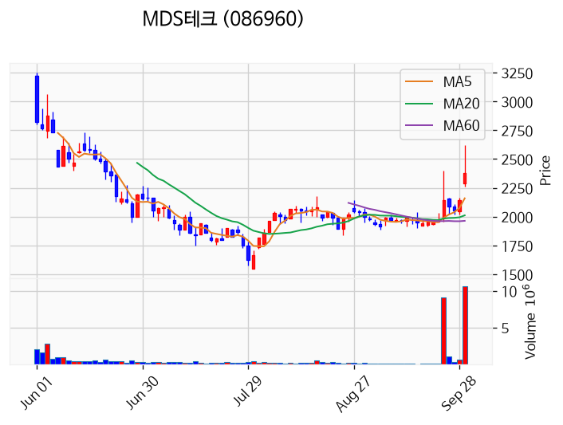

---

### 보원케미칼 (거래량 급증)
— 등락률 +7.85% / 거래량 1,328만 주

**◎ 관련기사**
_(관련기사 없음 / 미조회)_

**◎ 공시**
- _(공시 없음 / 미조회)_

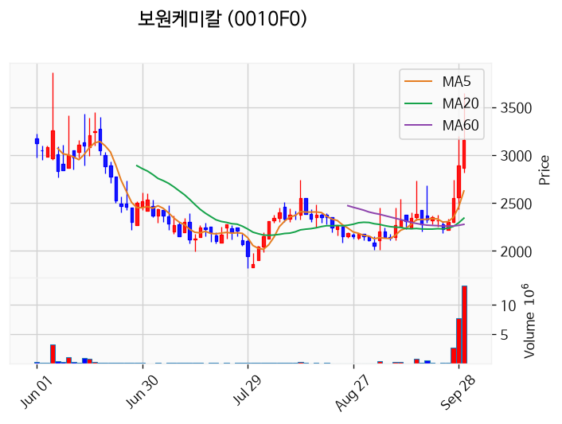

---

### 삼성전자 (거래량 급증)
— 등락률 +1.48% / 거래량 1,538만 주

**◎ 관련기사**
- [삼성전자 “파운드리 고객사 2029년까지 4배로…고성능 반도체 집중”](https://news.google.com/rss/articles/CBMidkFVX3lxTE5jb2JxM29nbTd3MXR3Q1FRd180NkdUaDBTZ3RmWC1UaEZ3Z1FDRDlCV0xvdkZTSVZzcVZPMkIzdW1FNHdBcnVXRElDeXozUjFTNWUwWW92NnltRC1XTS1wYmgtVmxvSmlUNDdub25wVk9SRFNzeVHSAWZBVV95cUxNN3pZeVVVeFV0VW12RGNqeDUzYkdVSjlLWEdVSkhvT1g0NExLRUhoWkFlckFqVEludjllSE1TM2pIMlFzeGNmNkt6YnBFa1F6aFVxcnhPeTdNUmttanhzTWd1MXd2Z3c?oc=5) — 동아일보, 2026-09-29

**◎ 공시**
- _(공시 없음 / 미조회)_

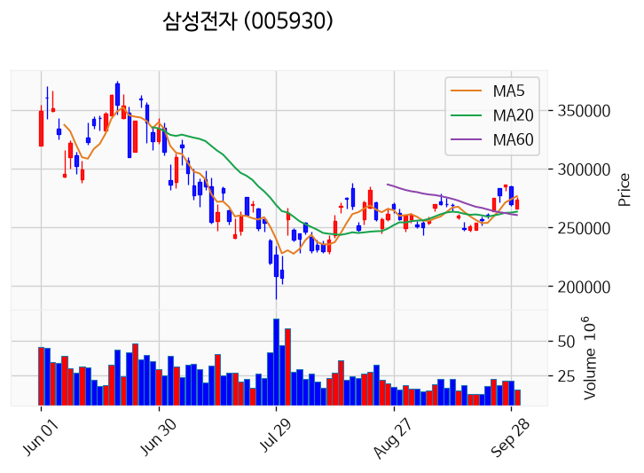

---

### 한국비엔씨 (거래량 급증)
— 등락률 -4.82% / 거래량 2,449만 주

**◎ 관련기사**
- [[나고야 2026] 김민영이 첫 金 딴 ‘쿠라시’가 뭐길래…유도와 닮은 듯 다르다](https://news.google.com/rss/articles/CBMiYkFVX3lxTE9IOEdzX0pTMEtabmJGbHFQVVFLZU1TRFh2Sl9PZGdxUXhKd3FzdzRKUjByWGxxYjRLOXRFc1BndGcxWlpLQTFyQ0pkSFlZUlFobzhOblh2QUtMZkJ1N0Y4UVlB?oc=5) — 일간스포츠, 2026-09-29

**◎ 공시**
- _(공시 없음 / 미조회)_

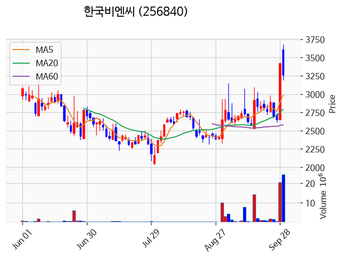

---

### 부산주공 (거래량 급증)
— 등락률 -92.39% / 거래량 2,887만 주

**◎ 관련기사**
_(관련기사 없음 / 미조회)_

**◎ 공시**
- _(공시 없음 / 미조회)_

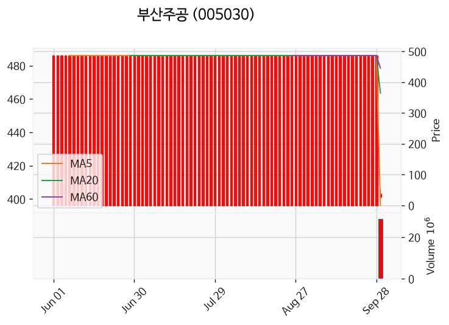

---

## 2. 거래량 폭증 후 급감 패턴 종목
_(폭증 전일 대비 500~1000%, 급감 전일 대비 25% 이하, 급감일 종가가 5일선 대비 -3% 이내)_

_해당 종목 없음_
