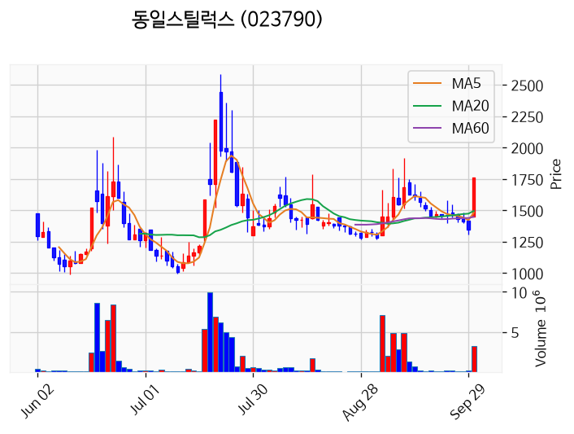
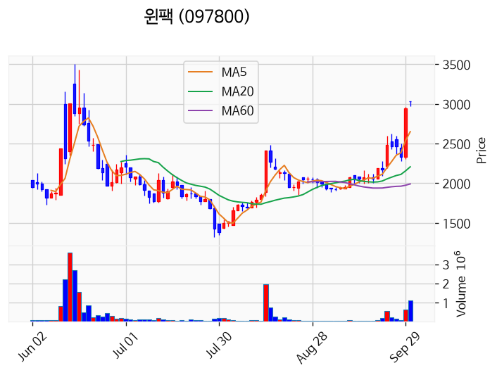
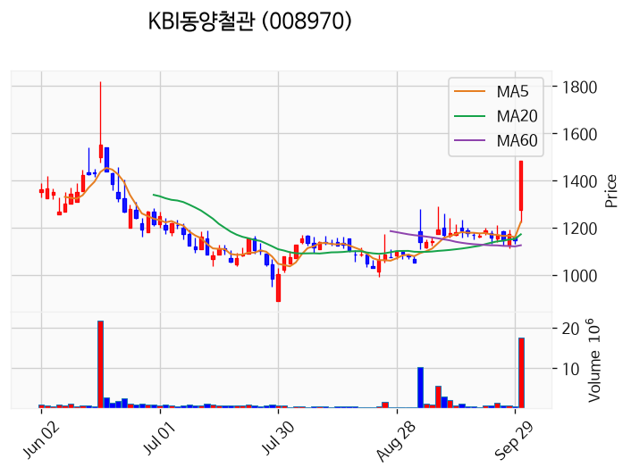
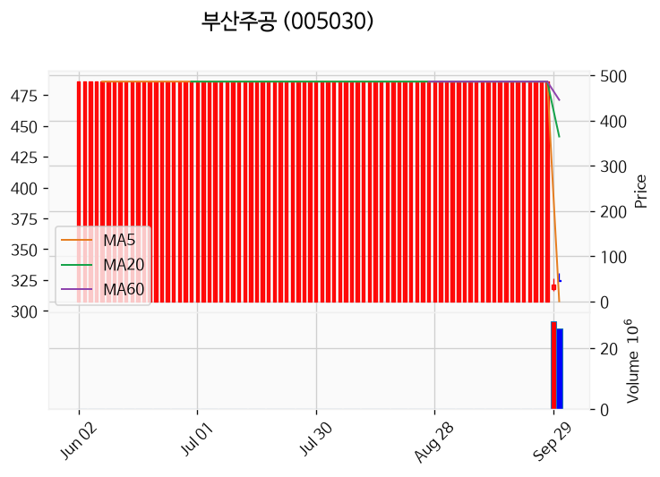
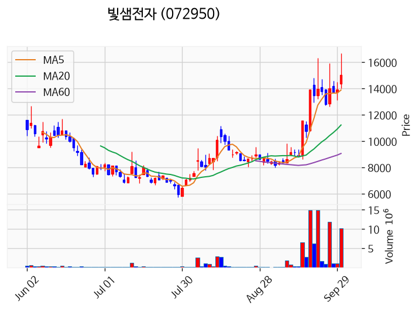
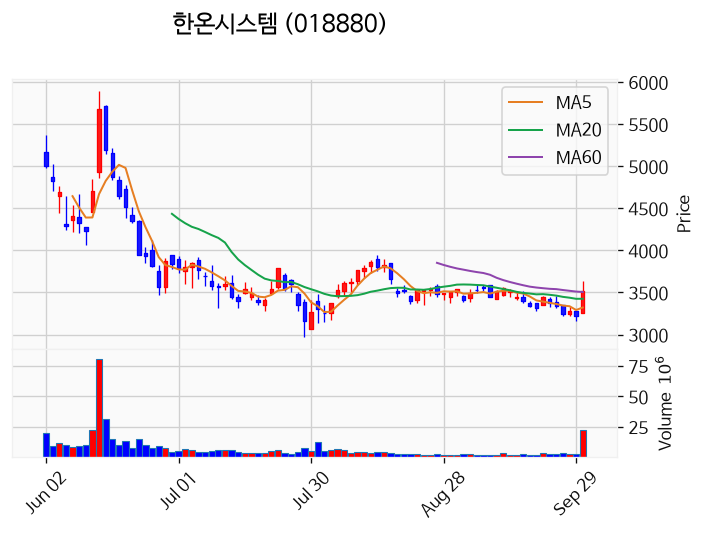
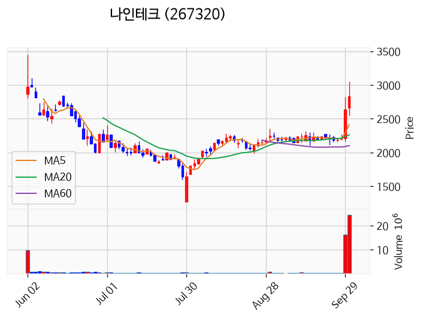
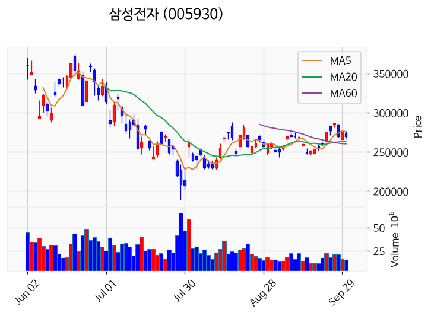
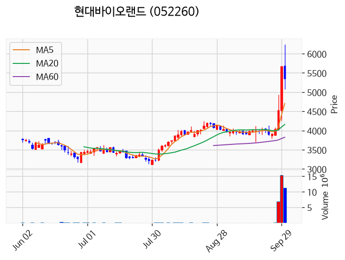
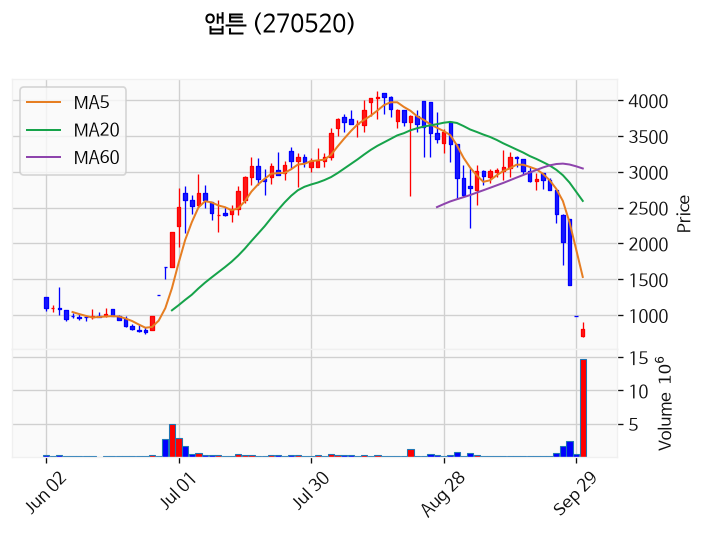

# 2026년 9월 30일 시황 노트

## 1. 상한가 / 거래량 1,000만주 이상 종목

### 동일스틸럭스 (상한가)
— 등락률 +29.99% / 거래량 323만 주

**◎ 관련기사**
- [오후 이슈 [전고체] : 이수스페셜티케미컬, 나인테크, 한농화성, 하나기술, 미코](https://news.google.com/rss/articles/CBMiWkFVX3lxTE1WRXNRZlNpSXd2TC1maVAtUmNaNHZrbGRXSC04REFhaXNic04xQVR2SDJlTE51SDM0eWtvRWxDVlVLWlBqVXJhUEZmdEh3dk50TUJXbmJXb3Nudw?oc=5) — 파이낸셜뉴스, 2026-09-30

**◎ 공시**
- _(공시 없음 / 미조회)_

---

### 윈팩 (상한가)
— 등락률 +29.98% / 거래량 109만 주

**◎ 관련기사**
- [윈팩 3035원 상한가…반도체 후공정 수급 집중](https://news.google.com/rss/articles/CBMibkFVX3lxTE5MSUp3UjJRTlBjbDNzd0Y5T2MtR1VuSXBTaG1kY1dydHdZNmVxMmYwbG1qVkVEeU9BMGJFZ0trZVZocFFSemc0a1k2bHJGZm9jTG1DSWdTaTU2b081ZUI0YzlkRWJsWlV3UDc0VGlB0gFyQVVfeXFMUHRvZjhHZVNveEJFdjNHTjhodVVCbHgxekNFdXR1YkVTY19mbzh1LUhFVlR5TnZUTUlRR2pJNGpDNTlDejg0QzZEelB1WEIwSWFUT1RDWVJMMm1aMFlNRlVKLXpmYkM1T1hBMHJXOW9hRDRR?oc=5) — 잡포스트, 2026-09-30

**◎ 공시**
- _(공시 없음 / 미조회)_

---

### KBI동양철관 (상한가)
— 등락률 +29.97% / 거래량 1,759만 주

**◎ 관련기사**
- [KBI동양철관 상한가 직행…1758만주 손바뀜](https://news.google.com/rss/articles/CBMibkFVX3lxTE1SQVQ2ampZWmJ0STd2Mlphd1JaYmZ6X3JXeGlXY0NmZmhSeGJmYU5fQmg5aEN5MUFnLUQ3Z1hBT2JZY1Vic25PMFc5MEVPN0tXTzAzeGxqeDZ0ZHlZck5nWDFuQ3VXQUw0WGNNaFJR0gFyQVVfeXFMT3Y0XzZlQVVsV3BZeXo3dTBoWm9ZWHZfLVFWM3lKTm5scGtyMHZrSVRTOVNhdkZIelF6b01MTUoyb1NJTzhWcHFQTWJ6Qmh5VmR6cGFXTXR6eUZRRVl5cy1JMzI0S1ZXems3ZkZYNVc5TlZn?oc=5) — 잡포스트, 2026-09-30

**◎ 공시**
- [[기재정정]반기보고서 (2026.06)](https://dart.fss.or.kr/dsaf001/main.do?rcpNo=20260930000528) — KBI동양철관, 20260930

---

### 빅웨이브로보틱스 (상한가)
— 등락률 +29.93% / 거래량 1,470만 주

**◎ 관련기사**
- [빅웨이브로보틱스 장원선 부사장, 소유 주식 수량 93만9360주 보고…소유 지분율 9.15%](https://news.google.com/rss/articles/CBMie0FVX3lxTE5CRFBGdk5lNThIcnc5a2VJNC1OLXpGS2Q0bDFGOHEwa3NEbnNoY1U1cGNvNlcyQXo0a3dibi1EbHE4ZExDV1RVeW84dHBnZlpkR2VFUWxkSGpYa1UxZEZIVm1EMzVJZkVwb2czM2VleXIzTVpsN2xZTFpXNA?oc=5) — digitaltoday.co.kr, 2026-09-30

**◎ 공시**
- [임원ㆍ주요주주특정증권등소유상황보고서](https://dart.fss.or.kr/dsaf001/main.do?rcpNo=20260930000543) — 이경준, 20260930
- [임원ㆍ주요주주특정증권등소유상황보고서](https://dart.fss.or.kr/dsaf001/main.do?rcpNo=20260930000514) — 송준봉, 20260930
- [임원ㆍ주요주주특정증권등소유상황보고서](https://dart.fss.or.kr/dsaf001/main.do?rcpNo=20260930000443) — 장원선, 20260930
- [임원ㆍ주요주주특정증권등소유상황보고서](https://dart.fss.or.kr/dsaf001/main.do?rcpNo=20260930000419) — 김민교, 20260930

---

### 덕산넵코어스 (거래량 급증)
— 등락률 +20.41% / 거래량 4,385만 주

**◎ 관련기사**
- [덕산넵코어스, 코스닥 입성..."글로벌 시장 공략 본격화"](https://news.google.com/rss/articles/CBMiVkFVX3lxTFBkRTlwVnhYNDBqOWFVRzMzNExlNVpvMFFpa1ZfMEN2XzhMYmxDVGNTdk0xaWZmMjBETVFmdG9Sbk1INUlUQ0xtTlJXYUlvQVByMjZCSlZ3?oc=5) — 지디넷코리아, 2026-09-30

**◎ 공시**
- _(공시 없음 / 미조회)_

---

### 부산주공 (거래량 급증)
— 등락률 +18.92% / 거래량 2,648만 주

**◎ 관련기사**
_(관련기사 없음 / 미조회)_

**◎ 공시**
- _(공시 없음 / 미조회)_

---

### 빛샘전자 (거래량 급증)
— 등락률 +11.23% / 거래량 1,022만 주

**◎ 관련기사**
_(관련기사 없음 / 미조회)_

**◎ 공시**
- _(공시 없음 / 미조회)_

---

### 한온시스템 (거래량 급증)
— 등락률 +10.00% / 거래량 2,281만 주

**◎ 관련기사**
- ['현대·기아차 1차 하청 갑질사건 여섯 번 검사 교체 끝에 무혐의](https://news.google.com/rss/articles/CBMiT0FVX3lxTE13TExJdldnMUVoUlZrc2YzUTJnTVUzZkFsZHlMamQtOFFKRllLUkJucFVEcW1zVE5LSnVGYzBNRFp2REd1Wl93a3hlZERxNm8?oc=5) — v.daum.net, 2026-09-30

**◎ 공시**
- _(공시 없음 / 미조회)_

---

### 나인테크 (거래량 급증)
— 등락률 +9.88% / 거래량 2,443만 주

**◎ 관련기사**
- [오후 이슈 [전고체] : 이수스페셜티케미컬, 나인테크, 한농화성, 하나기술, 미코](https://news.google.com/rss/articles/CBMiWkFVX3lxTE1WRXNRZlNpSXd2TC1maVAtUmNaNHZrbGRXSC04REFhaXNic04xQVR2SDJlTE51SDM0eWtvRWxDVlVLWlBqVXJhUEZmdEh3dk50TUJXbmJXb3Nudw?oc=5) — 파이낸셜뉴스, 2026-09-30

**◎ 공시**
- _(공시 없음 / 미조회)_

---

### 글로벌테크놀로지 (거래량 급증)
— 등락률 +7.41% / 거래량 3,684만 주

**◎ 관련기사**
- [한싹, 종속회사 에이치에스시큐리티에 76억원 규모 채무보증 결정](https://news.google.com/rss/articles/CBMic0FVX3lxTE5Yck5hbTg4SmZ4aExfMWlOMVpSREVzaEEzTWJwRzlhVDRGeExkVGtfeEZpdUg2dTFzRE1vYnFFTFQ2ODNOSDNIN0xVczhPUGg3RHU2aVNMM2paa1ZwS0ZNV0Ffb0tVTmk0aE80LWtTX2laaXc?oc=5) — 데이터투자, 2026-09-30

**◎ 공시**
- _(공시 없음 / 미조회)_

---

### 삼성전자 (거래량 급증)
— 등락률 -1.10% / 거래량 1,603만 주

**◎ 관련기사**
- [HBM 우려에도 꺾이지 않은 낙관론…삼성전자·하이닉스 증권가 전망은? [주가동향]](https://news.google.com/rss/articles/CBMib0FVX3lxTE1KY2FlekY3NEFRQ3F1TlMyWnM1Tm5sVXNzaXB5ek93UEhkLVBITlBnb3VGZVd2OG5sQXZVdDl6TUV2SDdiRlA0S01fTjRaclBGMFZxdGFIYWhwOXAtTFZlSXNaWVFmeUJPd1g3LWVqOA?oc=5) — 조세일보, 2026-09-30

**◎ 공시**
- _(공시 없음 / 미조회)_

---

### 현대바이오랜드 (거래량 급증)
— 등락률 -4.59% / 거래량 1,122만 주

**◎ 관련기사**
_(관련기사 없음 / 미조회)_

**◎ 공시**
- _(공시 없음 / 미조회)_

---

### 앱튼 (거래량 급증)
— 등락률 -18.26% / 거래량 1,475만 주

**◎ 관련기사**
_(관련기사 없음 / 미조회)_

**◎ 공시**
- _(공시 없음 / 미조회)_

---

## 2. 거래량 폭증 후 급감 패턴 종목
_(폭증 전일 대비 500~1000%, 급감 전일 대비 25% 이하, 급감일 종가가 5일선 대비 -3% 이내)_

### 하이트진로홀딩스
- 폭증일: 2026-09-29, 거래량 2만 주 (전일 대비 525%)
- 급감일: 2026-09-30, 거래량 0만 주 (전일 대비 24%)
- 급감일 종가 7,790원 / 5일선 4,696원 (이격률 +65.89%)

### 아모레퍼시픽홀딩스우
- 폭증일: 2026-09-29, 거래량 1만 주 (전일 대비 710%)
- 급감일: 2026-09-30, 거래량 0만 주 (전일 대비 22%)
- 급감일 종가 11,300원 / 5일선 6,812원 (이격률 +65.88%)

### HLB파나진
- 폭증일: 2026-09-29, 거래량 357만 주 (전일 대비 968%)
- 급감일: 2026-09-30, 거래량 41만 주 (전일 대비 11%)
- 급감일 종가 1,278원 / 5일선 799원 (이격률 +59.95%)

### 인티큐브
- 폭증일: 2026-09-29, 거래량 5만 주 (전일 대비 788%)
- 급감일: 2026-09-30, 거래량 1만 주 (전일 대비 22%)
- 급감일 종가 2,110원 / 5일선 1,282원 (이격률 +64.59%)

### 케이알엠
- 폭증일: 2026-09-29, 거래량 16만 주 (전일 대비 807%)
- 급감일: 2026-09-30, 거래량 4만 주 (전일 대비 24%)
- 급감일 종가 4,675원 / 5일선 2,789원 (이격률 +67.62%)

### 대주이엔티
- 폭증일: 2026-09-29, 거래량 0만 주 (전일 대비 789%)
- 급감일: 2026-09-30, 거래량 0만 주 (전일 대비 2%)
- 급감일 종가 2,835원 / 5일선 1,586원 (이격률 +78.75%)

### 위메이드플레이
- 폭증일: 2026-09-29, 거래량 2만 주 (전일 대비 607%)
- 급감일: 2026-09-30, 거래량 0만 주 (전일 대비 13%)
- 급감일 종가 6,650원 / 5일선 3,904원 (이격률 +70.34%)

### 대창스틸
- 폭증일: 2026-09-29, 거래량 4만 주 (전일 대비 571%)
- 급감일: 2026-09-30, 거래량 1만 주 (전일 대비 18%)
- 급감일 종가 1,997원 / 5일선 1,204원 (이격률 +65.81%)

### 듀켐바이오
- 폭증일: 2026-09-29, 거래량 48만 주 (전일 대비 784%)
- 급감일: 2026-09-30, 거래량 8만 주 (전일 대비 16%)
- 급감일 종가 6,880원 / 5일선 4,114원 (이격률 +67.23%)

### 에이치엘사이언스
- 폭증일: 2026-09-29, 거래량 0만 주 (전일 대비 751%)
- 급감일: 2026-09-30, 거래량 0만 주 (전일 대비 14%)
- 급감일 종가 5,210원 / 5일선 3,144원 (이격률 +65.71%)

### 지앤이헬스케어
- 폭증일: 2026-09-29, 거래량 1만 주 (전일 대비 967%)
- 급감일: 2026-09-30, 거래량 0만 주 (전일 대비 10%)
- 급감일 종가 590원 / 5일선 372원 (이격률 +58.60%)

### 알비더블유
- 폭증일: 2026-09-29, 거래량 15만 주 (전일 대비 922%)
- 급감일: 2026-09-30, 거래량 1만 주 (전일 대비 4%)
- 급감일 종가 1,586원 / 5일선 970원 (이격률 +63.54%)

### 티와이홀딩스우
- 폭증일: 2026-09-29, 거래량 1만 주 (전일 대비 670%)
- 급감일: 2026-09-30, 거래량 0만 주 (전일 대비 14%)
- 급감일 종가 2,885원 / 5일선 1,705원 (이격률 +69.21%)

### 그린리소스
- 폭증일: 2026-09-29, 거래량 50만 주 (전일 대비 544%)
- 급감일: 2026-09-30, 거래량 11만 주 (전일 대비 22%)
- 급감일 종가 7,500원 / 5일선 4,430원 (이격률 +69.30%)

### 뷰티스킨
- 폭증일: 2026-09-29, 거래량 369만 주 (전일 대비 820%)
- 급감일: 2026-09-30, 거래량 54만 주 (전일 대비 15%)
- 급감일 종가 2,470원 / 5일선 1,466원 (이격률 +68.49%)
