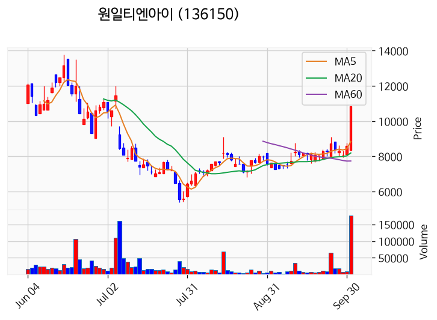
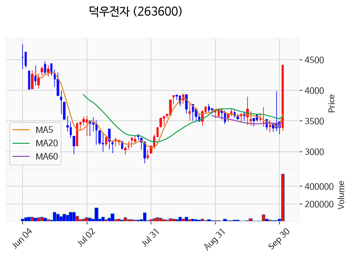
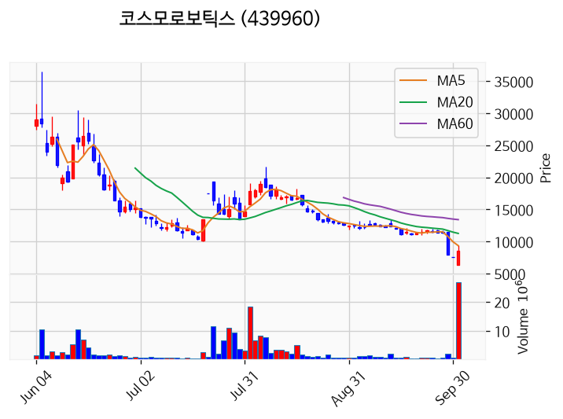
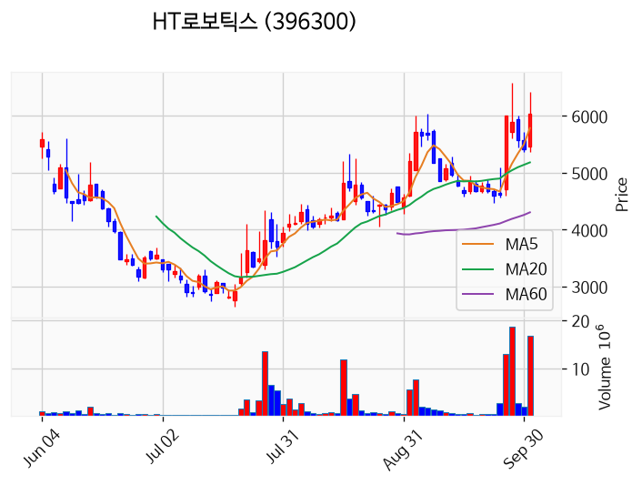
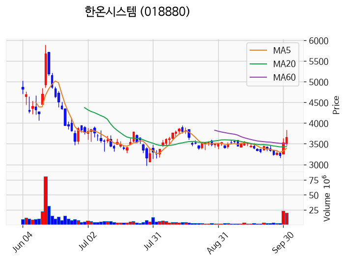
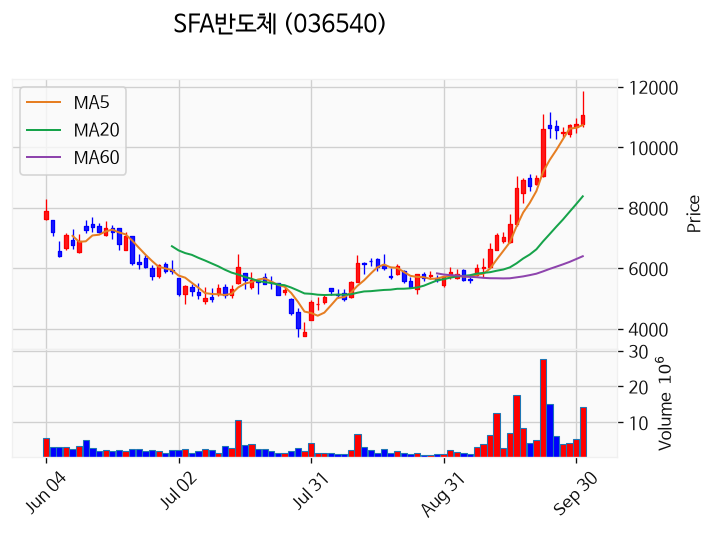
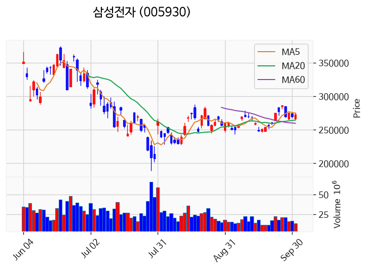
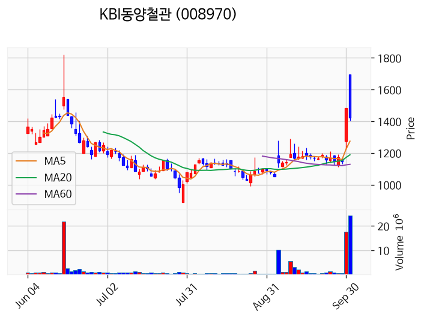
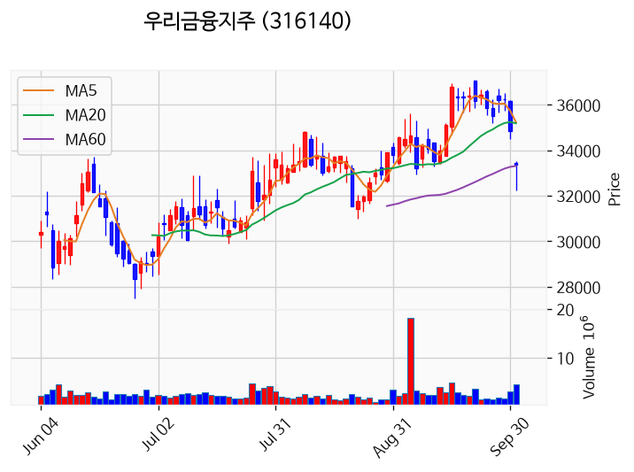
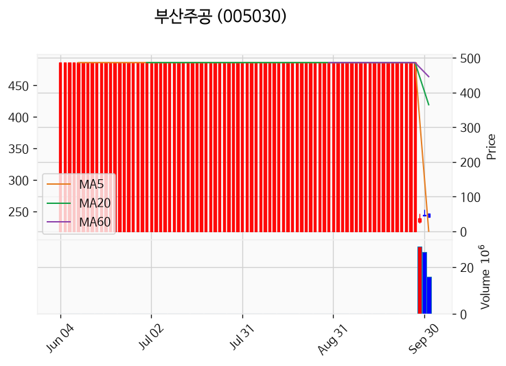

# 2026년 10월 1일 시황 노트

## 1. 상한가 / 거래량 1,000만주 이상 종목

### 브릴스 (상한가)
— 등락률 +58.97% / 거래량 1,589만 주

**◎ 관련기사**
- [로봇기업 브릴스, 코스닥 상장 첫날 56% 상승 마감(종합)](https://news.google.com/rss/articles/CBMiYEFVX3lxTFA5WnRRZnR2TkJ6ZjBpVXFEeW96eWo0c1lsVU14TG5PT1ZSQzF3eHAwOVp1bndzMnZUS2tYRmpiUEFzdmRkdDhYeUZoQVd5SHJlalZkQUdZM1lIRXZKTHJ1atIBeEFVX3lxTE92TXRrR1dXa3ltdjBEY2NwQWtsbXNGMk5mYTIzX2ptcXE5czMtT2duNEhqYzhYc0dWWVBhVVdwZ1NRZU5JY1paTEJYQ3lpNkxrNER1OXJEdXFvcUtFMl9mUVJiRFlzVVhENkZuZThoTE81eHJPdFpLVw?oc=5) — 뉴시스, 2026-10-01

**◎ 공시**
- _(공시 없음 / 미조회)_

---

### 원일티엔아이 (상한가)
— 등락률 +29.94% / 거래량 18만 주

**◎ 관련기사**
- [[급등락주 짚어보기] 원전·부품 호재에 원일티엔아이·덕우전자 '上'](https://news.google.com/rss/articles/CBMidEFVX3lxTE1aOF9lUFZGbkNhZ1lwbWU2UlJIUlg1MWgwbDdHYlo5TTJ1VUVuWkNPTm1VZl83bXVOa3VtYWljWFJYOE9SLXpLWFQtOWNJNVZvcktIeXNnX1YwS1oxNzB4VTBkQUdMaTY2dmxJdVFKT19sbkhf?oc=5) — 이투데이, 2026-10-01

**◎ 공시**
- _(공시 없음 / 미조회)_

---

### 덕우전자 (상한가)
— 등락률 +29.90% / 거래량 54만 주

**◎ 관련기사**
- [[급등락주 짚어보기] 원전·부품 호재에 원일티엔아이·덕우전자 '上'](https://news.google.com/rss/articles/CBMidEFVX3lxTE1aOF9lUFZGbkNhZ1lwbWU2UlJIUlg1MWgwbDdHYlo5TTJ1VUVuWkNPTm1VZl83bXVOa3VtYWljWFJYOE9SLXpLWFQtOWNJNVZvcktIeXNnX1YwS1oxNzB4VTBkQUdMaTY2dmxJdVFKT19sbkhf?oc=5) — 이투데이, 2026-10-01

**◎ 공시**
- _(공시 없음 / 미조회)_

---

### 코스모로보틱스 (거래량 급증)
— 등락률 +12.90% / 거래량 2,687만 주

**◎ 관련기사**
_(관련기사 없음 / 미조회)_

**◎ 공시**
- _(공시 없음 / 미조회)_

---

### HT로보틱스 (거래량 급증)
— 등락률 +11.83% / 거래량 1,665만 주

**◎ 관련기사**
_(관련기사 없음 / 미조회)_

**◎ 공시**
- _(공시 없음 / 미조회)_

---

### 한온시스템 (거래량 급증)
— 등락률 +4.26% / 거래량 2,013만 주

**◎ 관련기사**
_(관련기사 없음 / 미조회)_

**◎ 공시**
- _(공시 없음 / 미조회)_

---

### SFA반도체 (거래량 급증)
— 등락률 +2.97% / 거래량 1,400만 주

**◎ 관련기사**
_(관련기사 없음 / 미조회)_

**◎ 공시**
- _(공시 없음 / 미조회)_

---

### 삼성전자 (거래량 급증)
— 등락률 +1.86% / 거래량 1,323만 주

**◎ 관련기사**
- [삼성전자, 갤럭시S26 가격 인상...메모리 급등 여파](https://news.google.com/rss/articles/CBMigwFBVV95cUxQMUZlREZpVGhRa2ZKcjhmWERsRUZqQ1BRcE4yUEUzSGhpekpyR3NjT0FtQWtfSFk1Vmo2RWNnQ1o4WFJmak1pV1FCXzBjMUpGLTFoZURWMTU3SUdVVHRPcGNmMFFSUURxUGVnWjFvY0pGQUJRbGRvYm5vZHVkSll6UVdhVQ?oc=5) — 조선일보, 2026-10-01

**◎ 공시**
- [임원ㆍ주요주주특정증권등소유상황보고서](https://dart.fss.or.kr/dsaf001/main.do?rcpNo=20261001000251) — 나현수, 20261001
- [임원ㆍ주요주주특정증권등소유상황보고서](https://dart.fss.or.kr/dsaf001/main.do?rcpNo=20261001000203) — 이석림, 20261001

---

### KBI동양철관 (거래량 급증)
— 등락률 -3.64% / 거래량 2,428만 주

**◎ 관련기사**
- [[마감] 코스피, 반도체 훈풍에 상승…브릴스 상장 첫날 56% '급등'](https://news.google.com/rss/articles/CBMibEFVX3lxTFAxbjJyYWhOZE91UkpNUnVGNVhBUk1xd2o3dU43MXRRRi1DRDFxbVJUMGhSWVNrOWRhQm5jTkEzV0o1VkdtbFczLUgyRkI4VnA0UkJseTJMYUxQUEVidUI1dlNLNk1iRzhPSDY5VNIBb0FVX3lxTE4xbTRNUTRVNUlMWjlUaHdsdE5FcUk1alZmUm1IdkpYUUtKcHhkRXZYSk8tTXREVnJ2VnVwZVhXcGlHNXBIREloa1p2VXgtbW93MFlzazJ0VWxvbWw2ZTRpUHAyZ1ZJcmkxakdnYzNmRQ?oc=5) — 한스경제, 2026-10-01

**◎ 공시**
- _(공시 없음 / 미조회)_

---

### 우리금융지주 (거래량 급증)
— 등락률 -4.44% / 거래량 2,468만 주

**◎ 관련기사**
- [‘찬바람 불면 역시 배당주’ 올해도 통할까…증권가 콕 찍은 종목은](https://news.google.com/rss/articles/CBMiUkFVX3lxTE9PZFlndW5xc3dUWHQyNk5TVDhfYm9Del8taFhCR2Z2VG1jMkZ1ZTBsQ0diVHppSW5FRlZDLWprM29LQ1VzZWFGYTl1bGJwekt0X0E?oc=5) — 매일경제 마켓, 2026-10-01

**◎ 공시**
- _(공시 없음 / 미조회)_

---

### 덕산넵코어스 (거래량 급증)
— 등락률 -7.17% / 거래량 1,466만 주

**◎ 관련기사**
- [반도체 수출·마이크론 호실적에 코스피 7000선 눈앞…코스닥 4%대 급등 [이런국장 저런주식]](https://news.google.com/rss/articles/CBMiUkFVX3lxTE9Kcy14Y3c5dDFLeUxiZjNPTGw4MzA0cjhqWXAzOHRSQ3dpZXJLUmhfQjgtWjMzNHE1WTdVYS1YdVNwcktxSjBzWkZaNmk1VHFJTXfSAVNBVV95cUxOLWo4Z3k5dDZQMC1oZWRjSzdNeWh1NEoxWmxHRUJYQzBBbjRjRFJxYU1Mem9JME5ISU41X3dWMDdsOFpSUmJ5NUttT1VfcHkxemFiYw?oc=5) — 서울경제, 2026-10-01

**◎ 공시**
- _(공시 없음 / 미조회)_

---

### 부산주공 (거래량 급증)
— 등락률 -9.09% / 거래량 1,592만 주

**◎ 관련기사**
_(관련기사 없음 / 미조회)_

**◎ 공시**
- _(공시 없음 / 미조회)_

---

## 2. 거래량 폭증 후 급감 패턴 종목
_(폭증 전일 대비 500~1000%, 급감 전일 대비 25% 이하, 급감일 종가가 5일선 대비 -3% 이내)_

### 삼성스팩10호
- 폭증일: 2026-09-29, 거래량 2만 주 (전일 대비 589%)
- 급감일: 2026-10-01, 거래량 0만 주 (전일 대비 1%)
- 급감일 종가 1,993원 / 5일선 1,589원 (이격률 +25.39%)

### 동국산업
- 폭증일: 2026-09-30, 거래량 282만 주 (전일 대비 887%)
- 급감일: 2026-10-01, 거래량 45만 주 (전일 대비 16%)
- 급감일 종가 3,335원 / 5일선 2,694원 (이격률 +23.79%)

### 교보19호스팩
- 폭증일: 2026-09-30, 거래량 1만 주 (전일 대비 526%)
- 급감일: 2026-10-01, 거래량 0만 주 (전일 대비 7%)
- 급감일 종가 2,000원 / 5일선 1,595원 (이격률 +25.36%)

### 엔에이치스팩33호
- 폭증일: 2026-09-30, 거래량 1만 주 (전일 대비 634%)
- 급감일: 2026-10-01, 거래량 0만 주 (전일 대비 13%)
- 급감일 종가 1,998원 / 5일선 1,589원 (이격률 +25.76%)

### 삼보판지
- 폭증일: 2026-09-30, 거래량 1만 주 (전일 대비 540%)
- 급감일: 2026-10-01, 거래량 0만 주 (전일 대비 15%)
- 급감일 종가 9,030원 / 5일선 7,242원 (이격률 +24.69%)

### 한국주강
- 폭증일: 2026-09-30, 거래량 8만 주 (전일 대비 655%)
- 급감일: 2026-10-01, 거래량 1만 주 (전일 대비 8%)
- 급감일 종가 2,675원 / 5일선 2,113원 (이격률 +26.60%)

### 해성산업1우
- 폭증일: 2026-09-30, 거래량 0만 주 (전일 대비 923%)
- 급감일: 2026-10-01, 거래량 0만 주 (전일 대비 11%)
- 급감일 종가 5,800원 / 5일선 4,690원 (이격률 +23.67%)

### 승일
- 폭증일: 2026-09-30, 거래량 0만 주 (전일 대비 563%)
- 급감일: 2026-10-01, 거래량 0만 주 (전일 대비 18%)
- 급감일 종가 6,420원 / 5일선 5,106원 (이격률 +25.73%)

### 오션인더블유
- 폭증일: 2026-09-30, 거래량 56만 주 (전일 대비 919%)
- 급감일: 2026-10-01, 거래량 5만 주 (전일 대비 8%)
- 급감일 종가 1,565원 / 5일선 1,263원 (이격률 +23.95%)

### 테크엘
- 폭증일: 2026-09-30, 거래량 2만 주 (전일 대비 622%)
- 급감일: 2026-10-01, 거래량 0만 주 (전일 대비 21%)
- 급감일 종가 1,493원 / 5일선 1,196원 (이격률 +24.85%)

### 인지소프트
- 폭증일: 2026-09-30, 거래량 1만 주 (전일 대비 534%)
- 급감일: 2026-10-01, 거래량 0만 주 (전일 대비 2%)
- 급감일 종가 19,790원 / 5일선 15,982원 (이격률 +23.83%)

### 인터로이드
- 폭증일: 2026-09-29, 거래량 0만 주 (전일 대비 533%)
- 급감일: 2026-10-01, 거래량 0만 주 (전일 대비 5%)
- 급감일 종가 1,899원 / 5일선 1,357원 (이격률 +39.90%)

### 알체라
- 폭증일: 2026-09-30, 거래량 82만 주 (전일 대비 594%)
- 급감일: 2026-10-01, 거래량 15만 주 (전일 대비 19%)
- 급감일 종가 1,601원 / 5일선 1,242원 (이격률 +28.86%)

### 아이엘로보틱스
- 폭증일: 2026-09-30, 거래량 0만 주 (전일 대비 594%)
- 급감일: 2026-10-01, 거래량 0만 주 (전일 대비 5%)
- 급감일 종가 2,140원 / 5일선 1,683원 (이격률 +27.15%)

### 코람코더원리츠
- 폭증일: 2026-09-29, 거래량 54만 주 (전일 대비 758%)
- 급감일: 2026-10-01, 거래량 2만 주 (전일 대비 13%)
- 급감일 종가 2,390원 / 5일선 1,906원 (이격률 +25.39%)

### 블루엠텍
- 폭증일: 2026-09-30, 거래량 859만 주 (전일 대비 795%)
- 급감일: 2026-10-01, 거래량 73만 주 (전일 대비 8%)
- 급감일 종가 2,950원 / 5일선 2,315원 (이격률 +27.43%)

### 한국제15호스팩
- 폭증일: 2026-09-29, 거래량 0만 주 (전일 대비 619%)
- 급감일: 2026-10-01, 거래량 0만 주 (전일 대비 24%)
- 급감일 종가 2,080원 / 5일선 1,658원 (이격률 +25.45%)

### 로스웰
- 폭증일: 2026-09-29, 거래량 3만 주 (전일 대비 732%)
- 급감일: 2026-10-01, 거래량 0만 주 (전일 대비 1%)
- 급감일 종가 1,900원 / 5일선 1,540원 (이격률 +23.39%)
