# 2026년 10월 2일 시황 노트

## 1. 상한가 / 거래량 1,000만주 이상 종목

### 퓨쳐메디신 (상한가)
— 등락률 +70.59% / 거래량 33만 주

**◎ 관련기사**
_(관련기사 없음 / 미조회)_

**◎ 공시**
- _(공시 없음 / 미조회)_

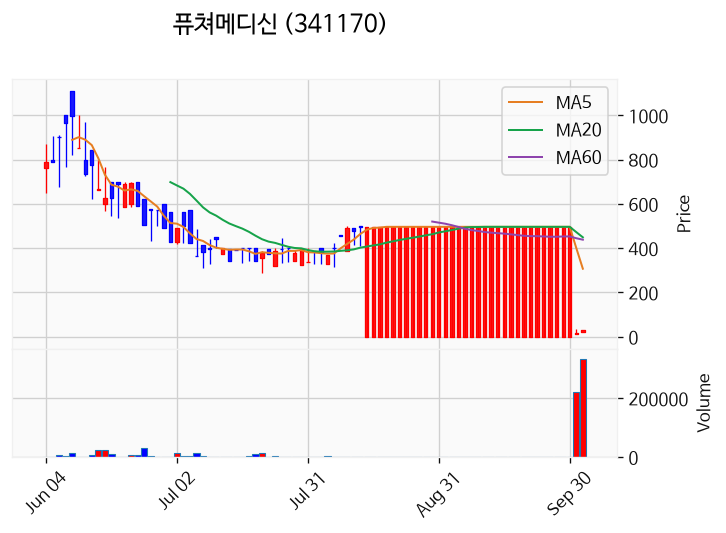

---

### 에스제이그룹 (상한가)
— 등락률 +29.96% / 거래량 26만 주

**◎ 관련기사**
- ['불꽃야구2' 김성근 감독, 파격 선발 라인업으로 승리 정조준[방송 프리뷰] - 조선비즈](https://news.google.com/rss/articles/CBMikwFBVV95cUxOS1RjcGYxaTg0NnUwaGZnM0VQWWtrc0xsOTNudTRFYU1xYWRmeW94aXhGX0ZfTnVWRE9naTd1VE9SMFR6bmNNSkZVY0FlUEVYMWNHWnZNdjV6SVBSU1NwZUtEaEFkVG4wMFpfa3hnNW1TWERNRG1BbDlTdzFabmpXMVJjTkd3ZnF3dzlMOGRUQXVhNTDSAacBQVVfeXFMTkNyelFlU2dYblhic2RGLV9KNlV3ZUFkMVdoQWlhNnR2Mmh2ZXkwN0dveXJNZzc1U1RuU2djU2lpakxid3k0QU5rUXlQODhHc2M3LTE5RmZJblRLM1AzQWJXYWhuS3ZwSmM5bHFLWUhVT3BVcFBmR3JSX3EybTU2Y3ZuUXBSbkFTYmRhMFpqc3J0Q2RBaEk5WVZDU21KMDdndVZUS0VORHM?oc=5) — Chosunbiz, 2026-10-02

**◎ 공시**
- _(공시 없음 / 미조회)_

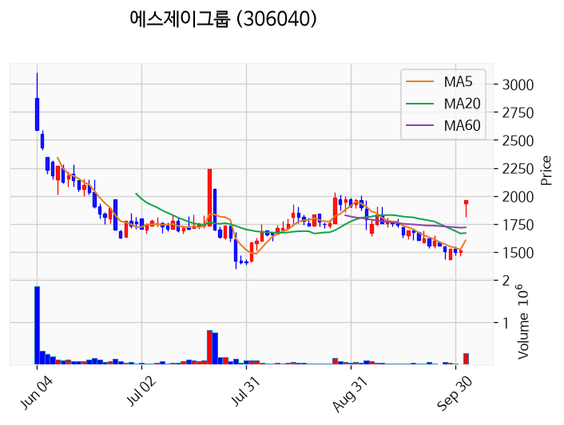

---

### 엑시온그룹 (상한가)
— 등락률 +29.96% / 거래량 131만 주

**◎ 관련기사**
- ['불꽃야구2' 김성근 감독, 파격 선발 라인업으로 승리 정조준[방송 프리뷰] - 조선비즈](https://news.google.com/rss/articles/CBMikwFBVV95cUxOS1RjcGYxaTg0NnUwaGZnM0VQWWtrc0xsOTNudTRFYU1xYWRmeW94aXhGX0ZfTnVWRE9naTd1VE9SMFR6bmNNSkZVY0FlUEVYMWNHWnZNdjV6SVBSU1NwZUtEaEFkVG4wMFpfa3hnNW1TWERNRG1BbDlTdzFabmpXMVJjTkd3ZnF3dzlMOGRUQXVhNTDSAacBQVVfeXFMTkNyelFlU2dYblhic2RGLV9KNlV3ZUFkMVdoQWlhNnR2Mmh2ZXkwN0dveXJNZzc1U1RuU2djU2lpakxid3k0QU5rUXlQODhHc2M3LTE5RmZJblRLM1AzQWJXYWhuS3ZwSmM5bHFLWUhVT3BVcFBmR3JSX3EybTU2Y3ZuUXBSbkFTYmRhMFpqc3J0Q2RBaEk5WVZDU21KMDdndVZUS0VORHM?oc=5) — Chosunbiz, 2026-10-02

**◎ 공시**
- _(공시 없음 / 미조회)_

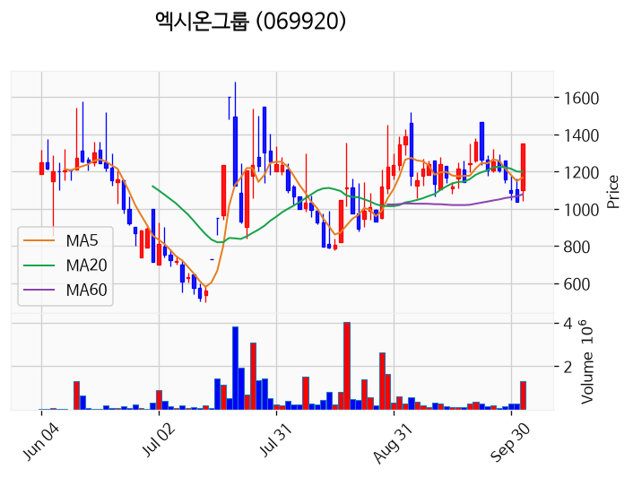

---

### 티엠씨 (상한가)
— 등락률 +29.95% / 거래량 582만 주

**◎ 관련기사**
- [티엠씨 주가, 10월 2일 애프터마켓 상한가 18,440원 29.95% 상승](https://news.google.com/rss/articles/CBMickFVX3lxTE4tUTFvZHNub3E4QnFnR2RKMkkwNTFBejhBV3BQV2RuUkdON0hwWUZGU1ZiblhRT19XeENMQUdrUUdKSzVONVlqakcxT1VfMmx2X2F0NVJDN1JjV0xQSUYtang0RkpNRHNMbGNwcS1iTjRsZw?oc=5) — TopStarNews, 2026-10-02

**◎ 공시**
- _(공시 없음 / 미조회)_

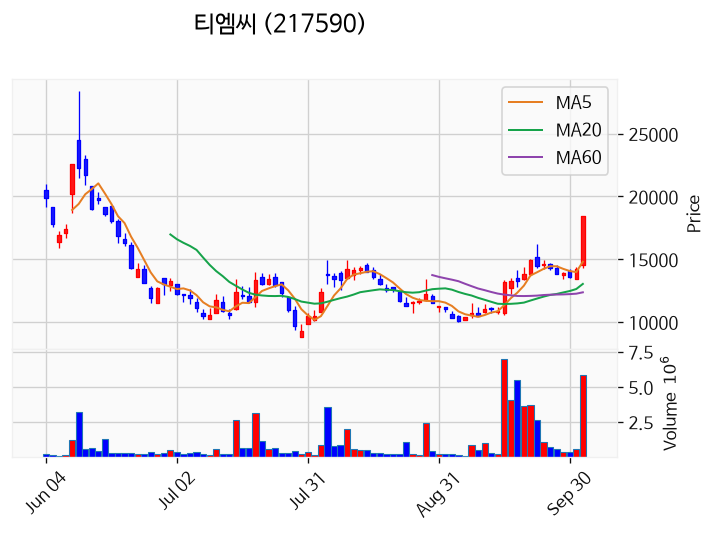

---

### 피제이전자 (상한가)
— 등락률 +29.91% / 거래량 169만 주

**◎ 관련기사**
- ['불꽃야구2' 김성근 감독, 파격 선발 라인업으로 승리 정조준[방송 프리뷰] - 조선비즈](https://news.google.com/rss/articles/CBMikwFBVV95cUxOS1RjcGYxaTg0NnUwaGZnM0VQWWtrc0xsOTNudTRFYU1xYWRmeW94aXhGX0ZfTnVWRE9naTd1VE9SMFR6bmNNSkZVY0FlUEVYMWNHWnZNdjV6SVBSU1NwZUtEaEFkVG4wMFpfa3hnNW1TWERNRG1BbDlTdzFabmpXMVJjTkd3ZnF3dzlMOGRUQXVhNTDSAacBQVVfeXFMTkNyelFlU2dYblhic2RGLV9KNlV3ZUFkMVdoQWlhNnR2Mmh2ZXkwN0dveXJNZzc1U1RuU2djU2lpakxid3k0QU5rUXlQODhHc2M3LTE5RmZJblRLM1AzQWJXYWhuS3ZwSmM5bHFLWUhVT3BVcFBmR3JSX3EybTU2Y3ZuUXBSbkFTYmRhMFpqc3J0Q2RBaEk5WVZDU21KMDdndVZUS0VORHM?oc=5) — Chosunbiz, 2026-10-02

**◎ 공시**
- _(공시 없음 / 미조회)_

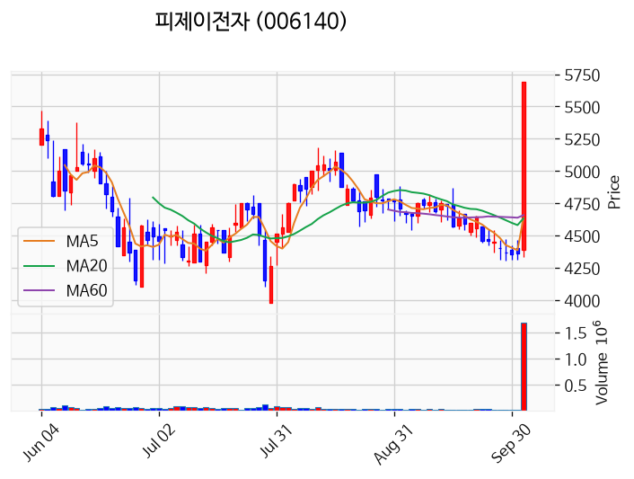

---

### 머큐리 (상한가)
— 등락률 +29.80% / 거래량 390만 주

**◎ 관련기사**
- [통신장비주가 다시 움직인다, AI 데이터센터에서 5G·6G까지 연결되는 이유](https://news.google.com/rss/articles/CBMifEFVX3lxTE9KWlItUXRwNWg3djk3ZFBscXduQlJ6Wjd1WWdHbFJtQkxmakNxdWZydDRRWkVfLUdPZFJDVkpURFVZbnZuSDBfb09OMXJzemkwcXZhOW4tMnZFQ1R1ektlVFFaLU13SkhqVy11TFBUMjR2emllakpUc3JkdzA?oc=5) — 프리미엄콘텐츠, 2026-10-02

**◎ 공시**
- _(공시 없음 / 미조회)_

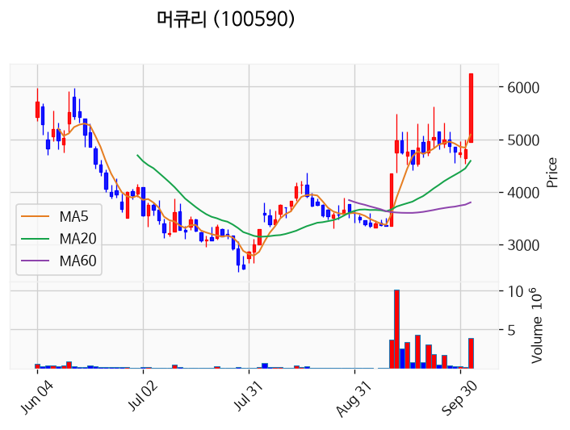

---

### 브릴스 (거래량 급증)
— 등락률 +13.14% / 거래량 1,241만 주

**◎ 관련기사**
- [개미 1.7조 투매에도…코스피 7000선 회복 마감 [시황]](https://news.google.com/rss/articles/CBMi7gFBVV95cUxNdy1uV1I4eXN2Ung1RWNsS3VMaXk5d1M4NkdNM0V2MlY2M3MyZ1JoWFQ1cEhBRGlKRGRFcmhJdFVjYVU1TUFSUkI1T0dRQjA2aVU4MHV4VmFsLTc0LWhiVDY5ZGQ5V0IySEVObkpVZXc0c0Uwemx2ekZvbzkydHB1SGs2SU5PQ1dGaWREclRVbGIwUU9sRVNOSzJIVW9DcnpLZnN5VHJSUVN0cUctT2VsenJWNU5rU0F0bm1SYWdLS1FtTUFsUXU5WHpIN3Q5Ul9WVUpzOUtqVFlkV3luWGlaNENLVGFxTTlkZ3B2d29n?oc=5) — 데일리안, 2026-10-02

**◎ 공시**
- _(공시 없음 / 미조회)_

---

### 우리로 (거래량 급증)
— 등락률 +11.88% / 거래량 1,300만 주

**◎ 관련기사**
- [창립 73주년 신풍교회, 지역과 함께하는 ‘한 걸음 더’](https://news.google.com/rss/articles/CBMiakFVX3lxTE8xY3hONmtLaVB5RmZFRHdnOUJENEM0SmFFbWtMZUozZmwyaklXSkRwaHdFQXBqSHl2eUlzMlJ4SFBBVm4yRjFGT1hvSWRYU1dIU05mUE1HV013N0xBSEpiUWs0c2picW1TYkE?oc=5) — 영등포투데이, 2026-10-02

**◎ 공시**
- _(공시 없음 / 미조회)_

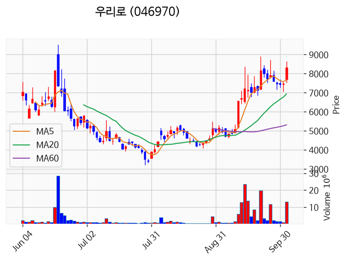

---

### 대한광통신 (거래량 급증)
— 등락률 +4.71% / 거래량 1,439만 주

**◎ 관련기사**
- [코스피, 5거래일 만에 7,000선 '탈환'…원·달러 환율 1천350원대](https://news.google.com/rss/articles/CBMiZ0FVX3lxTFBBZFNvYVFlRkZYRkZaY2NlWU1nZDR6bDhyQ2gwano2b19Hd25wNUVZMDBPRFpEVEpBY28zLTVla0dsb3BNa244QXVYREI2Y18yVUFDc0R0ZTFhZFA5Tmw5Y3F4Vk5wZ2c?oc=5) — 청년일보, 2026-10-02

**◎ 공시**
- _(공시 없음 / 미조회)_

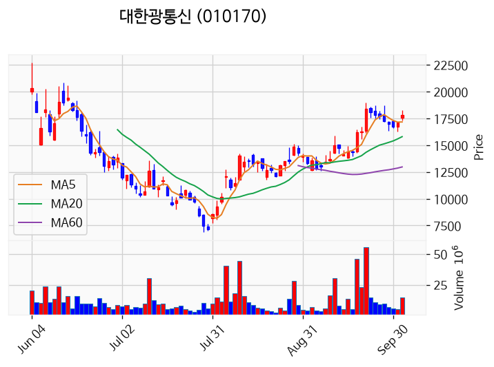

---

### 한온시스템 (거래량 급증)
— 등락률 +4.63% / 거래량 1,814만 주

**◎ 관련기사**
- [[거래소 기관] 삼성전자·SK하이닉스 담고… HD현대중공업·현대차는 대량 매](https://news.google.com/rss/articles/CBMic0FVX3lxTFAtVlBKakVwLTY0ak00dUFmX21Val9XVkQwTGppLXoybDNONkl4NmQwV3FXN0pWdEsxRkw1WWY3ejljaTFQOVM1ZmVhaWlhSjRxUlNSclFDVDZKVHRhU2JZYURDblBOeVMtVVI5Vm5sUElkbFXSAXdBVV95cUxNSmdRYUlSYktHN2NVTUwwSXE0dXFkSzBXc1gzMzZINDZyS1VRQmk3MGJlUmJtQTlNM2g3ZkxTQVRGeHJHWFRkRTktOENjTGhaLWpQN2xNVDFkWnhHWDc2SXdsSlVFenFRclNUbExUaldIMkhNZWEwbw?oc=5) — 핀포인트뉴스, 2026-10-02

**◎ 공시**
- _(공시 없음 / 미조회)_

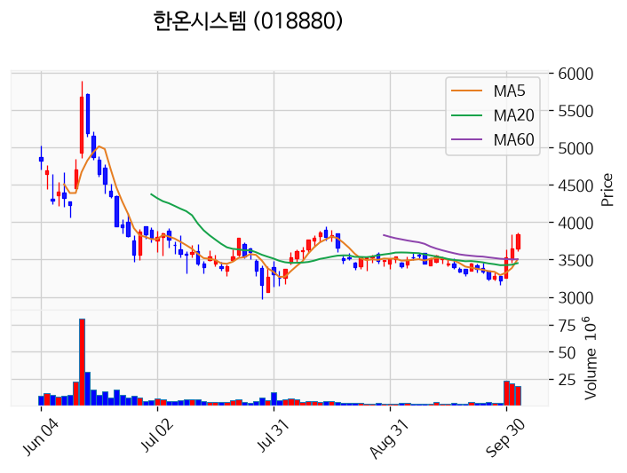

---

### 삼성전자 (거래량 급증)
— 등락률 -0.36% / 거래량 1,125만 주

**◎ 관련기사**
- [삼성전자, 자사주 매입 물량 이미 초과…15조원 한도 2~3일이면 끝](https://news.google.com/rss/articles/CBMiWkFVX3lxTE53VDBGckJpajVETTJTR3MyWjNMb0NCTFM2anpIX3h5S1E2SkVfT1A3VEl0U29VXy1lSWtYbi01S3NQNVh2Q3pUT1pES0loOGZhVWdReDBlOVNfZw?oc=5) — 파이낸셜뉴스, 2026-10-02

**◎ 공시**
- _(공시 없음 / 미조회)_

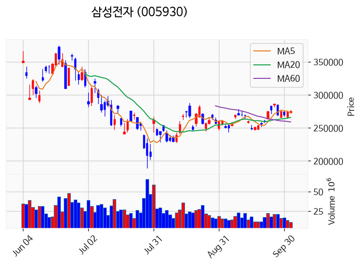

---

### 부산주공 (거래량 급증)
— 등락률 -32.50% / 거래량 1,775만 주

**◎ 관련기사**
- [부산주공, 상장폐지 가처분 기각에 즉시항고 제기](https://news.google.com/rss/articles/CBMic0FVX3lxTE5oXzFJcDliTFg0cEVtNEthRHZyYUczLUFmVzlnSXlmR0xSajNTZUVuMnRKRGw0N0FURlBTajUzQjk0OVQ3TnlBbEdTVU82ZnBlYlF2Zms2cGJCclJhb0dZX3ZRdGVuYnFrOE04T1pNUE9YUkU?oc=5) — 데이터투자, 2026-10-02

**◎ 공시**
- [기타경영사항(자율공시)              ](https://dart.fss.or.kr/dsaf001/main.do?rcpNo=20261002800924) — 부산주공, 20261002

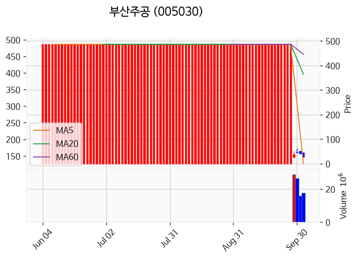

---

### 한창 (거래량 급증)
— 등락률 -91.07% / 거래량 1,001만 주

**◎ 관련기사**
- [코스피, 美 고용지표 경계 속 5거래일 만에 '칠천피'···정유주 동반 강세](https://news.google.com/rss/articles/CBMiakFVX3lxTE95X1hLS2tFb2VseXFHdW5PM2pPaEhjWlNOVU9JNVhtQmE2a09SenJkLUhFUW95TGFKTFRoRV8xNHNfT2ZPSzdtMUJaS05wSXVfZ0lEcGR5eXRwOVdDMEhvWUxaSHhVX0hVcnc?oc=5) — 서울파이낸스, 2026-10-02

**◎ 공시**
- _(공시 없음 / 미조회)_

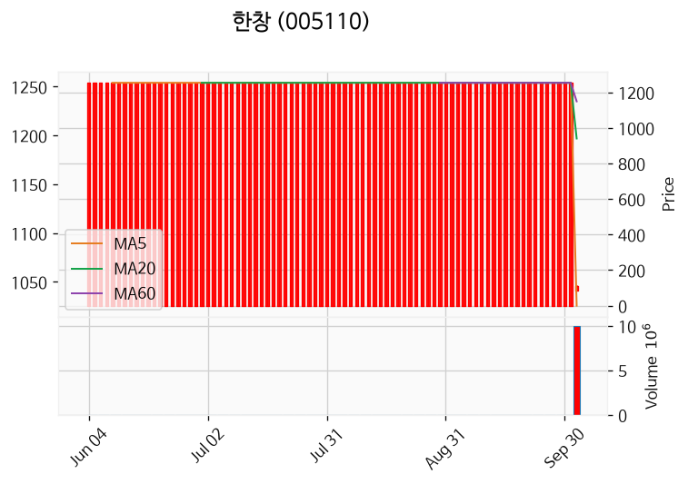

---

## 2. 거래량 폭증 후 급감 패턴 종목
_(폭증 전일 대비 500~1000%, 급감 전일 대비 25% 이하, 급감일 종가가 5일선 대비 -3% 이내)_

### 푸드웰
- 폭증일: 2026-09-30, 거래량 5만 주 (전일 대비 881%)
- 급감일: 2026-10-02, 거래량 0만 주 (전일 대비 21%)
- 급감일 종가 6,160원 / 5일선 6,194원 (이격률 -0.55%)

### 삼성공조
- 폭증일: 2026-10-01, 거래량 72만 주 (전일 대비 795%)
- 급감일: 2026-10-02, 거래량 13만 주 (전일 대비 18%)
- 급감일 종가 13,170원 / 5일선 12,848원 (이격률 +2.51%)

### 비엔케이제3호스팩
- 폭증일: 2026-09-30, 거래량 2만 주 (전일 대비 537%)
- 급감일: 2026-10-02, 거래량 0만 주 (전일 대비 0%)
- 급감일 종가 1,986원 / 5일선 1,982원 (이격률 +0.21%)

### 문배철강
- 폭증일: 2026-09-30, 거래량 22만 주 (전일 대비 636%)
- 급감일: 2026-10-02, 거래량 4만 주 (전일 대비 7%)
- 급감일 종가 2,085원 / 5일선 2,083원 (이격률 +0.10%)

### 시그네틱스
- 폭증일: 2026-10-01, 거래량 147만 주 (전일 대비 684%)
- 급감일: 2026-10-02, 거래량 29만 주 (전일 대비 20%)
- 급감일 종가 3,080원 / 5일선 2,911원 (이격률 +5.81%)

### 엘컴텍
- 폭증일: 2026-10-01, 거래량 13만 주 (전일 대비 906%)
- 급감일: 2026-10-02, 거래량 1만 주 (전일 대비 8%)
- 급감일 종가 2,750원 / 5일선 2,697원 (이격률 +1.97%)

### 대동스틸
- 폭증일: 2026-09-30, 거래량 13만 주 (전일 대비 999%)
- 급감일: 2026-10-02, 거래량 2만 주 (전일 대비 7%)
- 급감일 종가 2,800원 / 5일선 2,818원 (이격률 -0.64%)

### 세동
- 폭증일: 2026-09-29, 거래량 8만 주 (전일 대비 576%)
- 급감일: 2026-10-02, 거래량 1만 주 (전일 대비 19%)
- 급감일 종가 1,223원 / 5일선 1,224원 (이격률 -0.10%)

### 아이디스홀딩스
- 폭증일: 2026-09-30, 거래량 1만 주 (전일 대비 583%)
- 급감일: 2026-10-02, 거래량 0만 주 (전일 대비 4%)
- 급감일 종가 14,630원 / 5일선 14,784원 (이격률 -1.04%)

### DSR제강
- 폭증일: 2026-10-01, 거래량 16만 주 (전일 대비 678%)
- 급감일: 2026-10-02, 거래량 2만 주 (전일 대비 11%)
- 급감일 종가 5,620원 / 5일선 5,480원 (이격률 +2.55%)

### 팅크웨어
- 폭증일: 2026-10-01, 거래량 5만 주 (전일 대비 668%)
- 급감일: 2026-10-02, 거래량 1만 주 (전일 대비 13%)
- 급감일 종가 6,980원 / 5일선 6,782원 (이격률 +2.92%)

### 한국철강
- 폭증일: 2026-10-01, 거래량 13만 주 (전일 대비 787%)
- 급감일: 2026-10-02, 거래량 3만 주 (전일 대비 21%)
- 급감일 종가 9,440원 / 5일선 9,420원 (이격률 +0.21%)

### 아시아종묘
- 폭증일: 2026-10-01, 거래량 3만 주 (전일 대비 763%)
- 급감일: 2026-10-02, 거래량 1만 주 (전일 대비 18%)
- 급감일 종가 1,663원 / 5일선 1,589원 (이격률 +4.64%)

### 메디쎄이
- 폭증일: 2026-10-01, 거래량 1만 주 (전일 대비 648%)
- 급감일: 2026-10-02, 거래량 0만 주 (전일 대비 7%)
- 급감일 종가 11,410원 / 5일선 11,030원 (이격률 +3.45%)

### 명인제약
- 폭증일: 2026-10-01, 거래량 4만 주 (전일 대비 692%)
- 급감일: 2026-10-02, 거래량 1만 주 (전일 대비 23%)
- 급감일 종가 43,650원 / 5일선 43,050원 (이격률 +1.39%)

### 웨이버스
- 폭증일: 2026-09-29, 거래량 3만 주 (전일 대비 656%)
- 급감일: 2026-10-02, 거래량 0만 주 (전일 대비 14%)
- 급감일 종가 3,110원 / 5일선 3,104원 (이격률 +0.19%)

### 동국씨엠
- 폭증일: 2026-10-01, 거래량 9만 주 (전일 대비 526%)
- 급감일: 2026-10-02, 거래량 2만 주 (전일 대비 21%)
- 급감일 종가 5,370원 / 5일선 5,338원 (이격률 +0.60%)

### 아이지넷
- 폭증일: 2026-10-01, 거래량 5만 주 (전일 대비 511%)
- 급감일: 2026-10-02, 거래량 1만 주 (전일 대비 17%)
- 급감일 종가 1,660원 / 5일선 1,633원 (이격률 +1.64%)

### 하나34호스팩
- 폭증일: 2026-09-30, 거래량 1만 주 (전일 대비 539%)
- 급감일: 2026-10-02, 거래량 0만 주 (전일 대비 22%)
- 급감일 종가 2,045원 / 5일선 2,030원 (이격률 +0.74%)
