# 2026년 10월 6일 시황 노트

## 1. 상한가 / 거래량 1,000만주 이상 종목

### 퓨쳐메디신 (상한가)
— 등락률 +31.03% / 거래량 7만 주

**◎ 관련기사**
_(관련기사 없음 / 미조회)_

**◎ 공시**
- _(공시 없음 / 미조회)_

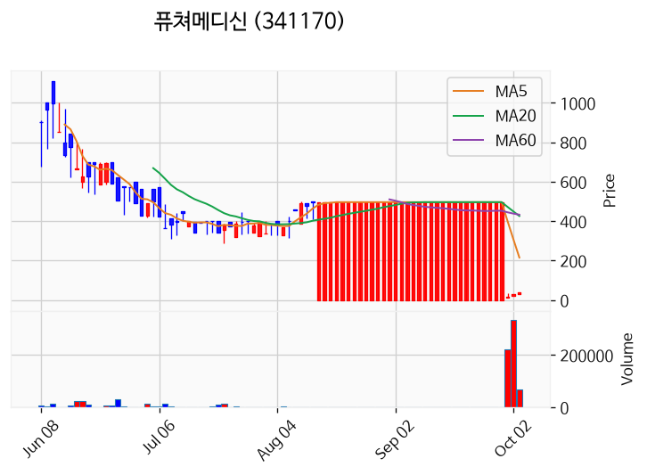

---

### 샌즈랩 (상한가)
— 등락률 +30.00% / 거래량 672만 주

**◎ 관련기사**
- [[MD증시] 외인 1.7조 던졌다…‘칠천피’ 하루 만에 반납](https://news.google.com/rss/articles/CBMiZkFVX3lxTE9zWUJEZUFJNkJKM2k1WUN5bjlsYlZVMDkzc281UVZLdlVfYkdBUTVoOHZGNXJJdlF2b1ZWai03Qk5yanltRC1tU0dlZWNRMFVXaW1UWHZONDFPQU0td0Uxbm5Idl94dw?oc=5) — 마이데일리, 2026-10-06

**◎ 공시**
- _(공시 없음 / 미조회)_

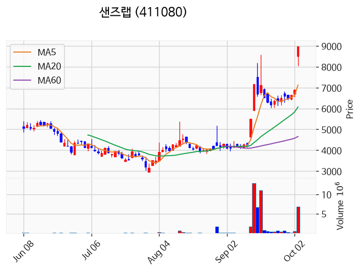

---

### 아티스트스튜디오 (상한가)
— 등락률 +30.00% / 거래량 63만 주

**◎ 관련기사**
- ['보스의 노골적 취향' 성훈X오세영, ‘취향 저격’ 커플 포스터 공개!](https://news.google.com/rss/articles/CBMiYkFVX3lxTFBfZklpSTVmbHIzdUM3LTNRQ1F6UVFqTzRrWmoxQ3B2M3RIc3FfSTJfejd0THVUd2FRcHNsMVkxM2U1QXNSV3A2ZHpVOHE1eHBHUmxXbktld2NGNFZ4dUhSQk9B?oc=5) — rnx.kr, 2026-10-06

**◎ 공시**
- _(공시 없음 / 미조회)_

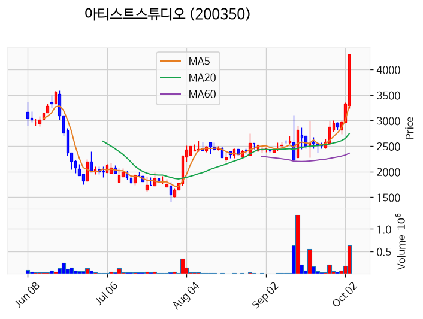

---

### 라온시큐어 (상한가)
— 등락률 +29.98% / 거래량 574만 주

**◎ 관련기사**
- [[MD증시] 외인 1.7조 던졌다…‘칠천피’ 하루 만에 반납](https://news.google.com/rss/articles/CBMiZkFVX3lxTE9zWUJEZUFJNkJKM2k1WUN5bjlsYlZVMDkzc281UVZLdlVfYkdBUTVoOHZGNXJJdlF2b1ZWai03Qk5yanltRC1tU0dlZWNRMFVXaW1UWHZONDFPQU0td0Uxbm5Idl94dw?oc=5) — 마이데일리, 2026-10-06

**◎ 공시**
- _(공시 없음 / 미조회)_

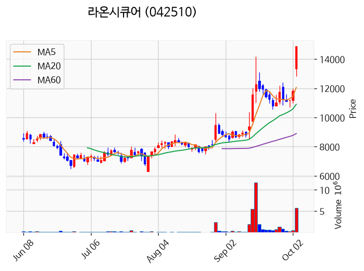

---

### HLB제약 (상한가)
— 등락률 +29.97% / 거래량 432만 주

**◎ 관련기사**
- [코스피, 외인 팔자에 또다시 7000선 밑으로…코스닥 3%↑](https://news.google.com/rss/articles/CBMiYEFVX3lxTE5FaVVZZ25WWno1aG04OXMwRkhHemljTzFIREdUeldwSnpiTk53ZE80RHBXTlpVZEZMUk1EZ2JFTlUyMkJDTTkxUjFiVzF1dWdMcVdzTlF5Rm1lU1AwRTllQ9IBeEFVX3lxTE5naEVlM1QwOUdJV1cxN3RXM2JJT1cyRFRNZy0xcEpEZl9sUHozTnJCcnp6dEtWZ3hTT0hrR0RaV1FPREF6RUFVODNzQTI1ZndfdG5MSmVabkV5TnFCYXhmTGFFcGpEVnpKTzBWRmlIQkplbkQ3RlpMZw?oc=5) — 뉴시스, 2026-10-06

**◎ 공시**
- _(공시 없음 / 미조회)_

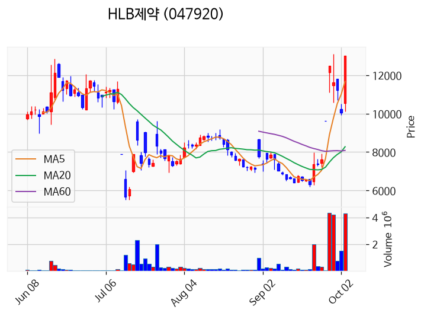

---

### 예선테크 (상한가)
— 등락률 +29.87% / 거래량 15만 주

**◎ 관련기사**
_(관련기사 없음 / 미조회)_

**◎ 공시**
- _(공시 없음 / 미조회)_

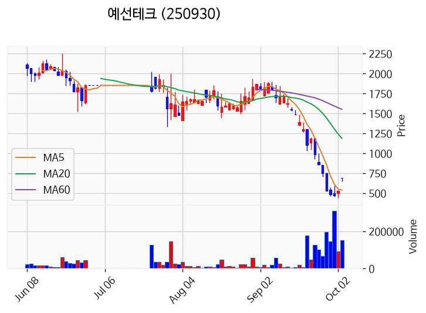

---

### 아톤 (거래량 급증)
— 등락률 +26.91% / 거래량 1,861만 주

**◎ 관련기사**
- [아톤 주가, 10월 6일 애프터마켓 7,000원 27.27% 상승](https://news.google.com/rss/articles/CBMickFVX3lxTE5ic1BYSy1BMVpOalpqbFFqU1RNZnBGbzdFSEVQX2ZyblF1TVpkSmp3ZEpjS2dHSFMyZFVQdWlTWVQzWEUwdTZ5OHljSE0yUlNxVWRVVXFJQTB5NW5Dci11TG5rUUxKdXRGUFJtNDJ6aFkzUQ?oc=5) — TopStarNews, 2026-10-06

**◎ 공시**
- _(공시 없음 / 미조회)_

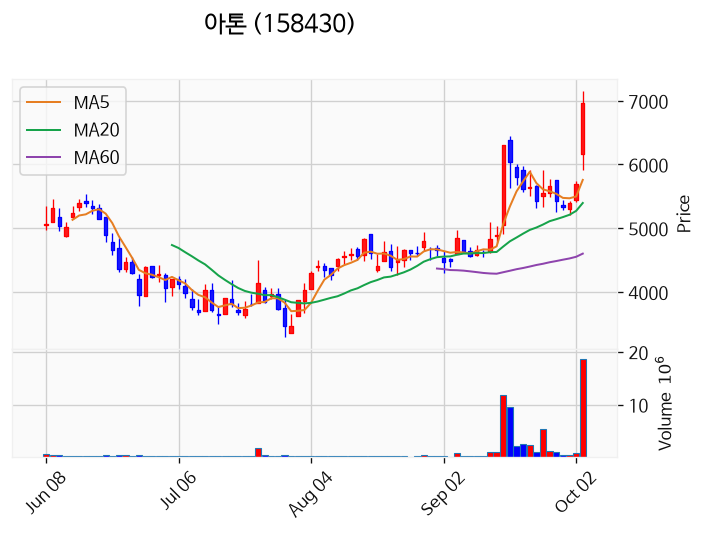

---

### 빛과전자 (거래량 급증)
— 등락률 +13.86% / 거래량 3,181만 주

**◎ 관련기사**
- [코스닥 '급등'...에코프로·주성엔지니어링·HLB·삼천당제약 '껑충'](https://news.google.com/rss/articles/CBMicEFVX3lxTE1hZ3pkV3h3eEpiV2hmYVdsb1VSbXVQNU1NOXk0M29ObTFaZWNQMDNGUGNtUGZMZEVhZUhOZFY3aUlycHM5dnRBLTZCdFFWNW1aQzIzbmlKZHV1T0hseWVuMi1fSU5ZTWFCNmoyZ0pZRXXSAXNBVV95cUxQZE1sZlYyLWVwclRkbWZkT2dFTFlnUGNyVjFSelZyZmJDS2NvV3cyRldxRmhqdzE5V0lZdVpxbXpJaG9IdDVoWnFmSGZkMTVDWHFyQ1o3c1YxNnFrQURHeGY5V1lFNTJvbFpGTmlDLUhtUklr?oc=5) — 초이스경제, 2026-10-06

**◎ 공시**
- _(공시 없음 / 미조회)_

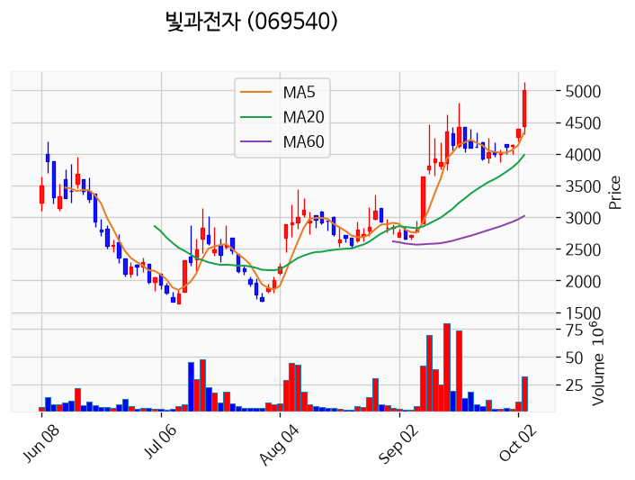

---

### 한컴위드 (거래량 급증)
— 등락률 +11.78% / 거래량 1,417만 주

**◎ 관련기사**
- [코스피, 삼성전자·SK하이닉스 하락에 6940선 후퇴...코스닥은 2.98% 급등](https://news.google.com/rss/articles/CBMic0FVX3lxTE5VLVhYYUJSanZMVXZicmp0UjNWMm1MYnZTZno0Tkp4ckJRcmttM2ZQNTc4QnU5eThucVoxUjd3U3dvcHhqVDZFVnZISEZlY29Pcy1Td0J0bXpGWW5nSE9PZ3pvR1lCczBFOTlZd2VNSUN3QzTSAXdBVV95cUxPTzI3MWdtbzA3SXJYSGFiZXZ3aDBNR1pzUXlrYWN2cGpjbmktcDZ1Zmx2SnhoS0pLalRyaE9FNDZqR0F1WXB2bnJuTUpScGZicFBGaHFvekRWVDRzMmVyUWdLRDZKV2N0TjVKLXlQWWxrbU5VV3ZNdw?oc=5) — 핀포인트뉴스, 2026-10-06

**◎ 공시**
- _(공시 없음 / 미조회)_

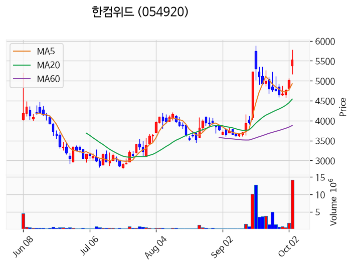

---

### KBI동양철관 (거래량 급증)
— 등락률 +8.66% / 거래량 1,435만 주

**◎ 관련기사**
_(관련기사 없음 / 미조회)_

**◎ 공시**
- _(공시 없음 / 미조회)_

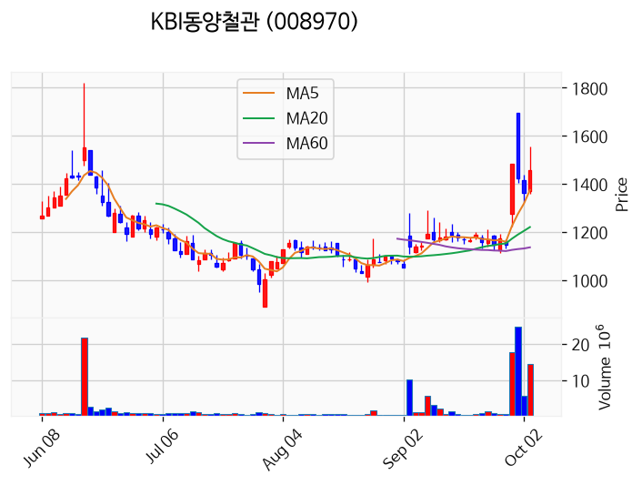

---

### 센서뷰 (거래량 급증)
— 등락률 +8.47% / 거래량 1,153만 주

**◎ 관련기사**
- [코스닥 '급등'...에코프로·주성엔지니어링·HLB·삼천당제약 '껑충'](https://news.google.com/rss/articles/CBMicEFVX3lxTE1hZ3pkV3h3eEpiV2hmYVdsb1VSbXVQNU1NOXk0M29ObTFaZWNQMDNGUGNtUGZMZEVhZUhOZFY3aUlycHM5dnRBLTZCdFFWNW1aQzIzbmlKZHV1T0hseWVuMi1fSU5ZTWFCNmoyZ0pZRXXSAXNBVV95cUxQZE1sZlYyLWVwclRkbWZkT2dFTFlnUGNyVjFSelZyZmJDS2NvV3cyRldxRmhqdzE5V0lZdVpxbXpJaG9IdDVoWnFmSGZkMTVDWHFyQ1o3c1YxNnFrQURHeGY5V1lFNTJvbFpGTmlDLUhtUklr?oc=5) — 초이스경제, 2026-10-06

**◎ 공시**
- _(공시 없음 / 미조회)_

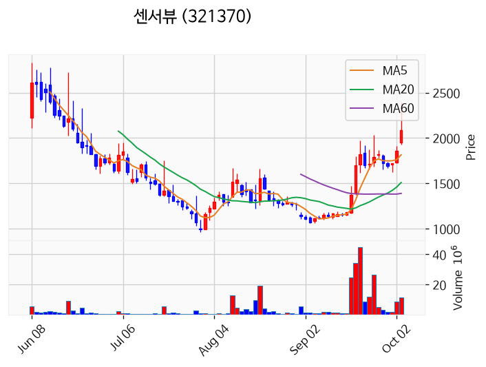

---

### 드림시큐리티 (거래량 급증)
— 등락률 +7.56% / 거래량 1,753만 주

**◎ 관련기사**
- [드림시큐리티 주가, 10월 6일 애프터마켓 3,060원 7.56% 상승](https://news.google.com/rss/articles/CBMickFVX3lxTFBMWHo1TUc5LUZnVVdGVFdyRlpXSHQ4WFNmcks2LWpsTmZ5VTdvU05HRFk3ejVudUhpbHh2LU9BSmtIcjQ0S0xHTXVSd0ctVldqWTNwbVNoRjBlWEhULVB6NGtnaWFQbDhlTDVLdU5jc25yUQ?oc=5) — TopStarNews, 2026-10-06

**◎ 공시**
- _(공시 없음 / 미조회)_

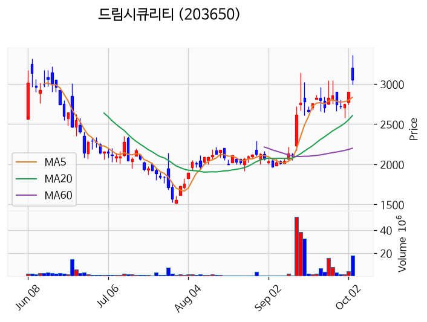

---

### 대한광통신 (거래량 급증)
— 등락률 +4.44% / 거래량 1,299만 주

**◎ 관련기사**
- [코스닥 '급등'...에코프로·주성엔지니어링·HLB·삼천당제약 '껑충'](https://news.google.com/rss/articles/CBMicEFVX3lxTE1hZ3pkV3h3eEpiV2hmYVdsb1VSbXVQNU1NOXk0M29ObTFaZWNQMDNGUGNtUGZMZEVhZUhOZFY3aUlycHM5dnRBLTZCdFFWNW1aQzIzbmlKZHV1T0hseWVuMi1fSU5ZTWFCNmoyZ0pZRXXSAXNBVV95cUxQZE1sZlYyLWVwclRkbWZkT2dFTFlnUGNyVjFSelZyZmJDS2NvV3cyRldxRmhqdzE5V0lZdVpxbXpJaG9IdDVoWnFmSGZkMTVDWHFyQ1o3c1YxNnFrQURHeGY5V1lFNTJvbFpGTmlDLUhtUklr?oc=5) — 초이스경제, 2026-10-06

**◎ 공시**
- _(공시 없음 / 미조회)_

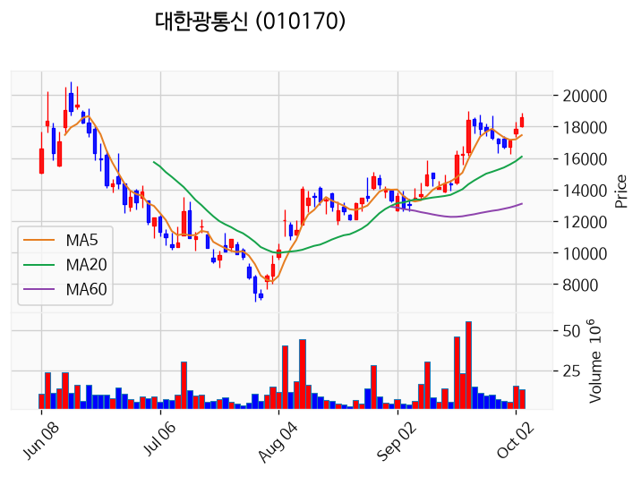

---

### 부산주공 (거래량 급증)
— 등락률 +3.70% / 거래량 1,668만 주

**◎ 관련기사**
- [부산주공, 최대주주등 지분율 30.32%에서 31.31%로 상승](https://news.google.com/rss/articles/CBMic0FVX3lxTE1jS2ZFVDdKWVd1ZXhIa19HZHdNRHUyck1xcGdQVFdyUjBheFQwSkFXS21xa0UxVXl2VG1oZ3RtTmp6djAxWE5Wdm8wN2FrRGhJTloxZnZZRGFlbXk4ekZ2STZqYVcyaXZTb2ZSREFXMHpMZUk?oc=5) — 데이터투자, 2026-10-06

**◎ 공시**
- [주식등의대량보유상황보고서(일반)](https://dart.fss.or.kr/dsaf001/main.do?rcpNo=20261006000309) — 장세훈, 20261006
- [최대주주등소유주식변동신고서              ](https://dart.fss.or.kr/dsaf001/main.do?rcpNo=20261006800424) — 부산주공, 20261006

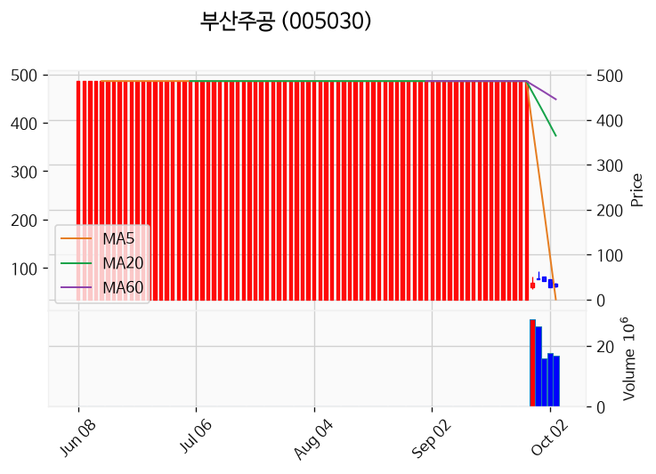

---

### 한온시스템 (거래량 급증)
— 등락률 +2.22% / 거래량 1,402만 주

**◎ 관련기사**
_(관련기사 없음 / 미조회)_

**◎ 공시**
- _(공시 없음 / 미조회)_

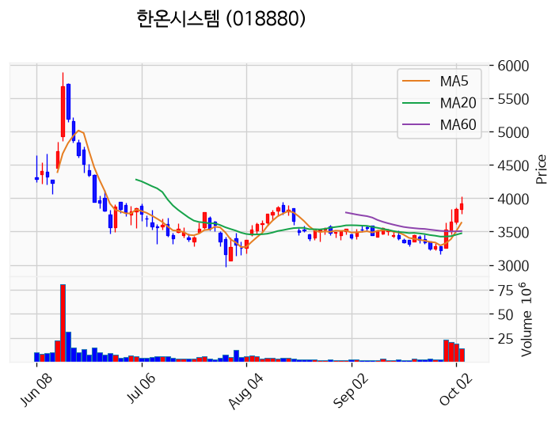

---

### 삼성전자 (거래량 급증)
— 등락률 -1.63% / 거래량 1,271만 주

**◎ 관련기사**
- [삼성전자 '역대급 배당' 마냥 웃을 일 아니다…개미들 '초비상'](https://news.google.com/rss/articles/CBMiWkFVX3lxTE9JM1RWUVNjcHRGRktwNEtQRElxQV9hNUMyNk1YU0NmTXdSdnpzMmJ6QWZTUmUzVnZmdmo2VExfRnlZV3FkejV1UVY5anJaU2xzR3dvVzZDamNjZw?oc=5) — 한국경제, 2026-10-06

**◎ 공시**
- _(공시 없음 / 미조회)_

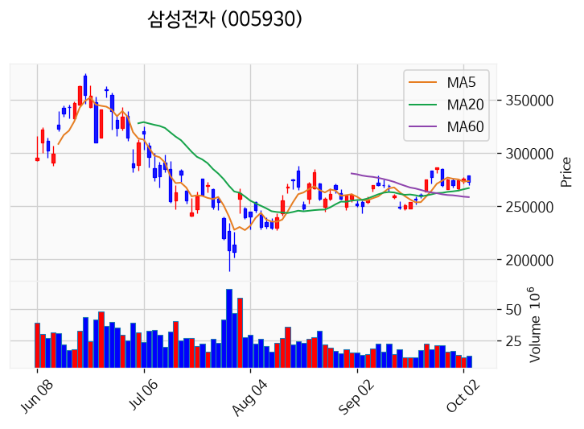

---

## 2. 거래량 폭증 후 급감 패턴 종목
_(폭증 전일 대비 500~1000%, 급감 전일 대비 25% 이하, 급감일 종가가 5일선 대비 -3% 이내)_

_해당 종목 없음_
