# 2026년 10월 7일 시황 노트

## 1. 상한가 / 거래량 1,000만주 이상 종목

### 동양고속 (상한가)
— 등락률 +30.00% / 거래량 10만 주

**◎ 관련기사**
- [해킹 범람하는데… ‘기본조차 안 지키는’ 증권사 내부통제 어쩌나 [뉴스톡 웰스톡]](https://news.google.com/rss/articles/CBMibEFVX3lxTE8zTE05Ny14OWhXdnoybUZlR3dsU3RtcEdlLW5OUnpzcmxmcjZpbXY5NGdVOW5OSXdxZ19FTWszeExjSTd4UDJIZUpWODBLbERUNG1BX0pERVlWWFFjT2VkcnZVYWpleXp3UzFkUQ?oc=5) — 뉴스웰, 2026-10-07

**◎ 공시**
- _(공시 없음 / 미조회)_

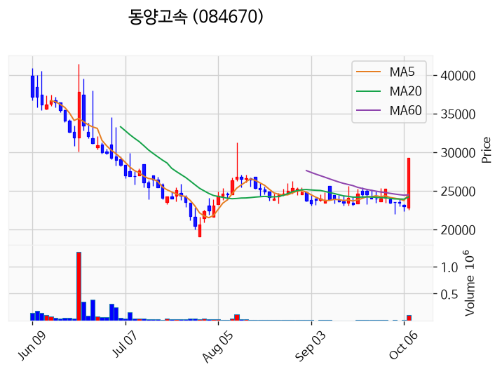

---

### HLB바이오스텝 (상한가)
— 등락률 +29.99% / 거래량 677만 주

**◎ 관련기사**
- ['신약 모멘텀' HLB 붙으면 일단 오른다?⋯그룹주 '옥석 가리기'](https://news.google.com/rss/articles/CBMiS0FVX3lxTE9rWElTVUdBdWgyRF9GMlN1N3JQSnlSd3M0M0JjZE80ZkZ3aGl6cllFZVdoa2h0WFN0ZGdPbHNpVTJaTW1RS0JqNWFqcw?oc=5) — 아이뉴스24, 2026-10-07

**◎ 공시**
- _(공시 없음 / 미조회)_

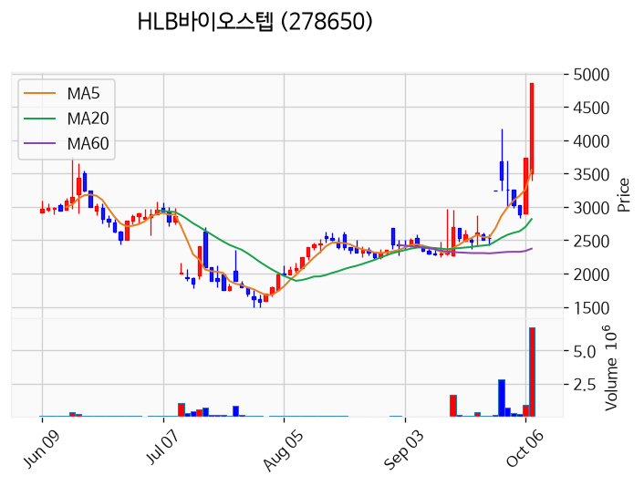

---

### 예선테크 (상한가)
— 등락률 +29.99% / 거래량 16만 주

**◎ 관련기사**
- [해킹 범람하는데… ‘기본조차 안 지키는’ 증권사 내부통제 어쩌나 [뉴스톡 웰스톡]](https://news.google.com/rss/articles/CBMibEFVX3lxTE8zTE05Ny14OWhXdnoybUZlR3dsU3RtcEdlLW5OUnpzcmxmcjZpbXY5NGdVOW5OSXdxZ19FTWszeExjSTd4UDJIZUpWODBLbERUNG1BX0pERVlWWFFjT2VkcnZVYWpleXp3UzFkUQ?oc=5) — 뉴스웰, 2026-10-07

**◎ 공시**
- _(공시 없음 / 미조회)_

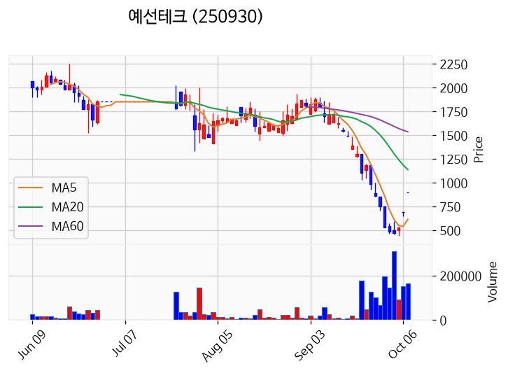

---

### 천일고속 (상한가)
— 등락률 +29.99% / 거래량 3만 주

**◎ 관련기사**
- [해킹 범람하는데… ‘기본조차 안 지키는’ 증권사 내부통제 어쩌나 [뉴스톡 웰스톡]](https://news.google.com/rss/articles/CBMibEFVX3lxTE8zTE05Ny14OWhXdnoybUZlR3dsU3RtcEdlLW5OUnpzcmxmcjZpbXY5NGdVOW5OSXdxZ19FTWszeExjSTd4UDJIZUpWODBLbERUNG1BX0pERVlWWFFjT2VkcnZVYWpleXp3UzFkUQ?oc=5) — 뉴스웰, 2026-10-07

**◎ 공시**
- _(공시 없음 / 미조회)_

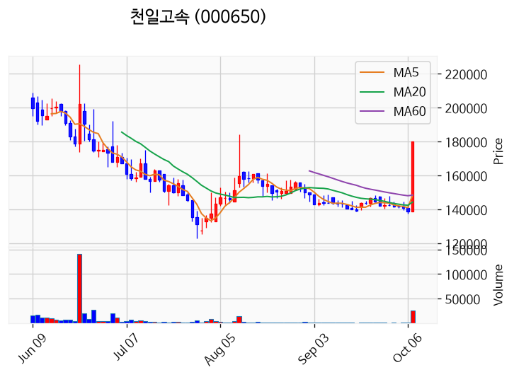

---

### 알파칩스 (상한가)
— 등락률 +29.97% / 거래량 60만 주

**◎ 관련기사**
- [알파칩스, 100% 무상증자 결정…“주주가치 제고”](https://news.google.com/rss/articles/CBMickFVX3lxTE0wWE8wRFl5NTNZbk02UE1DTzk0LTFtM2Zkb2g4c1Ntam5pbnl2aUFKNUNDOTFPTm5IbWpDOVAxT25HWElwLVFWQ3I0Rl9YbXNxeVBmYXZDaWREOVBaaXhDZnpEZnpZVGc4V0ZiYW1HdGkzQQ?oc=5) — 이투데이, 2026-10-07

**◎ 공시**
- [주주명부폐쇄기간또는기준일설정              ](https://dart.fss.or.kr/dsaf001/main.do?rcpNo=20261007900176) — 알파칩스, 20261007
- [주요사항보고서(무상증자결정)](https://dart.fss.or.kr/dsaf001/main.do?rcpNo=20261007000130) — 알파칩스, 20261007
- [주권매매거래정지              (무상증자)](https://dart.fss.or.kr/dsaf001/main.do?rcpNo=20261007900166) — 코스닥시장본부, 20261007

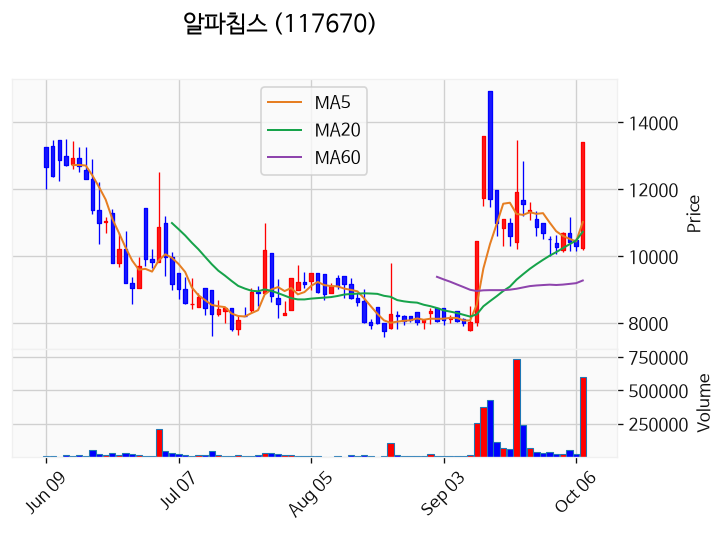

---

### 국제약품 (상한가)
— 등락률 +29.91% / 거래량 611만 주

**◎ 관련기사**
- [해킹 범람하는데… ‘기본조차 안 지키는’ 증권사 내부통제 어쩌나 [뉴스톡 웰스톡]](https://news.google.com/rss/articles/CBMibEFVX3lxTE8zTE05Ny14OWhXdnoybUZlR3dsU3RtcEdlLW5OUnpzcmxmcjZpbXY5NGdVOW5OSXdxZ19FTWszeExjSTd4UDJIZUpWODBLbERUNG1BX0pERVlWWFFjT2VkcnZVYWpleXp3UzFkUQ?oc=5) — 뉴스웰, 2026-10-07

**◎ 공시**
- [주식등의대량보유상황보고서(일반)](https://dart.fss.or.kr/dsaf001/main.do?rcpNo=20261006000461) — 남영우, 20261007

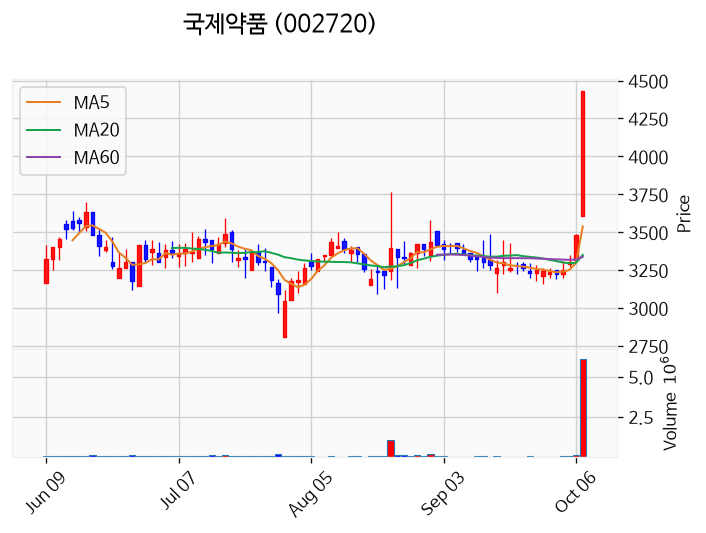

---

### 녹십자엠에스 (거래량 급증)
— 등락률 +26.89% / 거래량 2,032만 주

**◎ 관련기사**
- [녹십자엠에스 주가, 10월 7일 애프터마켓 4,185원 26.44% 상승](https://news.google.com/rss/articles/CBMickFVX3lxTE9vaVdCeDh6Z3Rpa0ZJbENKc0VYR1plX2R1X2QzMVhEa3RiYjBEcmkxaDZBV0tOaGVnZmNHa2FHb3ZJNG81dmN6bWJHcXFyZDlNVWxwRkhUSmpCMTd3QUFkZUpWZlNLd1QtN3U4THZ5Y0FvUQ?oc=5) — TopStarNews, 2026-10-07

**◎ 공시**
- _(공시 없음 / 미조회)_

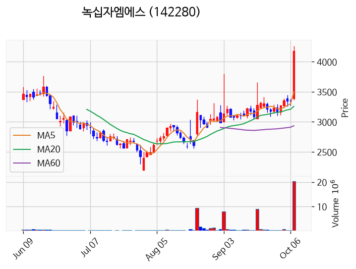

---

### 에이엔피 (거래량 급증)
— 등락률 +17.07% / 거래량 1,100만 주

**◎ 관련기사**
_(관련기사 없음 / 미조회)_

**◎ 공시**
- _(공시 없음 / 미조회)_

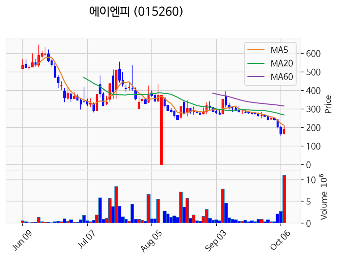

---

### 국전 (거래량 급증)
— 등락률 +15.24% / 거래량 1,473만 주

**◎ 관련기사**
- [국전 주가, 10월 7일 애프터마켓 2,765원 15.45% 상승](https://news.google.com/rss/articles/CBMickFVX3lxTFByZFctVWdhX21TRFotTFlLa1ZkdmFKVUVacGhhSER3QTJLZ29UTF9OQ3QtZnZjQ1JuUDZ2ZkQ0ajdsbmhTYXFHeWtRRFVvRE85cDQydVAtMmNWNGF2azhpeG1QRzFBZC1kRFhVTXVDcjAwQQ?oc=5) — TopStarNews, 2026-10-07

**◎ 공시**
- _(공시 없음 / 미조회)_

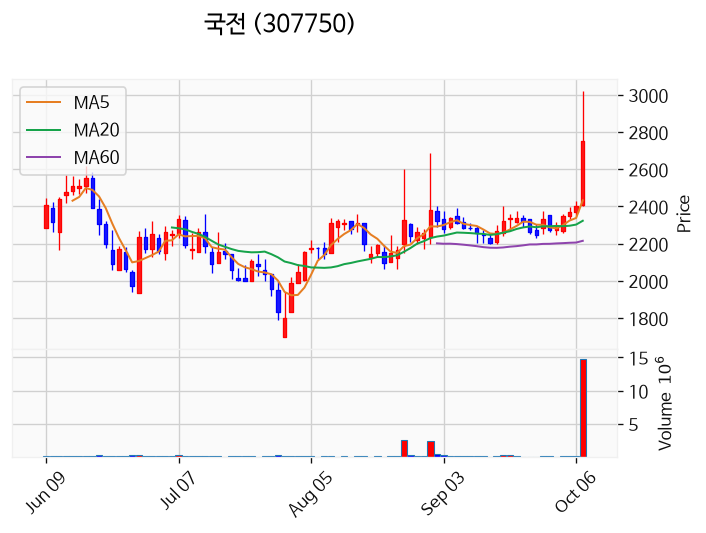

---

### 삼표시멘트 (거래량 급증)
— 등락률 +15.11% / 거래량 1,819만 주

**◎ 관련기사**
_(관련기사 없음 / 미조회)_

**◎ 공시**
- _(공시 없음 / 미조회)_

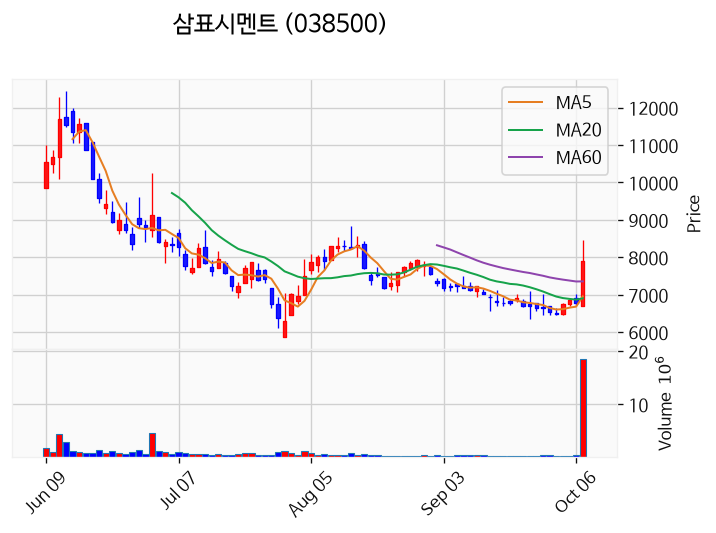

---

### 대양금속 (거래량 급증)
— 등락률 +13.99% / 거래량 1,297만 주

**◎ 관련기사**
- [韓총리, 대법관 재제청 논란에 “대통령이 수용만 할 거면 임명권 왜 있나” - 조선비즈](https://news.google.com/rss/articles/CBMihgFBVV95cUxNM0xqV2F4b1lNUVlvakpTTDNPSElCdlVxQUloZFdXYXFZTTNwM1Bwb2hZTHR0MGZjYjRhc2JoTFZOUU00MzFUOWFZeURuT3NCdGtCSF8zODRud0tqRVM0aTBnM1dVM2tNUEZWOWl0d3otV01mQllHQ3RUZG1DMzFsTVJKYkwtd9IBmgFBVV95cUxNTWUwTWVQcGxTVlJXOXJwOHlSQTRmZ29DUTNQSDM5WjVuN2xtdUwxa2FwZUNKZF9zcElKS055bXJISUhuS183WlR2Mkw3d1l2ejZVcjFkQ0hRRlNPRnNEN0FZSmhSUm5PZ0FJOEtpbjUwV3hDUGN6YXNNOGZmc3Z5ZTRfQ0F2bDhfcWl1ZTlSeFRMT0VVUkdibFVn?oc=5) — Chosunbiz, 2026-10-07

**◎ 공시**
- _(공시 없음 / 미조회)_

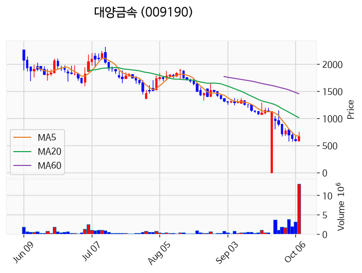

---

### 라온시큐어 (거래량 급증)
— 등락률 +13.18% / 거래량 1,804만 주

**◎ 관련기사**
- [금융권 연쇄 해킹에 보안주 불기둥…지속성은 ‘정책·투자’에 달려](https://news.google.com/rss/articles/CBMigAFBVV95cUxNMFI5NWdwVTU2SjRHbXJJa21iZ1JUbFRLaTJmMEU0dkhNaTdRMHZkdEY1a2Zjc2lQQUpRMW5kRFU1RVhzamp2VzNOTG1jVENMcFJCczViVWh1b3BuWF9BYkdsSjNGMlQ1emtxQUc4c3JnQV9WS3FjZnpEMEUzcFNrTg?oc=5) — 이데일리, 2026-10-07

**◎ 공시**
- _(공시 없음 / 미조회)_

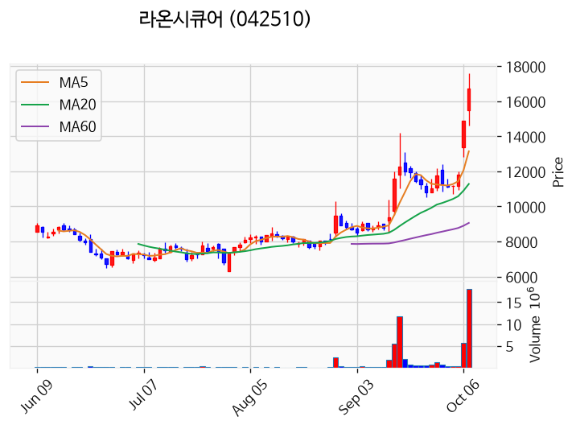

---

### 삼미금속 (거래량 급증)
— 등락률 +11.52% / 거래량 1,740만 주

**◎ 관련기사**
- [[코스닥 기관] 반도체주 대거 팔았다…주성엔지니어링 매도 1위](https://news.google.com/rss/articles/CBMic0FVX3lxTE9YLWpwdnFlbVJUcnhCamd0TkhBdklLOFhNd1BjUHRGVEVuTVZ2Y2pVNEdhNlpJRnlkRVdBVkJzRDdXeWZ1RlllSlhrcEVRcnFXSXppZXV1a2ducVFON29jOFdIVGwzeW1TUXUtRkUxcmlfelnSAXdBVV95cUxQZVFwOFo0V3hWTWhVckhKMUJ6VXRsOUl2cDhqMjlWRW9vSHV4UzJZbTVnOGY1NjBlZXZUcVBEVVdjYkdUUmhFUTBWMW4tNmdwS0xOUXVIMUY3WTRTWXlpT1JHRUw4U0VMRGh2VDRYTG5IckhodFZSRQ?oc=5) — 핀포인트뉴스, 2026-10-07

**◎ 공시**
- _(공시 없음 / 미조회)_

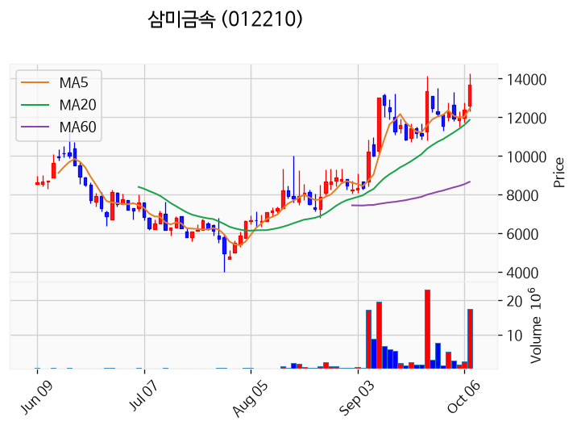

---

### 빛과전자 (거래량 급증)
— 등락률 +3.59% / 거래량 4,546만 주

**◎ 관련기사**
- [삼성전자, 영국 박물관 소장 명작 30점 '삼성 아트 스토어' 공개](https://news.google.com/rss/articles/CBMia0FVX3lxTE9OUW9iLWVyYndXZE5NTHRQUkZSdExVUVA1NkZZUS1zWmF0dW56WGVJS1FBX1p5Q0E5NkZJUWVvbHZYc1ViTS1uVHh3YlQ3NzE0ME5Ceko1NGhRZjJQcG9FWG5pa2FfZUd0OFR3?oc=5) — BBS불교방송, 2026-10-07

**◎ 공시**
- _(공시 없음 / 미조회)_

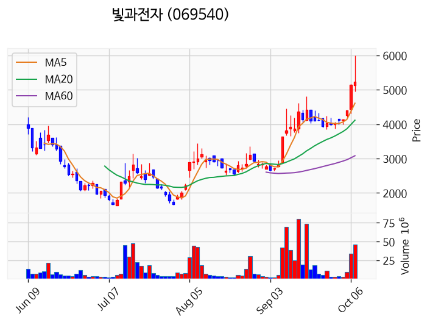

---

### 삼성전자 (거래량 급증)
— 등락률 -0.74% / 거래량 1,600만 주

**◎ 관련기사**
- [삼성전자·SK하이닉스 실적 공개 하루 앞두고…외인·기관 '팔자'](https://news.google.com/rss/articles/CBMiWkFVX3lxTE5tdkttWjJlRlBRNTRXb2FveW52ZVpMZ3pNTzU1dzZmU21UTzBJWkR3Rm83MTNyM3FqWkV3VlRJMWVkUnQ4bWtwT3djbVo5dWJaamdvSU1nRDhUZw?oc=5) — 한국경제, 2026-10-07

**◎ 공시**
- _(공시 없음 / 미조회)_

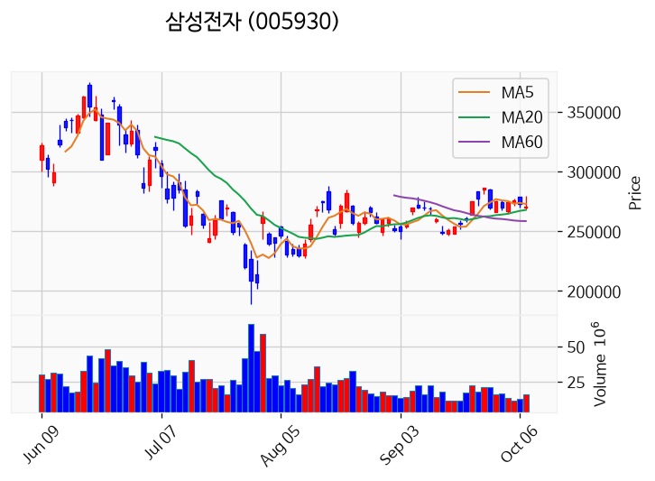

---

### 아톤 (거래량 급증)
— 등락률 -1.72% / 거래량 1,102만 주

**◎ 관련기사**
_(관련기사 없음 / 미조회)_

**◎ 공시**
- _(공시 없음 / 미조회)_

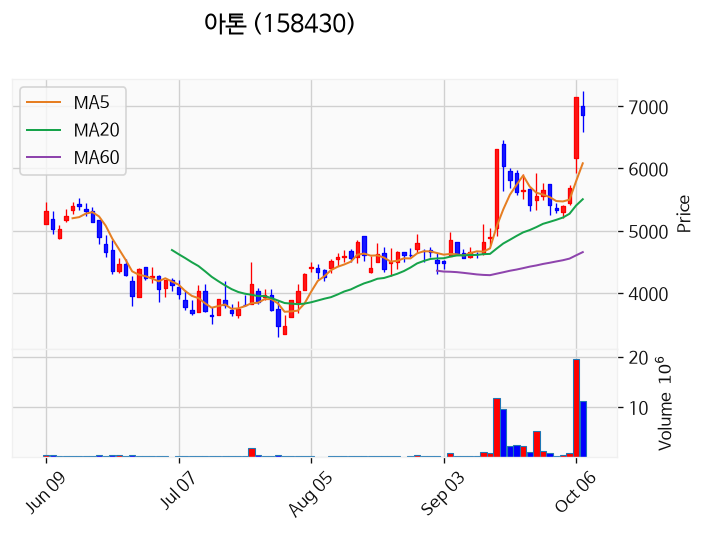

---

### 대한광통신 (거래량 급증)
— 등락률 -3.67% / 거래량 1,570만 주

**◎ 관련기사**
- [[코스닥 외국인] 반도체주 쓸어 담아…삼천당제약·주성엔지니어링은 내던졌다](https://news.google.com/rss/articles/CBMic0FVX3lxTE4waHNMZEVIZzctYXY0T1ZLZklTTWJqYlJ1QnpUa0hUZ0dyVl9INDZNTWhKcnZ5MDhoMHlfUVdJeF9MU2xLcldQVFVHYm1SZm93c21rTUE4ZDJnbmZpdGZIRktIYkUwdkFrZmZmRHdmeFhOT2vSAXdBVV95cUxQYjRsekhvcENzc2JyZTJWOWxJVHVpSW1fUTBEaGE4TlQ4cFhTY3dfWmxiM2RFZW02c1FFMmJqRzRRNENjNWRNbDJ3RkRvMmN4NmNGUHRabzZERTBRRXdnWDVoSENMRXJWSXdiQ2tlSllyZkU5aVJWYw?oc=5) — 핀포인트뉴스, 2026-10-07

**◎ 공시**
- _(공시 없음 / 미조회)_

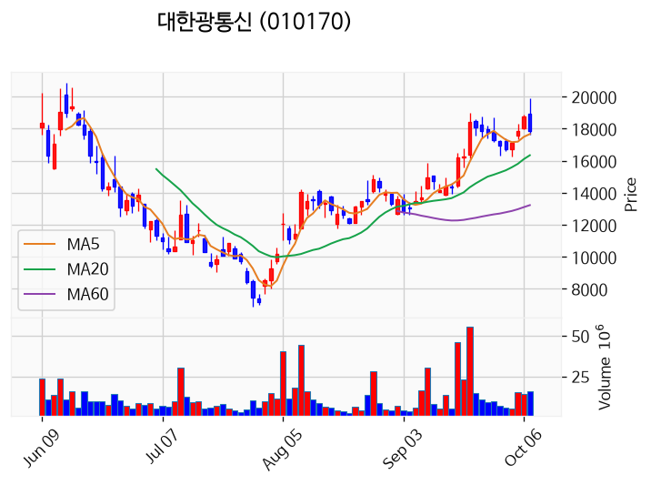

---

### 부산주공 (거래량 급증)
— 등락률 -10.71% / 거래량 1,169만 주

**◎ 관련기사**
_(관련기사 없음 / 미조회)_

**◎ 공시**
- _(공시 없음 / 미조회)_

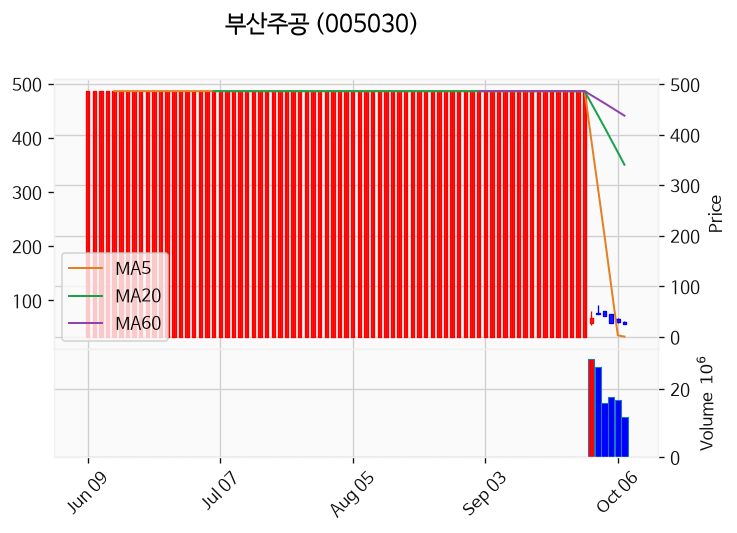

---

## 2. 거래량 폭증 후 급감 패턴 종목
_(폭증 전일 대비 500~1000%, 급감 전일 대비 25% 이하, 급감일 종가가 5일선 대비 -3% 이내)_

_해당 종목 없음_
