# 2026년 10월 8일 시황 노트

## 1. 상한가 / 거래량 1,000만주 이상 종목

### 유진테크놀로지 (상한가)
— 등락률 +30.00% / 거래량 54만 주

**◎ 관련기사**
- [[테마 제안] 시총미달상폐유예 — judal 미등록 신규 테마](https://news.google.com/rss/articles/CBMieEFVX3lxTE5wVXJsWWJ3SklzUXo1bWpDM2t0UDJ0WWhLMnNYSmpSLTJ6dG5JZmRyZW9mZ2k5a0d4VF9mZkR2bVdzZDFZZmo5WDFEcWpjZng3WlVRcTVrcEVUYWJkbFlhdzdHWEFnRDVuNWNRX1lxM013Rl9VLWFoSQ?oc=5) — 주달, 2026-10-08

**◎ 공시**
- _(공시 없음 / 미조회)_

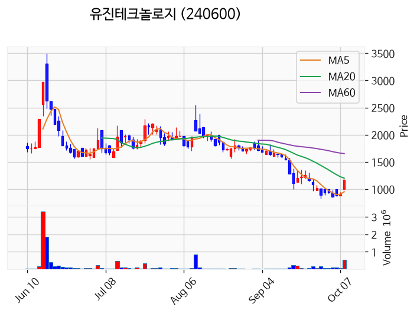

---

### 형지I&C (상한가)
— 등락률 +30.00% / 거래량 46만 주

**◎ 관련기사**
- [[테마 제안] 시총미달상폐유예 — judal 미등록 신규 테마](https://news.google.com/rss/articles/CBMidkFVX3lxTE9yaU1yMzkxNkd5d1ltaHQ1d3pSaV9xUjVuTTNyN1E0N0pLMVpKMUdDMHhMNlB2RXlBU0JYeTVUME0xOUVCNnFVLVJNanloMjBRSVpZMjBiUHhEMS13SHc4SVhNZ1dPZ2o0UGFhWDR1d0ptV2NYVkE?oc=5) — 주달, 2026-10-08

**◎ 공시**
- _(공시 없음 / 미조회)_

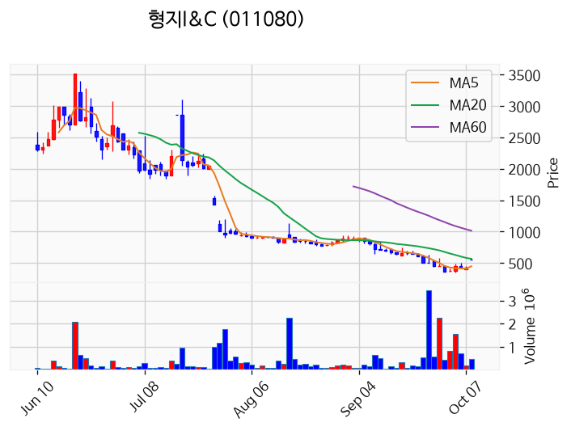

---

### CS (상한가)
— 등락률 +29.97% / 거래량 84만 주

**◎ 관련기사**
- [속보 | 프랑스 회사채 38%, 국채보다 낮은 수익률…연초比 18배 확대](https://news.google.com/rss/articles/CBMiV0FVX3lxTE9vSG05bEZvLW9lOEdxbkpuVTlkcFZPMUNrZG8zM3hXM09EdEMzX0pUNk9JcGp1eHU5WUVBNkx1RkJJSHRlRWpXMkUtOVB2eElSU000ZHJIQQ?oc=5) — CoinNess, 2026-10-08

**◎ 공시**
- _(공시 없음 / 미조회)_

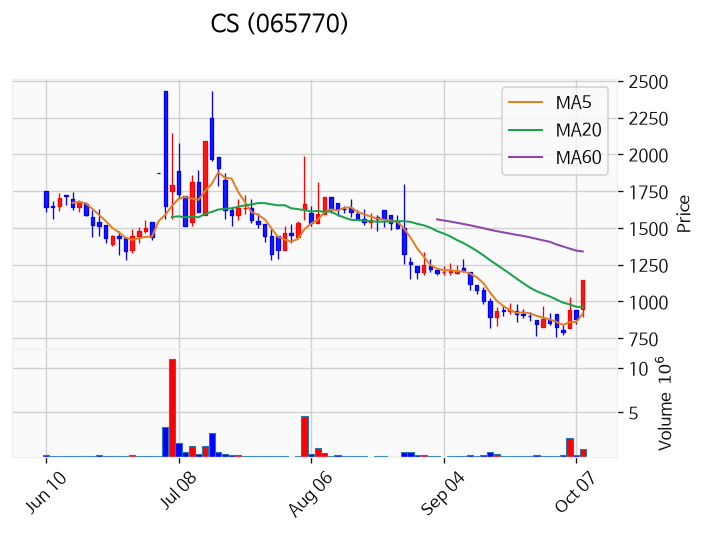

---

### HLB바이오스텝 (상한가)
— 등락률 +29.97% / 거래량 561만 주

**◎ 관련기사**
- [[단독]‘신병4’ 오대환 “70대 어르신이 ‘중대장’이라고..인기 실감”(인터뷰①) - 조선비즈](https://news.google.com/rss/articles/CBMikwFBVV95cUxQRUs0ODVVcERDWGtpMnJUNHdRcmRib0pPbFhETXdsQ3JwLUJVMVUxNGotZGFjWFZYZUNVSm1rUVVKLUJOUWJCQ0pyVmNVN2I5WWpUYzcyVUpOcGlTc1V2UEZZTVhRMElaMVdNbU0zOC0tZFdIUFBVSkFDbV9WWDNTV0lOb3R0bzQ0NGIwNTVuMDZwNG_SAacBQVVfeXFMTXR1VkpLMnpTUC1SNlU0Ulh3bzE0aWc5cHpfVFl0VGRYMFphZ3d5VmZPd3Q3ZlhrTDlVc0w3cDk0LXB4Vl9Odnc5My1uZjlXeE51elhjRC01VmJpeG1UbFVrLWJwNmkzbDh0Q3hMUlBWWVZvZ1BqX3RQaVRMMzZUWVRGZGpqRUJUZnE0QkxMdlVEMnM2VnVZY3VZNUFub0hoWVJsb25jaVk?oc=5) — Chosunbiz, 2026-10-08

**◎ 공시**
- _(공시 없음 / 미조회)_

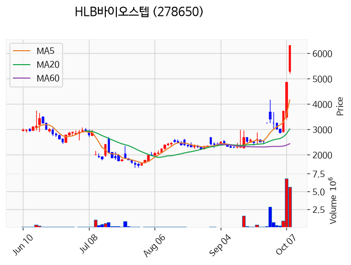

---

### HLB파나진 (상한가)
— 등락률 +29.96% / 거래량 671만 주

**◎ 관련기사**
- [[단독]‘신병4’ 오대환 “70대 어르신이 ‘중대장’이라고..인기 실감”(인터뷰①) - 조선비즈](https://news.google.com/rss/articles/CBMikwFBVV95cUxQRUs0ODVVcERDWGtpMnJUNHdRcmRib0pPbFhETXdsQ3JwLUJVMVUxNGotZGFjWFZYZUNVSm1rUVVKLUJOUWJCQ0pyVmNVN2I5WWpUYzcyVUpOcGlTc1V2UEZZTVhRMElaMVdNbU0zOC0tZFdIUFBVSkFDbV9WWDNTV0lOb3R0bzQ0NGIwNTVuMDZwNG_SAacBQVVfeXFMTXR1VkpLMnpTUC1SNlU0Ulh3bzE0aWc5cHpfVFl0VGRYMFphZ3d5VmZPd3Q3ZlhrTDlVc0w3cDk0LXB4Vl9Odnc5My1uZjlXeE51elhjRC01VmJpeG1UbFVrLWJwNmkzbDh0Q3hMUlBWWVZvZ1BqX3RQaVRMMzZUWVRGZGpqRUJUZnE0QkxMdlVEMnM2VnVZY3VZNUFub0hoWVJsb25jaVk?oc=5) — Chosunbiz, 2026-10-08

**◎ 공시**
- _(공시 없음 / 미조회)_

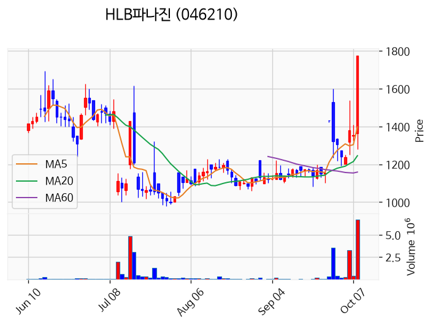

---

### 뉴인텍 (상한가)
— 등락률 +29.95% / 거래량 279만 주

**◎ 관련기사**
_(관련기사 없음 / 미조회)_

**◎ 공시**
- _(공시 없음 / 미조회)_

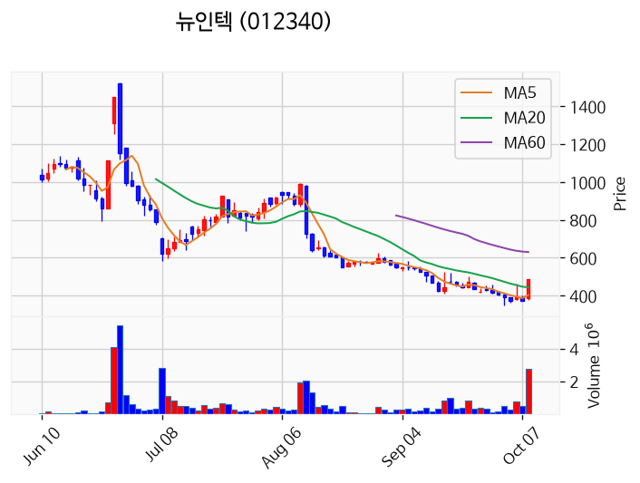

---

### 바이오인프라 (상한가)
— 등락률 +29.93% / 거래량 8만 주

**◎ 관련기사**
- [[테마 제안] 시총미달상폐유예 — judal 미등록 신규 테마](https://news.google.com/rss/articles/CBMidkFVX3lxTE9yaU1yMzkxNkd5d1ltaHQ1d3pSaV9xUjVuTTNyN1E0N0pLMVpKMUdDMHhMNlB2RXlBU0JYeTVUME0xOUVCNnFVLVJNanloMjBRSVpZMjBiUHhEMS13SHc4SVhNZ1dPZ2o0UGFhWDR1d0ptV2NYVkE?oc=5) — 주달, 2026-10-08

**◎ 공시**
- _(공시 없음 / 미조회)_

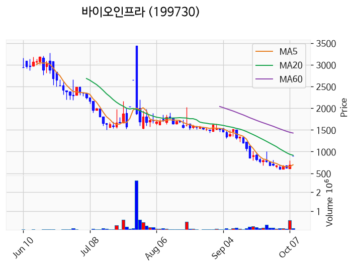

---

### 삼기에너지솔루션즈 (상한가)
— 등락률 +29.93% / 거래량 2,473만 주

**◎ 관련기사**
- [코스피, 삼성전자 '영업이익 107조'에도 지수 6620선 후퇴…코스닥도 하락](https://news.google.com/rss/articles/CBMic0FVX3lxTE9VeVRscFlJWGpEcnNNcTgwSDc1a2lCc05XdkxTR3EwUE5NcjlUQXJfcnJlYW11aUsxSm5FaWhNY2hwT1FxRS1Da01tTHp0VVc3NzluLTFURzVRZlJZNGk4SVVCWk84MDktd28wWFI5S1cwYjTSAXdBVV95cUxOb2JnQlZjWk85VEZENHp6T0gyUy1yQUl5X2V4REItc3EzUUVFcXJZeEltTFdfeXd6b1lIOWZRTkczNVN1QnVWMXRkMFEzQ0ZENDJOLUluSENOOUhjbkpacUNKWFdaMDBOTmZrUHY5cXNiTHhaVk5PUQ?oc=5) — 핀포인트뉴스, 2026-10-08

**◎ 공시**
- _(공시 없음 / 미조회)_

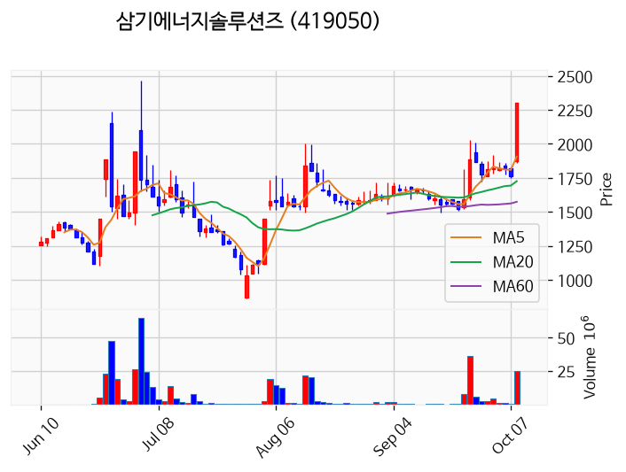

---

### 동양고속 (상한가)
— 등락률 +29.91% / 거래량 140만 주

**◎ 관련기사**
_(관련기사 없음 / 미조회)_

**◎ 공시**
- _(공시 없음 / 미조회)_

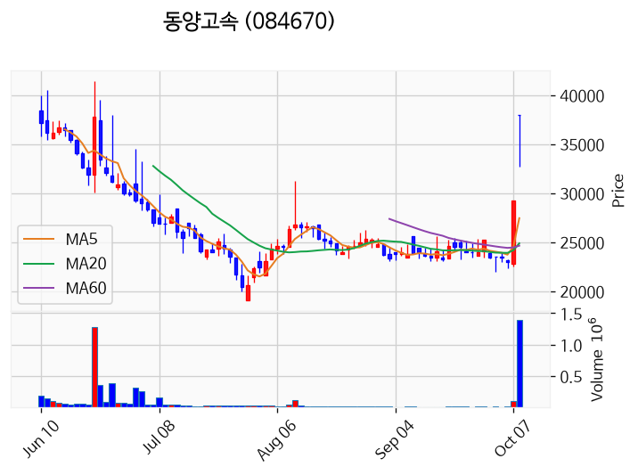

---

### 예선테크 (상한가)
— 등락률 +29.90% / 거래량 2만 주

**◎ 관련기사**
- [[테마 제안] 시총미달상폐유예 — judal 미등록 신규 테마](https://news.google.com/rss/articles/CBMidkFVX3lxTE9yaU1yMzkxNkd5d1ltaHQ1d3pSaV9xUjVuTTNyN1E0N0pLMVpKMUdDMHhMNlB2RXlBU0JYeTVUME0xOUVCNnFVLVJNanloMjBRSVpZMjBiUHhEMS13SHc4SVhNZ1dPZ2o0UGFhWDR1d0ptV2NYVkE?oc=5) — 주달, 2026-10-08

**◎ 공시**
- _(공시 없음 / 미조회)_

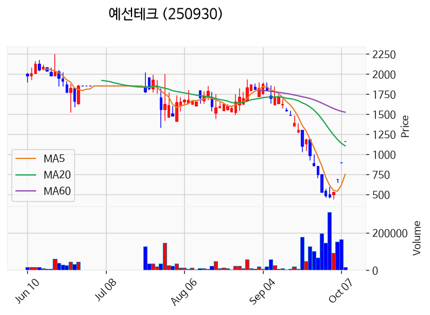

---

### 형지글로벌 (상한가)
— 등락률 +29.88% / 거래량 114만 주

**◎ 관련기사**
- [[테마 제안] 시총미달상폐유예 — judal 미등록 신규 테마](https://news.google.com/rss/articles/CBMidkFVX3lxTE9yaU1yMzkxNkd5d1ltaHQ1d3pSaV9xUjVuTTNyN1E0N0pLMVpKMUdDMHhMNlB2RXlBU0JYeTVUME0xOUVCNnFVLVJNanloMjBRSVpZMjBiUHhEMS13SHc4SVhNZ1dPZ2o0UGFhWDR1d0ptV2NYVkE?oc=5) — 주달, 2026-10-08

**◎ 공시**
- _(공시 없음 / 미조회)_

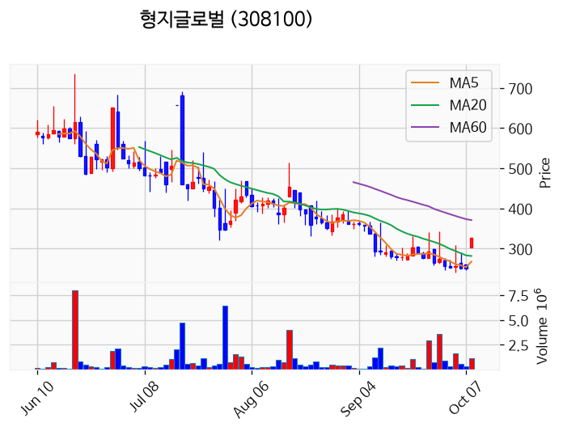

---

### 빅텐츠 (상한가)
— 등락률 +29.84% / 거래량 71만 주

**◎ 관련기사**
_(관련기사 없음 / 미조회)_

**◎ 공시**
- _(공시 없음 / 미조회)_

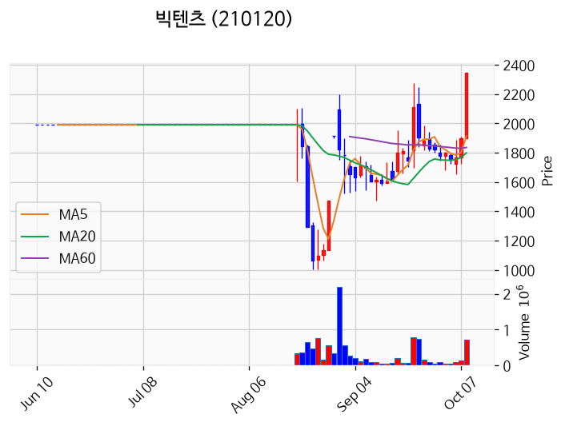

---

### 신라섬유 (상한가)
— 등락률 +29.84% / 거래량 65만 주

**◎ 관련기사**
_(관련기사 없음 / 미조회)_

**◎ 공시**
- _(공시 없음 / 미조회)_

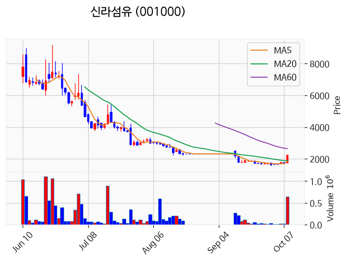

---

### HLB글로벌 (상한가)
— 등락률 +29.80% / 거래량 525만 주

**◎ 관련기사**
- [[공모주 마감] 엘리스그룹 청약 2일차 종료, 균등·비례 어느 증권사가 유리했나?](https://news.google.com/rss/articles/CBMiaEFVX3lxTE9RSFZCSEdyOVp1UVBXLWgxMjlsRERSREktYkd3cElGZ1dEUzBFeE9SWTluRHRsd0E1QVQ3SE1uM3g1cW1TT1JSLWRrUV84b2hnTG5jYlpCSEhEZDA2NlVWZmQ0ejd5djhh?oc=5) — CBC뉴스, 2026-10-08

**◎ 공시**
- _(공시 없음 / 미조회)_

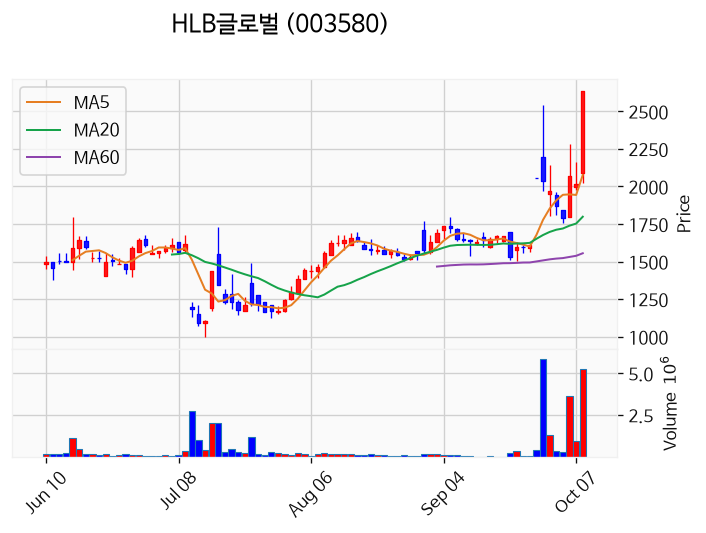

---

### 에이엔피 (상한가)
— 등락률 +29.69% / 거래량 281만 주

**◎ 관련기사**
- [[테마 제안] 시총미달상폐유예 — judal 미등록 신규 테마](https://news.google.com/rss/articles/CBMidkFVX3lxTE9yaU1yMzkxNkd5d1ltaHQ1d3pSaV9xUjVuTTNyN1E0N0pLMVpKMUdDMHhMNlB2RXlBU0JYeTVUME0xOUVCNnFVLVJNanloMjBRSVpZMjBiUHhEMS13SHc4SVhNZ1dPZ2o0UGFhWDR1d0ptV2NYVkE?oc=5) — 주달, 2026-10-08

**◎ 공시**
- _(공시 없음 / 미조회)_

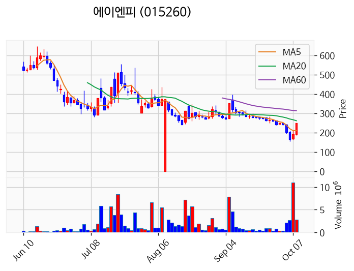

---

### 모아데이타 (상한가)
— 등락률 +29.56% / 거래량 324만 주

**◎ 관련기사**
- [[테마 제안] 시총미달상폐유예 — judal 미등록 신규 테마](https://news.google.com/rss/articles/CBMidkFVX3lxTE9yaU1yMzkxNkd5d1ltaHQ1d3pSaV9xUjVuTTNyN1E0N0pLMVpKMUdDMHhMNlB2RXlBU0JYeTVUME0xOUVCNnFVLVJNanloMjBRSVpZMjBiUHhEMS13SHc4SVhNZ1dPZ2o0UGFhWDR1d0ptV2NYVkE?oc=5) — 주달, 2026-10-08

**◎ 공시**
- _(공시 없음 / 미조회)_

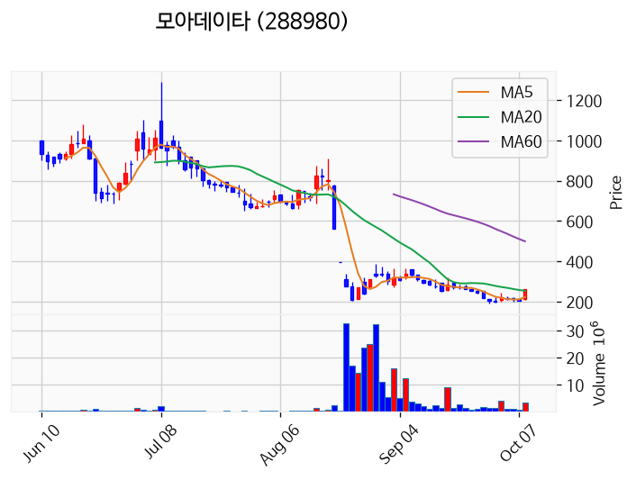

---

### 동국산업 (거래량 급증)
— 등락률 +21.95% / 거래량 2,120만 주

**◎ 관련기사**
_(관련기사 없음 / 미조회)_

**◎ 공시**
- _(공시 없음 / 미조회)_

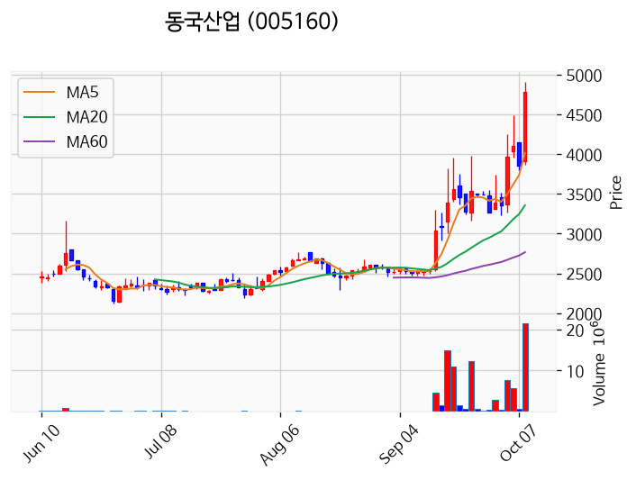

---

### 국전 (거래량 급증)
— 등락률 +8.66% / 거래량 1,779만 주

**◎ 관련기사**
_(관련기사 없음 / 미조회)_

**◎ 공시**
- _(공시 없음 / 미조회)_

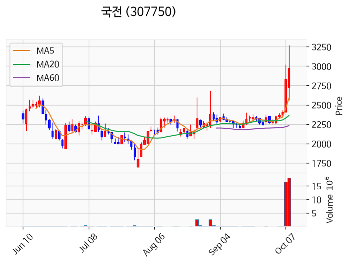

---

### 삼기 (거래량 급증)
— 등락률 +8.41% / 거래량 2,040만 주

**◎ 관련기사**
- [통영시, 인구감소지역 지정에 생애주기 인구 정책 강화](https://news.google.com/rss/articles/CBMiakFVX3lxTFBtSHZtcXV3bUVzckhNOTB3TmhNMFN5anVOS2NfWDdkaFcwVDZTMXl2eHJjYlAxZFVob2dwVlMzRjNHTXcxOHAtNmR2ZDVsMFhHY2dBa1JZQlJzLTY0TjA3ZERoVGx3M3VDc2c?oc=5) — 경남도민일보, 2026-10-08

**◎ 공시**
- _(공시 없음 / 미조회)_

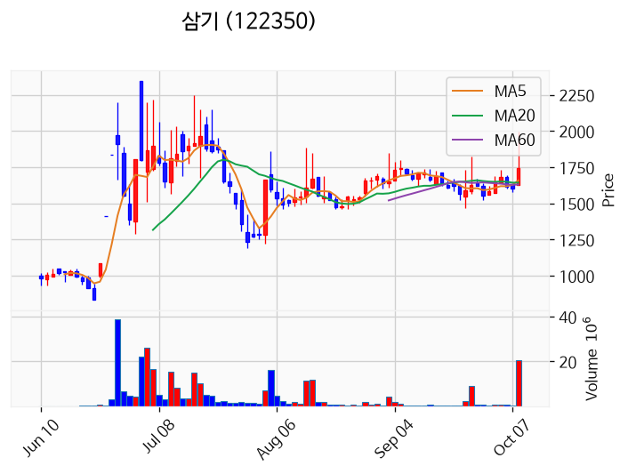

---

### 동국S&C (거래량 급증)
— 등락률 +5.55% / 거래량 1,129만 주

**◎ 관련기사**
_(관련기사 없음 / 미조회)_

**◎ 공시**
- _(공시 없음 / 미조회)_

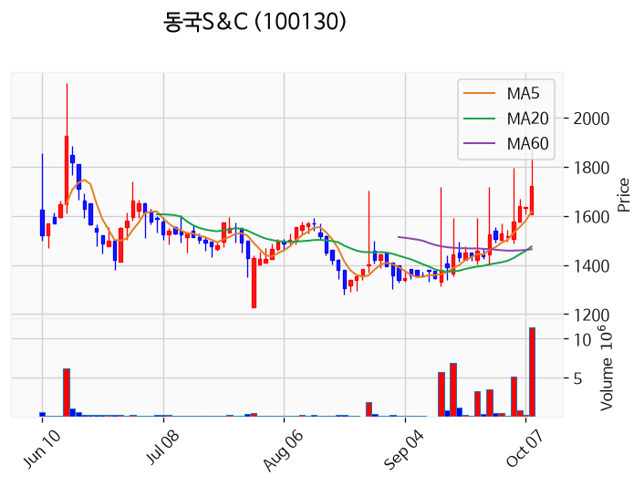

---

### 한빛레이저 (거래량 급증)
— 등락률 +5.34% / 거래량 1,406만 주

**◎ 관련기사**
- [10/01일 공략주 Review _ 한빛레이저](https://news.google.com/rss/articles/CBMiiwFBVV95cUxPTU0zSHRNNWNJOHFrSnBkOWw2Q0JuVzEycTV0Z1BFd09MQnZoS0RrYlZpT0szaEQ5VXExVWk2cFkyNVpPcVNDZWU5SnkxN1A3NWlfdFFBLVVBNFNGSXF0dzA4VXAxRE4tckR2WnRPNFUybVBpVy1xRUlxZnoyZ25hNE56a2JUN2VPdlo4?oc=5) — 네이버 프리미엄콘텐츠, 2026-10-08

**◎ 공시**
- _(공시 없음 / 미조회)_

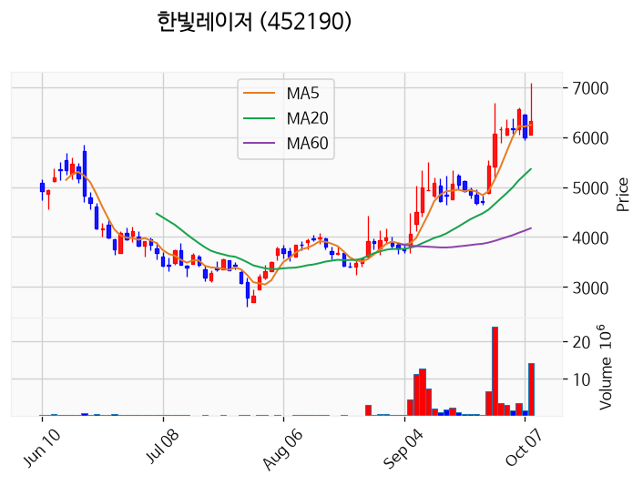

---

### 한온시스템 (거래량 급증)
— 등락률 +4.15% / 거래량 1,315만 주

**◎ 관련기사**
- [한온시스템 주가, 10월 8일 애프터마켓 4,005원 3.89% 상승](https://news.google.com/rss/articles/CBMickFVX3lxTFBVcFlmdXh1X0drRHRYcWpaZ3ltSmRxNEdZdjdDVFQwZk9GWjdqWHQtSEh4aXJDbm0wN296bm1IWmJSZW1HbWZSczNZZzhTeVZZdGRtcU01Zno2X0VBRERfUFVzdUMtdV9PbGExNlA3c0VrUQ?oc=5) — TopStarNews, 2026-10-08

**◎ 공시**
- _(공시 없음 / 미조회)_

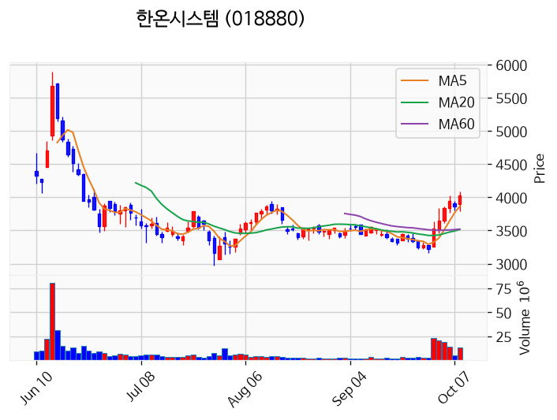

---

### 나인테크 (거래량 급증)
— 등락률 +4.07% / 거래량 1,242만 주

**◎ 관련기사**
_(관련기사 없음 / 미조회)_

**◎ 공시**
- _(공시 없음 / 미조회)_

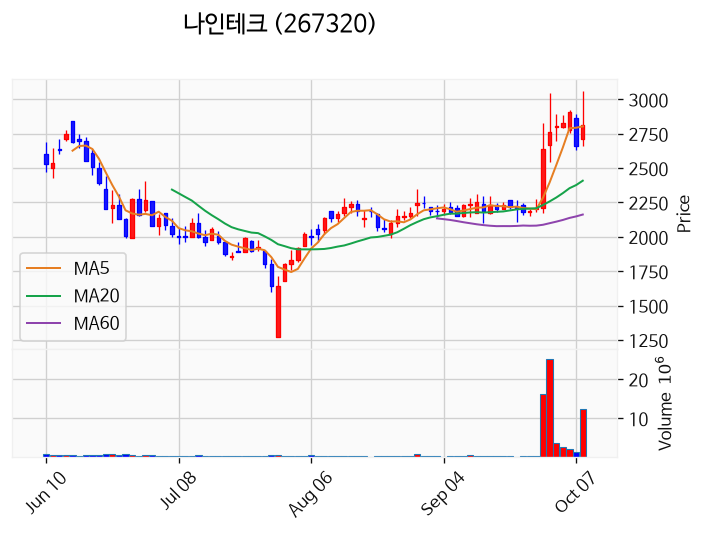

---

### 덕산넵코어스 (거래량 급증)
— 등락률 +3.26% / 거래량 1,576만 주

**◎ 관련기사**
- [중복상장 문턱 넘은 디티에스…AI 데이터센터 냉각 시장 공략 [IPO톡톡]](https://news.google.com/rss/articles/CBMid0FVX3lxTE03dzZzdU1LV1d3cnVsdWlhY0c5U1l6VlN1d3FFNWl5LWRwbkVNbnlWNnIwRzIxY2w4Qm05dEdlbVpyVDFSNEJKM3dOczM4ai1Gdzd4UGxxU25NU2JQcnRIb0ZzQTZlblA2OFJNRDJ0VlVVWVE1WEQ0?oc=5) — 한국경제TV, 2026-10-08

**◎ 공시**
- _(공시 없음 / 미조회)_

---

### 삼성전자 (거래량 급증)
— 등락률 -1.86% / 거래량 2,069만 주

**◎ 관련기사**
- [삼성전자 100조 실적에도…코스피 2% 넘게 하락](https://news.google.com/rss/articles/CBMiZ0FVX3lxTE1WYkcyUUhMTENZV3c2MFlHQjZuU3FpZHZmeTUyRGZacU1Yc19MeUpwSHZzbVlWNWh1NUZWLXR1N3N6MXFIY0pYY0JPVnpiNVhVVGlUMHZDdG5PUU9ZcWZnaTY0QUplVms?oc=5) — 연합뉴스TV, 2026-10-08

**◎ 공시**
- [기업설명회(IR)개최(안내공시)              ](https://dart.fss.or.kr/dsaf001/main.do?rcpNo=20261008800028) — 삼성전자, 20261008
- [연결재무제표기준영업(잠정)실적(공정공시)              ](https://dart.fss.or.kr/dsaf001/main.do?rcpNo=20261008800004) — 삼성전자, 20261008

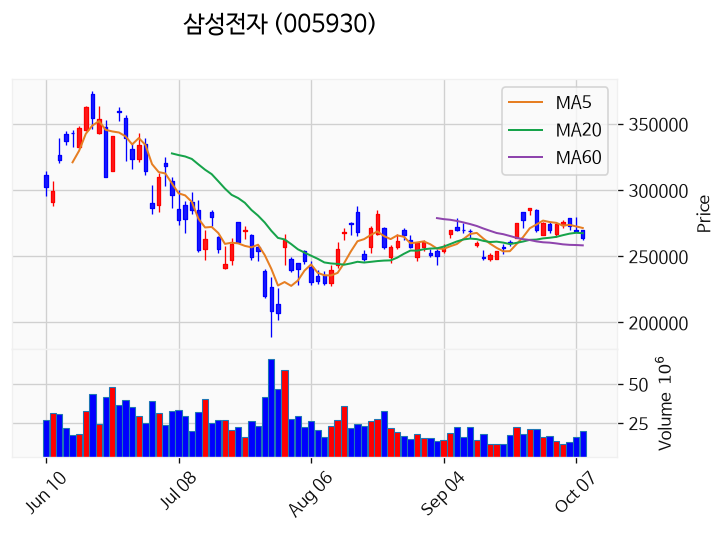

---

### 국제약품 (거래량 급증)
— 등락률 -4.85% / 거래량 2,076만 주

**◎ 관련기사**
- [남태훈 대표이사부회장, 국제약품 주식 181만5237주 ↑…지분율 10.70%](https://news.google.com/rss/articles/CBMic0FVX3lxTE9WdWdxZG1vWS04SC1jeXpocnN3bmNCUlRGNHNNTXM3OEtPQnJyS0U0UlFET0QwcFR1OEc4YkdtRlhiM1hHYWczXzJjb1F6b2JZbngxRVB1WEc4ZllpYThpVUJIbElsb09DN3ZjS1NqLWtDUGc?oc=5) — 데이터투자, 2026-10-08

**◎ 공시**
- [임원ㆍ주요주주특정증권등소유상황보고서](https://dart.fss.or.kr/dsaf001/main.do?rcpNo=20261008000513) — 남태훈, 20261008
- [임원ㆍ주요주주특정증권등소유상황보고서](https://dart.fss.or.kr/dsaf001/main.do?rcpNo=20261008000507) — 남영우, 20261008

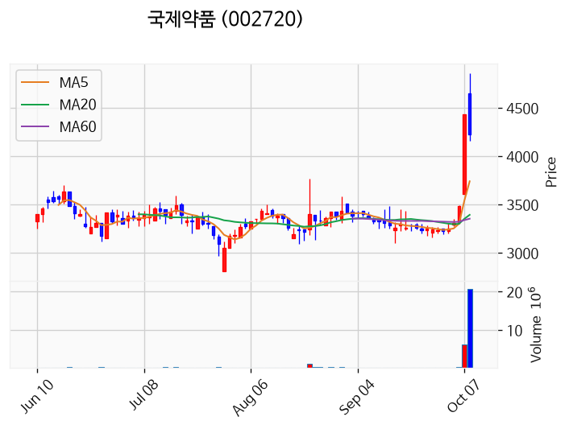

---

### 빛과전자 (거래량 급증)
— 등락률 -6.72% / 거래량 1,511만 주

**◎ 관련기사**
_(관련기사 없음 / 미조회)_

**◎ 공시**
- _(공시 없음 / 미조회)_

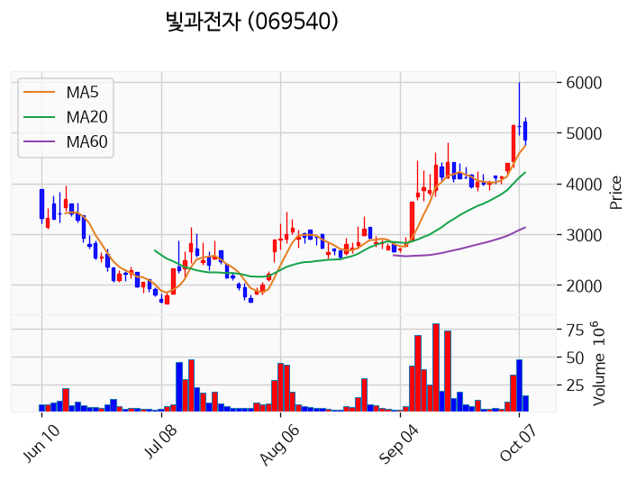

---

### 삼표시멘트 (거래량 급증)
— 등락률 -10.61% / 거래량 1,282만 주

**◎ 관련기사**
_(관련기사 없음 / 미조회)_

**◎ 공시**
- _(공시 없음 / 미조회)_

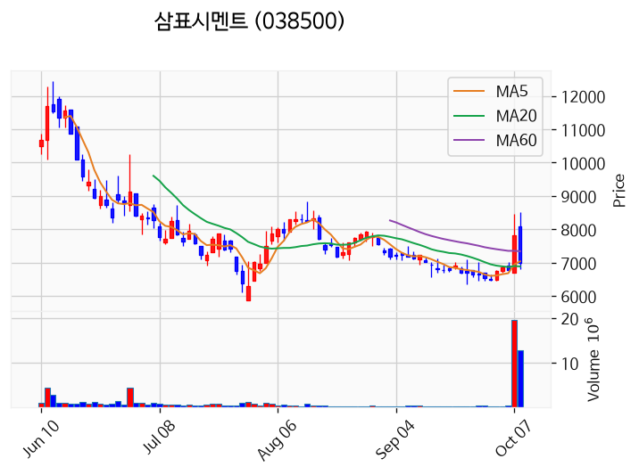

---

### 부산주공 (거래량 급증)
— 등락률 -28.00% / 거래량 1,855만 주

**◎ 관련기사**
_(관련기사 없음 / 미조회)_

**◎ 공시**
- _(공시 없음 / 미조회)_

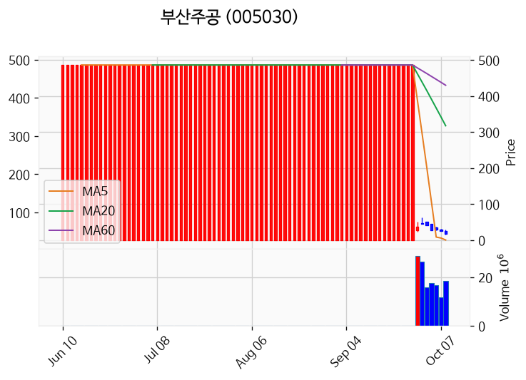

---

## 2. 거래량 폭증 후 급감 패턴 종목
_(폭증 전일 대비 500~1000%, 급감 전일 대비 25% 이하, 급감일 종가가 5일선 대비 -3% 이내)_

### 경방
- 폭증일: 2026-10-07, 거래량 13만 주 (전일 대비 573%)
- 급감일: 2026-10-08, 거래량 3만 주 (전일 대비 20%)
- 급감일 종가 8,070원 / 5일선 4,826원 (이격률 +67.22%)

### BYC
- 폭증일: 2026-10-07, 거래량 1만 주 (전일 대비 546%)
- 급감일: 2026-10-08, 거래량 0만 주 (전일 대비 23%)
- 급감일 종가 38,100원 / 5일선 22,420원 (이격률 +69.94%)

### 조흥
- 폭증일: 2026-10-07, 거래량 0만 주 (전일 대비 700%)
- 급감일: 2026-10-08, 거래량 0만 주 (전일 대비 14%)
- 급감일 종가 139,000원 / 5일선 83,400원 (이격률 +66.67%)

### 부광약품
- 폭증일: 2026-10-07, 거래량 252만 주 (전일 대비 915%)
- 급감일: 2026-10-08, 거래량 43만 주 (전일 대비 17%)
- 급감일 종가 4,055원 / 5일선 2,495원 (이격률 +62.53%)

### 한국화장품제조
- 폭증일: 2026-10-07, 거래량 583만 주 (전일 대비 609%)
- 급감일: 2026-10-08, 거래량 120만 주 (전일 대비 21%)
- 급감일 종가 16,240원 / 5일선 9,622원 (이격률 +68.78%)

### 태영건설우
- 폭증일: 2026-10-07, 거래량 0만 주 (전일 대비 686%)
- 급감일: 2026-10-08, 거래량 0만 주 (전일 대비 15%)
- 급감일 종가 6,030원 / 5일선 3,644원 (이격률 +65.48%)

### 삼미금속
- 폭증일: 2026-10-07, 거래량 1,806만 주 (전일 대비 873%)
- 급감일: 2026-10-08, 거래량 214만 주 (전일 대비 12%)
- 급감일 종가 12,160원 / 5일선 7,642원 (이격률 +59.12%)

### 경동인베스트
- 폭증일: 2026-10-07, 거래량 3만 주 (전일 대비 706%)
- 급감일: 2026-10-08, 거래량 1만 주 (전일 대비 19%)
- 급감일 종가 47,850원 / 5일선 27,840원 (이격률 +71.88%)

### 신풍제약
- 폭증일: 2026-10-07, 거래량 364만 주 (전일 대비 827%)
- 급감일: 2026-10-08, 거래량 80만 주 (전일 대비 22%)
- 급감일 종가 9,830원 / 5일선 6,102원 (이격률 +61.09%)

### 한솔홈데코
- 폭증일: 2026-10-07, 거래량 6만 주 (전일 대비 543%)
- 급감일: 2026-10-08, 거래량 1만 주 (전일 대비 13%)
- 급감일 종가 1,900원 / 5일선 1,133원 (이격률 +67.64%)

### 한국파마
- 폭증일: 2026-10-07, 거래량 139만 주 (전일 대비 600%)
- 급감일: 2026-10-08, 거래량 12만 주 (전일 대비 8%)
- 급감일 종가 8,460원 / 5일선 5,218원 (이격률 +62.13%)

### 진양화학
- 폭증일: 2026-10-07, 거래량 204만 주 (전일 대비 729%)
- 급감일: 2026-10-08, 거래량 25만 주 (전일 대비 12%)
- 급감일 종가 1,651원 / 5일선 956원 (이격률 +72.66%)

### 지엔코
- 폭증일: 2026-10-07, 거래량 3만 주 (전일 대비 549%)
- 급감일: 2026-10-08, 거래량 0만 주 (전일 대비 6%)
- 급감일 종가 3,415원 / 5일선 2,041원 (이격률 +67.32%)

### JW신약
- 폭증일: 2026-10-07, 거래량 745만 주 (전일 대비 521%)
- 급감일: 2026-10-08, 거래량 179만 주 (전일 대비 24%)
- 급감일 종가 2,750원 / 5일선 1,710원 (이격률 +60.82%)

### 엔브이에이치코리아
- 폭증일: 2026-10-07, 거래량 5만 주 (전일 대비 760%)
- 급감일: 2026-10-08, 거래량 1만 주 (전일 대비 23%)
- 급감일 종가 1,656원 / 5일선 992원 (이격률 +66.87%)

### 퀀텀레일
- 폭증일: 2026-10-07, 거래량 957만 주 (전일 대비 698%)
- 급감일: 2026-10-08, 거래량 238만 주 (전일 대비 25%)
- 급감일 종가 621원 / 5일선 373원 (이격률 +66.58%)

### 효성ITX
- 폭증일: 2026-10-07, 거래량 2만 주 (전일 대비 890%)
- 급감일: 2026-10-08, 거래량 0만 주 (전일 대비 22%)
- 급감일 종가 11,840원 / 5일선 7,110원 (이격률 +66.53%)

### 위메이드플레이
- 폭증일: 2026-10-07, 거래량 10만 주 (전일 대비 616%)
- 급감일: 2026-10-08, 거래량 1만 주 (전일 대비 9%)
- 급감일 종가 6,420원 / 5일선 3,850원 (이격률 +66.75%)

### 한국화장품
- 폭증일: 2026-10-07, 거래량 39만 주 (전일 대비 733%)
- 급감일: 2026-10-08, 거래량 6만 주 (전일 대비 15%)
- 급감일 종가 6,410원 / 5일선 3,876원 (이격률 +65.38%)

### 제로투세븐
- 폭증일: 2026-10-07, 거래량 28만 주 (전일 대비 664%)
- 급감일: 2026-10-08, 거래량 3만 주 (전일 대비 12%)
- 급감일 종가 2,240원 / 5일선 1,320원 (이격률 +69.70%)

### 캐프
- 폭증일: 2026-10-07, 거래량 8만 주 (전일 대비 502%)
- 급감일: 2026-10-08, 거래량 1만 주 (전일 대비 17%)
- 급감일 종가 2,095원 / 5일선 1,258원 (이격률 +66.53%)

### 바이오인프라
- 폭증일: 2026-10-07, 거래량 50만 주 (전일 대비 863%)
- 급감일: 2026-10-08, 거래량 8만 주 (전일 대비 15%)
- 급감일 종가 903원 / 5일선 443원 (이격률 +103.75%)

### 이비테크
- 폭증일: 2026-10-07, 거래량 0만 주 (전일 대비 595%)
- 급감일: 2026-10-08, 거래량 0만 주 (전일 대비 1%)
- 급감일 종가 5,090원 / 5일선 3,018원 (이격률 +68.65%)

### 하이즈항공
- 폭증일: 2026-10-07, 거래량 6만 주 (전일 대비 764%)
- 급감일: 2026-10-08, 거래량 1만 주 (전일 대비 13%)
- 급감일 종가 2,050원 / 5일선 1,242원 (이격률 +65.06%)

### 세화피앤씨
- 폭증일: 2026-10-07, 거래량 4만 주 (전일 대비 735%)
- 급감일: 2026-10-08, 거래량 1만 주 (전일 대비 15%)
- 급감일 종가 2,485원 / 5일선 1,444원 (이격률 +72.09%)

### 한국비엔씨
- 폭증일: 2026-10-07, 거래량 965만 주 (전일 대비 517%)
- 급감일: 2026-10-08, 거래량 194만 주 (전일 대비 20%)
- 급감일 종가 3,065원 / 5일선 1,908원 (이격률 +60.64%)

### 제일약품
- 폭증일: 2026-10-07, 거래량 9만 주 (전일 대비 813%)
- 급감일: 2026-10-08, 거래량 2만 주 (전일 대비 24%)
- 급감일 종가 10,000원 / 5일선 6,070원 (이격률 +64.74%)

### EMB
- 폭증일: 2026-10-07, 거래량 0만 주 (전일 대비 642%)
- 급감일: 2026-10-08, 거래량 0만 주 (전일 대비 1%)
- 급감일 종가 3,000원 / 5일선 1,780원 (이격률 +68.54%)

### 자이언트스텝
- 폭증일: 2026-10-07, 거래량 14만 주 (전일 대비 565%)
- 급감일: 2026-10-08, 거래량 3만 주 (전일 대비 20%)
- 급감일 종가 950원 / 5일선 553원 (이격률 +71.91%)

### 라피치
- 폭증일: 2026-10-07, 거래량 1만 주 (전일 대비 696%)
- 급감일: 2026-10-08, 거래량 0만 주 (전일 대비 1%)
- 급감일 종가 7,130원 / 5일선 4,306원 (이격률 +65.58%)

### 아이엘로보틱스
- 폭증일: 2026-10-07, 거래량 1만 주 (전일 대비 575%)
- 급감일: 2026-10-08, 거래량 0만 주 (전일 대비 8%)
- 급감일 종가 2,030원 / 5일선 1,227원 (이격률 +65.44%)

### 블루엠텍
- 폭증일: 2026-10-07, 거래량 407만 주 (전일 대비 853%)
- 급감일: 2026-10-08, 거래량 97만 주 (전일 대비 24%)
- 급감일 종가 3,070원 / 5일선 1,829원 (이격률 +67.85%)
